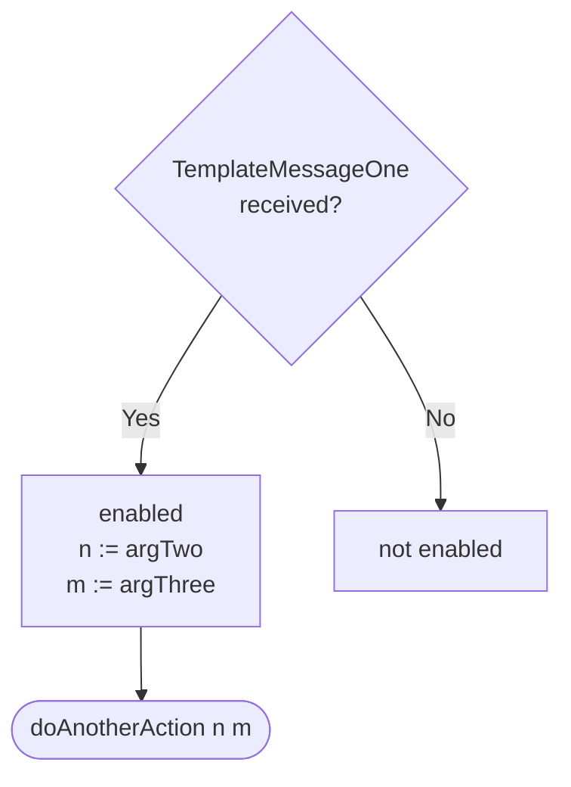

Source code: [[template_dynamics|`./docs/node_architecture/engines/template_dynamics.juvix.md`]]


??? note "Juvix preamble"

    ```juvix
    module node_architecture.engines.template_dynamics;

    import Stdlib.Data.String open;
    import prelude open;
    ```

# `Template` Dynamics

## Overview

Lorem ipsum dolor sit amet, consectetur adipiscing elit.

## Action labels

??? note "Auxiliary Juvix code"

    <!-- --8<-- [start:auxiliary-juvix-code] -->
    ```juvix
    type SomeActionLabel :=
      | DoThis String
    ;

    type AnotherActionLabel :=
      | DoThat String
    ;
    ```
    <!-- --8<-- [end:auxiliary-juvix-code] -->

<!-- --8<-- [start:template-action-label] -->
```juvix
type TemplateActionLabel :=
  | -- --8<-- [start:TemplateDoAlternative]
    TemplateDoAlternative (Either SomeActionLabel AnotherActionLabel)
    -- --8<-- [end:TemplateDoAlternative]

  | -- --8<-- [start:TemplateDoBoth]
    TemplateDoBoth (Pair SomeActionLabel AnotherActionLabel)
    -- --8<-- [end:TemplateDoBoth]

  | -- --8<-- [start:TemplateDoAnotherAction]
    TemplateDoAnotherAction String
    -- --8<-- [end:TemplateDoAnotherAction]
;
```
<!-- --8<-- [end:template-action-label] -->

### `TemplateDoAlternative`

!!! quote ""

    --8<-- "./template_dynamics.juvix.md:TemplateDoAlternative"

We perform one of the two altertives, depending on user input and
randomness—`coming soon™`.

<!-- --8<-- [start:do-alternative-example] -->
```juvix extract-module-statements
module do_alternative_example;
example : TemplateActionLabel :=
  TemplateDoAlternative (prelude.Left (DoThis "do it!"));
end;
```
<!-- --8<-- [end:do-alternative-example] -->

#### `Either.Left`

The first alternative does _this._

State update

: The state is unchanged as the timer will have all information necessary.

Messages to be sent

: No messages are added to the send queue.

Engines to be spawned

: We shall create a new engine.

Timer updates

: We set a timer for 10 seconds to check up on the spawned engine (although that
  should not be necessary as it will send messages as the first thing after
    spawning).

Acquaintance updates

: None

#### `Either.Right`

Lore

### `TemplateDoBoth`

Lore

### `TemplateDoAnotherAction`

Lore

## Matchable arguments

??? note "Auxiliary Juvix code"

    <!-- --8<-- [start:matchable-arguments-auxiliary-code] -->
    ```juvix
    syntax alias thisOneNatFromAllMessages := Nat;
    ```
    <!-- --8<-- [end:matchable-arguments-auxiliary-code] -->


<!-- --8<-- [start:template-matchable-argument] -->
```juvix
type TemplateMatchableArgument :=
  | -- --8<-- [start:TemplateMessageOne]
    TemplateMessageOne thisOneNatFromAllMessages
    -- --8<-- [end:TemplateMessageOne]
  | -- --8<-- [start:TemplateMessageTwo]
    TemplateMessageTwo thisOneNatFromAllMessages
    -- --8<-- [end:TemplateMessageTwo]
  | -- --8<-- [start:TemplateSomeThingFromAMailbox]
    TemplateSomeThingFromAMailbox String
    -- --8<-- [end:TemplateSomeThingFromAMailbox]
;
```
<!-- --8<-- [end:template-matchable-argument] -->

### `TemplateMessageOne`

!!! quote ""

    --8<-- "./template_dynamics.juvix.md:TemplateMessageOne"

We compute a natural number from the arguments of message one.

<!-- --8<-- [start:message-one-example] -->
```juvix extract-module-statements
module message_one_example;
TemplateMessageOneExample : TemplateMatchableArgument := TemplateMessageOne 1;
end;
```
<!-- --8<-- [end:message-one-example] -->

### `TemplateMessageTwo`

Lorem ipsum dolor sit amet, consectetur adipiscing elit.

### `TemplateSomeThingFromAMailbox`

!!! quote ""

    --8<-- "./template_dynamics.juvix.md:TemplateSomeThingFromAMailbox"

We also match a message from a message that we had stored in a mailbox.
See the section on pre-computation results for more on how we remember
which messages we will remove from which mailbox.

<!-- --8<-- [start:some-thing-from-a-mailbox] -->
```juvix
module some_thing_from_a_mailbox;
  someThingFromAMailboxExample : TemplateMatchableArgument :=
    TemplateSomeThingFromAMailbox "Hello World!";
end;
```
<!-- --8<-- [end:some-thing-from-a-mailbox] -->

## Precomputation results

??? note "Auxiliary Juvix code"

    <!-- --8<-- [start:pseudo-example-auxiliary-code] -->
    ```juvix
    syntax alias someMessageType := Nat;
    ```
    <!-- --8<-- [end:pseudo-example-auxiliary-code] -->

<!-- --8<-- [start:template-precomputation-entry] -->
```juvix
type TemplatePrecomputationEntry :=
  | -- --8<-- [start:TemplateDeleteThisMessageFromMailbox]
    TemplateDeleteThisMessageFromMailbox someMessageType Nat
    -- --8<-- [end:TemplateDeleteThisMessageFromMailbox]
  | -- --8<-- [start:TemplateCloseMailbox]
    TemplateCloseMailbox Nat
    -- --8<-- [end:TemplateCloseMailbox]
;

TemplatePrecomputation : Type := List TemplatePrecomputationEntry;
```
<!-- --8<-- [end:template-precomputation-entry] -->

Often, the guard detects that we can close a mailbox and that we have to add a
message to a mailbox. Note that we have a list of
`TemplatePrecomputationEntry`-terms as precomputation result and that we
describe the latter in more detail.

### `TemplateDeleteThisMessageFromMailbox`

!!! quote ""

    --8<-- "./template_dynamics.juvix.md:TemplateDeleteThisMessageFromMailbox"

We delete the given message from the mailbox with
the mailbox ID.

<!-- --8<-- [start:TemplateDeleteThisMessageFromMailbox] -->
```juvix extract-module-statements
module template_delete_this_message_from_mailbox;

templateDeleteThisMessageFromMailboxExample : TemplatePrecomputationEntry :=
  TemplateDeleteThisMessageFromMailbox undef 1;
end;
```
<!-- --8<-- [end:TemplateDeleteThisMessageFromMailbox] -->

## Guards

### `TemplateMessageOneGuard`



For `TemplateMessageOne`-messages, we do the other action, passing the String
representation of the second and third argument.

<!-- --8<-- [start:message-one-guard] -->
```juvix
guard : Type := undef;
```
<!-- --8<-- [end:message-one-guard] -->

!!! todo "fix/add code (with conversion from Nat to String)"

    ```
    TemplateMessageOneGuard :  Maybe Time
        -> Trigger I H
            -> EngineEnvironment S I M H
                -> Maybe (GuardOutput A L X) :=
                Lore ;
    ```

## Action dependencies and conflict resolution

We just use the lexicographical ordering.

!!! todo "fix code"

<!-- --8<-- [start:lexicographical-ordering] -->
```juvix
lexicographicalOrdering : Type -> Type := undef;
```
<!-- --8<-- [end:lexicographical-ordering] -->

## Action function

The action function amounts to one single
case statement.

!!! todo "fix code"

<!-- --8<-- [start:action-function] -->
```juvix
actionFunction : Type -> Type := undef;
```
<!-- --8<-- [end:action-function] -->

## Engine family summary

!!! todo "fix example 👇 (undef!)"

<!-- --8<-- [start:template-engine-family] -->
```juvix
TemplateEngineFamily : Type := undef;
```
<!-- --8<-- [end:template-engine-family] -->

!!! todo "fix example 👇 (undef!)"

<!-- --8<-- [start:template-engine-family-example] -->
```juvix
module template_engine_family;
templateEngineFamilyExample : TemplateEngineFamily := undef;
end;
```
<!-- --8<-- [end:template-engine-family-example] -->

<!--
### [Action Name ⟨$i$⟩] `{` one such sub-section per guarded action `}`

!!! note

    The description of the actions starts
    with an English language high-level description,
    followed by more detailed descriptions
    of state update, messages to be sent, timers to be set/cancelled/reset,
    and engine instances to be spawned.

    This section may be split into several
    if there are several different cases
    such that each of them deserves a different action label.

### Overview `{` action ⟨𝒊⟩`}`

!!! note

	Some paragraphs of English language prose
	as the author sees fit.

!!! example

	Besides answering the request,
	we have to update the ringbuffer of the mailbox state.

### Code `{` action ⟨$i$⟩ `}`

??? note "show me the code"

    ♢juvix

### [Action label ⟨$i_j$⟩]

#### Purpose `{`⟨$i_j$⟩`}`

!!! note

    We give quick descriptions of the action for this label.

##### State update `{`⟨$i_j$⟩`}`

!!! note

    Describe the state update

!!! example

    The rate limit is constant in the example.

##### Messages to be sent `{`⟨$i_j$⟩`}`

!!! note

    Describe the messages to be sent
    as a list (or a set if you prefer).

!!! example

    We send only a single message.

    - Send the time stamped hash to the requested »reply to« address.

##### Engines to be created `{`⟨$i_j$⟩`}`

!!! note

    Describe the engines to be created.

!!! example

    No engines are created.

##### Timers to be set/cancelled/reset `{`⟨$i_j$⟩`}`

!!! note

    Describe the engines timers to be set/cancelled/reset.

!!! example

    The time stamping server does not need to set any timers.

## Concurrency, conflict, mutual exclusion. `{` v2' `}`

!!! note "Coming soon™"

    Finally, we need to define the relations of
    concurrency, conflict, mutual exclusion
    between action labels.

-->