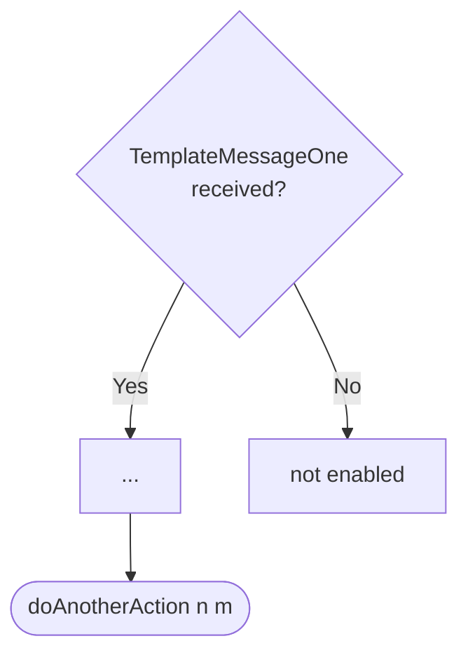

??? note "Juvix preamble"

    ```juvix
    module node_architecture.engines.template_dynamics;

    import Stdlib.Data.String open;
    import prelude open;
    import node_architecture.types.basics open;
    import node_architecture.engines.template_overview open;
    import node_architecture.engines.template_environment open;
    import node_architecture.types.engine_dynamics open;
    import node_architecture.types.engine_family open;
    ```

# `Template` Dynamics

## Overview

This engine does things in the ways described on this page.

## Action labels

??? quote "Auxiliary Juvix code"

    <!-- --8<-- [start:auxiliary-juvix-code] -->
    ```juvix
    type SomeActionLabel :=
      | DoThis String
    ;

    type AnotherActionLabel :=
      | DoThat String
    ;
    ```
    <!-- --8<-- [end:auxiliary-juvix-code] -->

<!-- --8<-- [start:template-action-label] -->
```juvix
type TemplateActionLabel :=
  | -- --8<-- [start:TemplateDoAlternative]
    TemplateDoAlternative (Either SomeActionLabel AnotherActionLabel)
    -- --8<-- [end:TemplateDoAlternative]

  | -- --8<-- [start:TemplateDoBoth]
    TemplateDoBoth (Pair SomeActionLabel AnotherActionLabel)
    -- --8<-- [end:TemplateDoBoth]

  | -- --8<-- [start:TemplateDoAnotherAction]
    TemplateDoAnotherAction String
    -- --8<-- [end:TemplateDoAnotherAction]
;
```
<!-- --8<-- [end:template-action-label] -->

### `TemplateDoAlternative`

!!! quote ""

    --8<-- "./template_dynamics.juvix.md:TemplateDoAlternative"

This action label corresponds to performing the `doAlternative` action
and is relevant for guard `X` and `Y`.

<!-- --8<-- [start:do-alternative-example] -->
```juvix extract-module-statements
module do_alternative_example;
  example : TemplateActionLabel :=
    TemplateDoAlternative (Either.left (DoThis "do it!"));
end;
```
<!-- --8<-- [end:do-alternative-example] -->

??? quote "`TemplateDoAlternative` action effect"

    #### `Either.left`

    This alternative does the following.

    | Aspect | Description |
    |--------|-------------|
    | State update          | The state is unchanged as the timer will have all information necessary. |
    | Messages to be sent   | No messages are added to the send queue. |
    | Engines to be spawned | No engine is created by this action. |
    | Timer updates         | No timers are set or cancelled. |
    | Acquaintance updates  | None |

    #### `Either.right`

    This alternative does the following.

    | Aspect | Description |
    |--------|-------------|
    | State update          | The state is unchanged as the timer will have all information necessary. |
    | Messages to be sent   | No messages are added to the send queue. |
    | Engines to be spawned | No engine is created by this action. |
    | Timer updates         | No timers are set or cancelled. |
    | Spawned engines       | No engines are spawned by this action. |

### `TemplateDoBoth`

!!! quote ""

    --8<-- "./template_dynamics.juvix.md:TemplateDoBoth"

This action label corresponds to performing both the `doAlternative` and the
`doAnotherAction` action.

??? quote "`TemplateDoBoth` action effect"

    This action consists of two components.

    #### `Pair.fst`

    This alternative does the following.

    | Aspect | Description |
    |--------|-------------|
    | State update          | The state is unchanged as the timer will have all information necessary. |
    | Messages to be sent   | No messages are added to the send queue. |
    | Engines to be spawned | No engine is created by this action. |
    | Timer updates         | No timers are set or cancelled. |

    #### `Pair.snd`

    This alternative does the following.

    | Aspect | Description |
    |--------|-------------|
    | State update          | The state is unchanged as the timer will have all information necessary. |
    | Messages to be sent   | No messages are added to the send queue. |
    | Engines to be spawned | No engine is created by this action. |
    | Timer updates         | No timers are set or cancelled. |

### `TemplateDoAnotherAction`

!!! quote ""

    --8<-- "./template_dynamics.juvix.md:TemplateDoAnotherAction"

This action label corresponds to performing the `doAnotherAction` action.

??? quote "`TemplateDoAnotherAction` action effect"

    This action does the following.

    | Aspect | Description |
    |--------|-------------|
    | State update          | The state is unchanged as the timer will have all information necessary. |
    | Messages to be sent   | No messages are added to the send queue. |
    | Engines to be spawned | No engine is created by this action. |
    | Timer updates         | No timers are set or cancelled. |
    | Spawned engines       | No engines are spawned by this action. |


## Matchable arguments

??? quote "Auxiliary Juvix code"

    <!-- --8<-- [start:matchable-arguments-auxiliary-code] -->
    ```juvix
    syntax alias Val := Nat;
    ```
    <!-- --8<-- [end:matchable-arguments-auxiliary-code] -->


<!-- --8<-- [start:template-matchable-argument] -->
```juvix
type TemplateMatchableArgument :=
  | -- --8<-- [start:TemplateMessageOne]
    TemplateMessageOne Val
    -- --8<-- [end:TemplateMessageOne]
  | -- --8<-- [start:TemplateSomeThingFromAMailbox]
    TemplateSomeThingFromAMailbox String
    -- --8<-- [end:TemplateSomeThingFromAMailbox]
;
```
<!-- --8<-- [end:template-matchable-argument] -->

### `TemplateMessageOne`

!!! quote ""

    ```
    --8<-- "./template_dynamics.juvix.md:TemplateMessageOne"
    ```

Lorem ipsum dolor sit amet, consectetur adipiscing elit.

??? example "`TemplateMessageOne` example"

    <!-- --8<-- [start:message-one-example] -->
    ```juvix extract-module-statements
    module message_one_example;
      one : TemplateMatchableArgument := TemplateMessageOne 1;
    end;
    ```
    <!-- --8<-- [end:message-one-example] -->

??? quote "`TemplateMessageOne` matchable argument"

    This matchable argument corresponds to the first message in the list of
    all messages.

    #### `Value1`

    Lorem ipsum dolor sit amet, consectetur adipiscing elit.

### `TemplateSomeThingFromAMailbox`

!!! quote ""

    ```
    --8<-- "./template_dynamics.juvix.md:TemplateSomeThingFromAMailbox"
    ```

Lorem ipsum dolor sit amet, consectetur adipiscing elit.

??? example "`TemplateSomeThingFromAMailbox` example"

    <!-- --8<-- [start:some-thing-from-a-mailbox] -->
    ```juvix
    module some_thing_from_a_mailbox;
      someThingFromAMailboxExample : TemplateMatchableArgument :=
        TemplateSomeThingFromAMailbox "Hello World!";
    end;
    ```
    <!-- --8<-- [end:some-thing-from-a-mailbox] -->

??? quote "`TemplateSomeThingFromAMailbox` matchable argument"

    #### `String`

    Lorem ipsum dolor sit amet, consectetur adipiscing elit.

## Precomputation results

??? quote "Auxiliary Juvix code"

    <!-- --8<-- [start:pseudo-example-auxiliary-code] -->
    ```juvix
    syntax alias SomeMessageType := Nat;
    ```
    <!-- --8<-- [end:pseudo-example-auxiliary-code] -->

<!-- --8<-- [start:template-precomputation-entry] -->
```juvix
type TemplatePrecomputationEntry :=
  | -- --8<-- [start:TemplateDeleteThisMessageFromMailbox]
    TemplateDeleteThisMessageFromMailbox SomeMessageType Nat
    -- --8<-- [end:TemplateDeleteThisMessageFromMailbox]
  | -- --8<-- [start:TemplateCloseMailbox]
    TemplateCloseMailbox Nat
    -- --8<-- [end:TemplateCloseMailbox]
  ;

TemplatePrecomputation : Type := List TemplatePrecomputationEntry;
```
<!-- --8<-- [end:template-precomputation-entry] -->

Often, the guard detects that we can close a mailbox and that we have to add a
message to a mailbox. Note that we have a list of
`TemplatePrecomputationEntry`-terms as precomputation result and that we
describe the latter in more detail.

### `TemplateDeleteThisMessageFromMailbox`

!!! quote ""

    --8<-- "./template_dynamics.juvix.md:TemplateDeleteThisMessageFromMailbox"

We delete the given message from the mailbox with
the mailbox ID.

<!-- --8<-- [start:TemplateDeleteThisMessageFromMailbox] -->
```juvix extract-module-statements
module template_delete_this_message_from_mailbox;

templateDeleteThisMessageFromMailboxExample : TemplatePrecomputationEntry :=
  TemplateDeleteThisMessageFromMailbox undef 1;
end;
```
<!-- --8<-- [end:TemplateDeleteThisMessageFromMailbox] -->

## Guards

??? quote "Auxiliary Juvix code"

    Type alias for the guard.

    ```juvix
    TemplateGuard : Type :=
      Guard
        TemplateLocalState
        TemplateMailboxState
        TemplateTimerHandle
        TemplateMatchableArgument
        TemplateActionLabel
        TemplatePrecomputation
    ```

### `TemplateMessageOneGuard`

<figure markdown>



<figcaption>TemplateMessageOneGuard flowchart</figcaption>
</figure>

For `TemplateMessageOne`-messages, we do the other action, passing the String
representation of the second and third argument.

<!-- --8<-- [start:message-one-guard] -->
```juvix
messageOneGuard : TemplateGuard
     | _ _ :=  some (
        mkGuardOutput@{
          args := [TemplateSomeThingFromAMailbox "Hello World!"];
          label := TemplateDoAlternative (left (DoThis "paramneter 2"));
          other := [TemplateCloseMailbox 1; TemplateDeleteThisMessageFromMailbox 1337 0]
          });
```
<!-- --8<-- [end:message-one-guard] -->

## Action function

The action function amounts to one single case statement.

??? quote "Auxiliary Juvix code"

    Type alias for the action function.

    ```juvix
    TemplateActionFunction : Type :=
      ActionFunction
          TemplateLocalState
          TemplateMailboxState
          TemplateTimerHandle
          TemplateMatchableArgument
          TemplateActionLabel
          TemplatePrecomputation;
    ```


<!-- --8<-- [start:action-function] -->
```juvix
templateAction : TemplateActionFunction
  | mkActionInput@{
      guardOutput := out;
      env := env
   } := case GuardOutput.label out of {
    | (TemplateDoAlternative (left _)) :=
          mkActionEffect@{
            newEnv := env;
            producedMessages := [];
            timers := [];
            spawnedEngines := [];
        }
    | _ := undef
   };
```
<!-- --8<-- [end:action-function] -->

## Conflict solver

Lorem ipsum dolor sit amet, consectetur adipiscing elit.

```juvix
templateConflictSolver : Set TemplateMatchableArgument -> List (Set TemplateMatchableArgument)
  | _ := [];
```

## `Template` Engine Summary

--8<-- "./docs/node_architecture/engines/template.juvix.md:template-engine-family"
