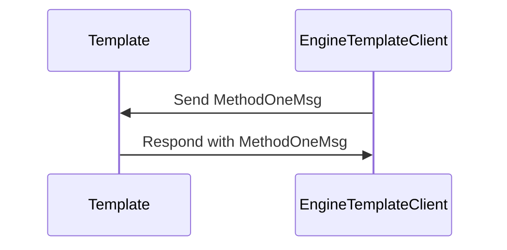

??? quote "Juvix imports"

    ```juvix
    module node_architecture.engines.template_messages;
    import prelude open;
    ```

# Template Messages

<!-- --8<-- [start:template-messages] -->

## Message interface

??? quote "Auxiliary Juvix code"

    ```juvix
    syntax alias MethodOneArgOne := Nat;
    syntax alias MethodOneArgTwo := Nat;
    syntax alias MethodOneArgThree := Nat;
    syntax alias MethodTwoArgOne := Nat;
    ```

<!-- --8<-- [start:TemplateMsg] -->
```juvix
type TemplateMsg :=
  | -- --8<-- [start:MethodOneMsg]
    MethodOneMsg {
      argOne : MethodOneArgOne;
      argTwo : MethodOneArgTwo;
      argThree : MethodOneArgThree;
    }
    -- --8<-- [end:MethodOneMsg]
  | -- --8<-- [start:MethodTwoMsg]
    MethodTwoMsg {
      argOne : MethodTwoArgOne;
    }
    -- --8<-- [end:MethodTwoMsg]
  ;
```
<!-- --8<-- [end:TemplateMsg] -->

### `MethodOneMsg`

!!! quote "MethodOneMsg"

    ```
    --8<-- "./template_messages.juvix.md:MethodOneMsg"
    ```

Lorem ipsum dolor sit amet, consectetur adipiscing elit.
The following is an example of a `MethodOneMsg`-message:

<!-- --8<-- [start:example-message-one] -->
```juvix extract-module-statements
module example-message-one;
  example_message_one : TemplateMsg := MethodOneMsg@{
    argOne := 1;
    argTwo := 2;
    argThree := 3;
  };
end;
```
<!-- --8<-- [end:example-message-one] -->

`argOne`
: Lorem ipsum dolor sit amet, consectetur adipiscing elit.

`argTwo`
: Lorem ipsum dolor sit amet, consectetur adipiscing elit.

`argThree`
: This is the last argument and here we actually
  can describe more detail about the property about `argOne`
  and `argThree` mentioned above.

### `MethodTwoMsg`

!!! quote "MethodTwoMsg"

    ```
    --8<-- "./template_messages.juvix.md:MethodTwoMsg"
    ```

Lorem ipsum dolor sit amet, consectetur adipiscing elit.
The following is an example of a `MethodTwoMsg` message:

<!-- --8<-- [start:message_two_example] -->
```juvix extract-module-statements
module message_two_example;
  example_message_two : TemplateMsg := MethodTwoMsg@{
    argOne := 1;
  };
end;
```
<!-- --8<-- [end:message_two_example] -->

`argOne`
: Lorem ipsum dolor sit amet, consectetur adipiscing elit.

## Message sequence diagrams

### [Title of message sequence diagram ⟨𝑖⟩]

Lorem ipsum dolor sit amet, consectetur adipiscing elit. Sed ut purus eget
sapien. Nulla facilisi.

<!-- --8<-- [start:message-sequence-diagram] -->
<figure markdown="span">



<figcaption markdown="span">
Lorem ipsum dolor sit amet, consectetur adipiscing elit.
</figcaption>
</figure>
<!-- --8<-- [end:message-sequence-diagram] -->

<!-- --8<-- [end:template-messages] -->
