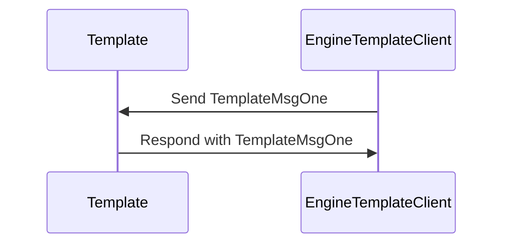

??? info "Juvix preamble"

    ```juvix
    module node_architecture.engines.template_overview;
    import prelude open;
    ```

# Engine Overview

Lorem ipsum dolor sit amet, consectetur adipiscing elit. Sed ut purus eget sapien. Nulla facilisi.

# `Template` Engine Family

## Purpose

Lorem ipsum dolor sit amet, consectetur adipiscing elit. Sed ut purus eget sapien. Nulla facilisi.

## Message interface

??? note "Auxiliary Juvix code"

    ```juvix
    syntax alias MethodOneArgOne := Nat;
    syntax alias MethodOneArgTwo := Nat;
    syntax alias MethodOneArgThree := Nat;
    syntax alias MethodTwoArgOne := Nat;
    ```

<!-- --8<-- [start:TemplateMsg] -->
```juvix
type TemplateMsg :=
  | -- --8<-- [start:TemplateMsgOne]
    TemplateMsgOne {
      argOne : MethodOneArgOne;
      argTwo : MethodOneArgTwo;
      argThree : MethodOneArgThree
  }
    -- --8<-- [end:TemplateMsgOne]
  | -- --8<-- [start:TemplateMsgTwo]
    TemplateMsgTwo {
      argOne : MethodTwoArgOne
  }
    -- --8<-- [end:TemplateMsgTwo]
  ;
```
<!-- --8<-- [end:TemplateMsg] -->

### `TemplateMsgOne` message


!!! quote "TemplateMsgOne"

    ```
    --8<-- "./template_overview.juvix.md:TemplateMsgOne"
    ```

Lorem ipsum dolor sit amet, consectetur adipiscing elit.
The following is an example of a `TemplateMsgOne`-message:

<!-- --8<-- [start:message_one_example] -->
```juvix extract-module-statements
module message_one_example;
  example_message_one : TemplateMsg := TemplateMsgOne@{
    argOne := 1;
    argTwo := 2;
    argThree := 3
    };
end;
```
<!-- --8<-- [end:message_one_example] -->

`argOne`

: Lorem ipsum dolor sit amet, consectetur adipiscing elit.

`argTwo`

: Lorem ipsum dolor sit amet, consectetur adipiscing elit.

`argThree`

: This is the last argument and here we actually
  can describe more detail about the property about `argOne`
  and `argThree` mentioned above.

### `TemplateMsgTwo` message

!!! quote "TemplateMsgTwo"

    ```
    --8<-- "./template_overview.juvix.md:TemplateMsgTwo"
    ```

Lorem ipsum dolor sit amet, consectetur adipiscing elit.
The following is an example of a `TemplateMsgTwo`-message:

<!-- --8<-- [start:message_two_example] -->
```juvix extract-module-statements
module message_two_example;
  example_message_two : TemplateMsg := TemplateMsgTwo@{
    argOne := 1
    };
end;
```
<!-- --8<-- [end:message_two_example] -->

`argOne`

: Lorem ipsum dolor sit amet, consectetur adipiscing elit.


## Message sequence diagrams

### [Title of message sequence diagram ⟨𝑖⟩]

Lorem ipsum dolor sit amet, consectetur adipiscing elit. Sed ut purus eget
sapien. Nulla facilisi.

<!-- --8<-- [start:message-sequence-diagram] -->
<figure markdown="span">



<figcaption markdown="span">
Lorem ipsum dolor sit amet, consectetur adipiscing elit.
</figcaption>
</figure>
<!-- --8<-- [end:message-sequence-diagram] -->

## Engine Components

??? note "[[template_environment|Template Engine Environment]]"
    
    Source code: [[template_environment|`template_environment.juvix.md`]]

    --8<-- "./docs/node_architecture/engines/template_environment.juvix.md!"

??? note "[[template_dynamics|Template Engine Dynamics]]"
    
    Source code: [[template_dynamics|`template_dynamics.juvix.md`]]

    --8<-- "./docs/node_architecture/engines/template_dynamics.juvix.md!"

## Useful links

Lorem ipsum dolor sit amet, consectetur adipiscing elit. Sed ut purus eget sapien. Nulla facilisi.