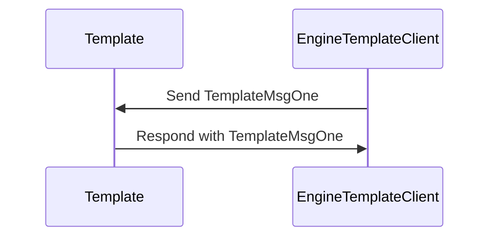
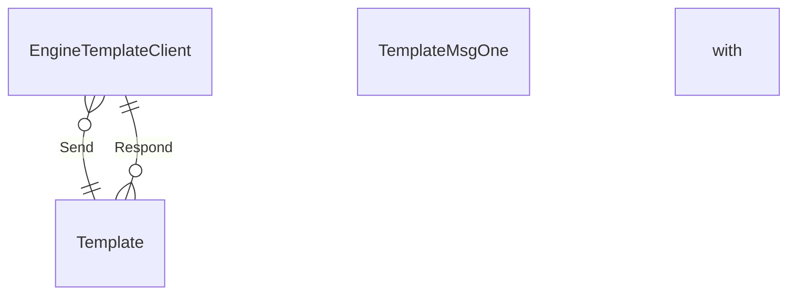

??? info "Juvix preamble"

    ```juvix
    module node_architecture.engines.template_overview;
    import prelude open;
    ```

# Engine Overview

Lorem ipsum dolor sit amet, consectetur adipiscing elit. Sed ut purus eget sapien. Nulla facilisi.

# `Template` Engine Family  

## Purpose  

Lorem ipsum dolor sit amet, consectetur adipiscing elit. Sed ut purus eget sapien. Nulla facilisi.

## Message interface

??? note "Auxiliary Juvix code"

    ```juvix
    syntax alias MethodOneArgOne := Nat;
    syntax alias MethodOneArgTwo := Nat;
    syntax alias MethodOneArgThree := Nat;
    syntax alias MethodTwoArgOne := Nat;
    ```

<!-- --8<-- [start:TemplateMsg] -->
```juvix
type TemplateMsg :=
  | -- --8<-- [start:TemplateMsgOne]
    TemplateMsgOne {
      argOneOne : MethodOneArgOne;
      argTwo : MethodOneArgTwo;
      argThree : MethodOneArgThree
  }
    -- --8<-- [end:TemplateMsgOne]
  | TemplateMsgTwo {
      argOne : MethodTwoArgOne
  }
  ;
```
<!-- --8<-- [end:TemplateMsg] -->

### `TemplateMsgOne`

If an `Template`-engine receives a `TemplateMsgOne`-message,
it will store three values, one for each argument. 

`argOneOne`

: Lorem ipsum dolor sit amet, consectetur adipiscing elit.

`argTwo`

: Lorem ipsum dolor sit amet, consectetur adipiscing elit.

argThree

: This is the last argument and here we actually
  can describe more detail about the property about `argOne`
  and `argThree` mentioned above

### `TemplateMsgTwo`

Lorem ipsum dolor sit amet, consectetur adipiscing elit.

#### Example of a `Template`-message

The following is an example of a `TemplateMsgOne`-message:

<!-- --8<-- [start:message_one_example] -->
```juvix extract-module-statements 1
module message_one_example;
  example_message_one : TemplateMsg := TemplateMsgOne@{
    argOneOne := 1;
    argTwo := 2;
    argThree := 3
    };
end;
```
<!-- --8<-- [end:message_one_example] -->


## Message sequence diagrams  

### [Title of message sequence diagram ⟨𝑖⟩]  

Lorem ipsum dolor sit amet, consectetur adipiscing elit. Sed ut purus eget
sapien. Nulla facilisi.


<figure markdown="span">



<figcaption markdown="span">
Lorem ipsum dolor sit amet, consectetur adipiscing elit.
</figcaption>
</figure>

## Conversation-partner Diagram

<figure markdown="span">



<figcaption markdown="span">
Lorem ipsum dolor sit amet, consectetur adipiscing elit.
</figcaption>
</figure>


## Engine Components  

??? note [[Template Engine Environment|Engine environment]]  

     
   --8< "./docs/node_architecture/engines/template_environment.juvix.md"

??? note [[Template Engine Dynamics|Engine dynamics]]  

   --8< "./docs/node_architecture/engines/template_dynamics.juvix.md"

## Useful links

Lorem ipsum dolor sit amet, consectetur adipiscing elit. Sed ut purus eget sapien. Nulla facilisi.