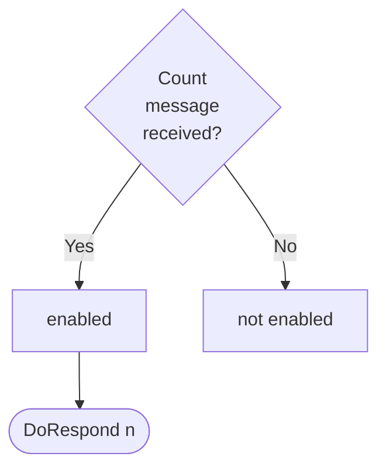

Source code: [[ticker_dynamics|`./docs/node_architecture/engines/ticker_dynamics.juvix.md`]]

??? note "Juvix preamble"

    ```juvix
    module node_architecture.engines.ticker_dynamics;

    import node_architecture.basics open;
    import node_architecture.types.engine_family open;
    import node_architecture.engines.ticker_overview open;
    import node_architecture.engines.ticker_environment open public;
    import node_architecture.types.engine_dynamics open;
    ```

# `Ticker` Dynamics

## Overview

The Ticker engine maintains a counter as local state and allows two actions:
incrementing the counter and sending the current counter value.

## Action labels

<!-- --8<-- [start:ticker-action-label] -->
```juvix
type TickerActionLabel :=
| -- --8<-- [start:DoIncrement]
DoIncrement
-- --8<-- [end:DoIncrement]
| -- --8<-- [start:DoRespond]
DoRespond Nat
-- --8<-- [end:DoRespond]
;
```
<!-- --8<-- [end:ticker-action-label] -->

### `DoIncrement`

!!! quote ""

    --8<-- "./ticker_dynamics.juvix.md:DoIncrement"

This action label corresponds to incrementing the counter and is relevant for the `Increment` message.

??? quote "`DoIncrement` action effect"

    This action does the following:

    | Aspect | Description |
    |--------|-------------|
    | State update          | The counter value is increased by one. |
    | Messages to be sent   | No messages are added to the send queue. |
    | Engines to be spawned | No engine is created by this action. |
    | Timer updates         | No timers are set or cancelled. |

### `DoRespond`

!!! quote ""

    --8<-- "./ticker_dynamics.juvix.md:DoRespond"

This action label corresponds to responding with the current counter value and is relevant for the `Count` message.

??? quote "`DoRespond` action effect"

    This action does the following:

    | Aspect | Description |
    |--------|-------------|
    | State update          | The state remains unchanged. |
    | Messages to be sent   | A message with the current counter value is sent to the requester. |
    | Engines to be spawned | No engine is created by this action. |
    | Timer updates         | No timers are set or cancelled. |

## Matchable arguments

<!-- --8<-- [start:ticker-matchable-argument] -->

```juvix
type TickerMatchableArgument :=
  | -- --8<-- [start:ReplyTo]
  ReplyTo (Maybe Address) (Maybe MailboxID)
  -- --8<-- [end:ReplyTo]
;
```
<!-- --8<-- [end:ticker-matchable-argument] -->

### `ReplyTo`

!!! quote ""

    ```
    --8<-- "./ticker_dynamics.juvix.md:ReplyTo"
    ```

This matchable argument contains the address and mailbox ID of where the response message should be sent.

## Precomputation results

The Ticker engine does not require any non-trivial pre-computations.

<!-- --8<-- [start:ticker-precomputation-entry] -->
```juvix
type TickerPrecomputationEntry := Unit;
TickerPrecomputation : Type := List TickerPrecomputationEntry;
```
<!-- --8<-- [end:ticker-precomputation-entry] -->

## Guards

??? note "Auxiliary Juvix code"

    Type alias for the guard.

    ```juvix
    TickerGuard : Type :=
      Guard
        TickerLocalState
        TickerMsg
        TickerTimerHandle
        TickerMailboxState
        TickerMatchableArgument
        TickerActionLabel
        TickerPrecomputation
    ```

### `IncrementGuard`

<figure markdown>


<figcaption>IncrementGuard flowchart</figcaption>
</figure>

<!-- --8<-- [start:increment-guard] -->
```
incrementGuard : TickerGuard
  | (MessageArrived@{ envelope := m}) :=
    case getMessageType m of {
      | Increment := just (
        mkGuardOutput@{
          args := [];
          label := DoIncrement;
          other := []
        }
      )
  | := nothing
  }
  | (Elapsed@{ timers := ts }) := nothing
;
```
<!-- --8<-- [end:increment-guard] -->

### `CountGuard`

<figure markdown>


<figcaption>CountGuard flowchart</figcaption>
</figure>

<!-- --8<-- [start:count-guard] -->
```
countGuard : TickerGuard
  | (MessageArrived@{ envelope := m }) :=
    case getMessageType m of {
      | Count := just (
          mkGuardOutput@{
          args := [ReplyTo (getMessageSender m) nothing];
          label := DoRespond 0; -- The actual value will be set in the action
          other := []
        }
      )
    | := nothing
    }
    | (Elapsed@{ timers := ts }) := nothing
;
```
<!-- --8<-- [end:count-guard] -->

## Action function

??? info "Auxiliary Juvix code"

    Type alias for the action function.

    ```juvix
    TickerActionFunction : Type :=
      ActionFunction
          TickerLocalState
          TickerMsg
          TickerMailboxState
          TickerTimerHandle
          TickerMatchableArgument
          TickerActionLabel
          TickerPrecomputation;
    ```
<!-- --8<-- [start:action-function] -->
```
action : TickerActionFunction
    | mkActionInput@{
        guardOutput := out;
        env := env
    } := case GuardOutput.label out of {
          | DoIncrement :=
              let counterValue := LocalStateType.counter (localState env)
              in mkActionEffect@{
                    newEnv := env@EngineEnvironment{
                        localState := mkLocalStateType@{
                          counter := counterValue + 1
                        }
                    };
                    producedMessages := [];
                    timers := [];
                    spawnedEngines := [];
                }
          | DoRespond :=
              let counterValue := LocalStateType.counter (localState env);
              replyTo := case GuardOutput.args out of {
                | [ReplyTo addr mbx] := Left addr
                | := Right 0 -- No address
      }
      in mkActionEffect@{
        newEnv := env;
        producedMessages := [
          mkEnvelopedMessage@{
            packet := mkMessagePacket@{
              target := replyTo;
              message := mkMessage@{
                messageType := Result counterValue;
                payload := natToString counterValue
              }
            };
      sender := name env
    }
  ];
  timers := [];
  spawnedEngines := [];
}
};
```
<!-- --8<-- [end:action-function] -->

<!-- --8<-- [start:ticker-engine-family] -->
```
TickerEngineFamily : Type :=
  EngineFamily
    TickerLocalState
    TickerMsg
    TickerMailboxState
    TickerTimerHandle
    TickerMatchableArgument
    TickerActionLabel
    TickerPrecomputation
;
```
<!-- --8<-- [end:ticker-engine-family] -->

