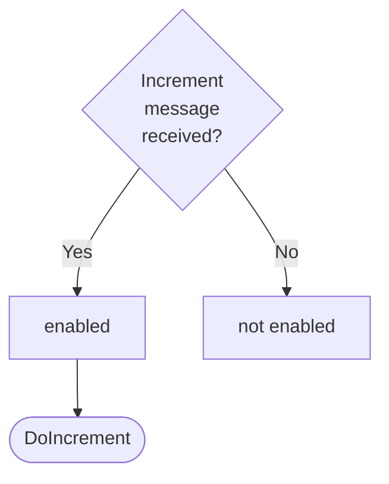
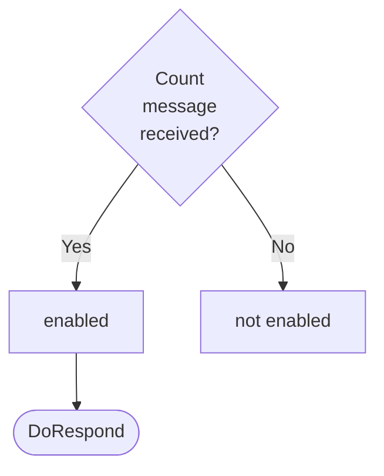

Source code: [[ticker_dynamics|`./docs/node_architecture/engines/ticker_dynamics.juvix.md`]]

??? note "Juvix preamble"

    ```juvix
    module node_architecture.engines.ticker_dynamics;

    import node_architecture.basics open;
    import node_architecture.types.engine_family open;
    import node_architecture.engines.ticker_overview open;
    import node_architecture.engines.ticker_environment open;
    import node_architecture.types.engine_environment open;
    import node_architecture.types.engine_dynamics open;
    import node_architecture.types.anoma_message open;
    ```

??? quote "Auxiliary Juvix code"

    ```juvix
    import Stdlib.Data.Fixity open;

    trait
    type Applicative (f : Type -> Type) :=
      mkApplicative {
        {{ApplicativeFunctor}} : Functor f;
        pure : {A : Type} -> A -> f A;
        ap : {A B : Type} -> f (A -> B) -> f A -> f B
      };

    trait
    type Monad (f : Type -> Type) :=
      mkMonad {
        {{MonadApplicative}} : Applicative f;

        builtin monad-bind
        bind : {A B : Type} -> f A -> (A -> f B) -> f B
      };

    open Functor;
    open Applicative;
    open Monad;

    syntax operator >>= seq;
    >>= {A B} {f : Type -> Type} {{Monad f}} (x : f A) (g : A -> f B) : f B := bind x g;

    monadMap {A B} {f : Type -> Type} {{Monad f}} (g : A -> B) (x : f A) : f B := map g x;


    instance
    maybeApplicative : Applicative Maybe :=
      mkApplicative@{
        pure := just;
        ap {A B} : Maybe (A -> B) -> Maybe A -> Maybe B
          | (just f) (just x) := just (f x)
          | _ _ := nothing
      };

    instance
    maybeMonad : Monad Maybe :=
      mkMonad@{
        bind {A B} : Maybe A -> (A -> Maybe B) -> Maybe B
          | nothing _ := nothing
          | (just a) f := f a
      };
    ```


# `Ticker` Dynamics

## Overview

The Ticker engine maintains a counter as local state and allows two actions:
incrementing the counter and sending the current counter value.

## Action labels

<!-- --8<-- [start:ticker-action-label] -->
```juvix
type TickerActionLabel :=
  | -- --8<-- [start:DoIncrement]
    DoIncrement
    -- --8<-- [end:DoIncrement]
  | -- --8<-- [start:DoRespond]
    DoRespond
    -- --8<-- [end:DoRespond]
;
```
<!-- --8<-- [end:ticker-action-label] -->

### `DoIncrement`

!!! quote ""

    --8<-- "./ticker_dynamics.juvix.md:DoIncrement"

This action label corresponds to incrementing the counter and is relevant for the `Increment` message.

??? quote "`DoIncrement` action effect"

    This action does the following:

    | Aspect | Description |
    |--------|-------------|
    | State update          | The counter value is increased by one. |
    | Messages to be sent   | No messages are added to the send queue. |
    | Engines to be spawned | No engine is created by this action. |
    | Timer updates         | No timers are set or cancelled. |

### `DoRespond`

!!! quote ""

    --8<-- "./ticker_dynamics.juvix.md:DoRespond"

This action label corresponds to responding with the current counter value and
is relevant for the `Count` message.

??? quote "`DoRespond` action effect"

    This action does the following:

    | Aspect | Description |
    |--------|-------------|
    | State update          | The state remains unchanged. |
    | Messages to be sent   | A message with the current counter value is sent to the requester. |
    | Engines to be spawned | No engine is created by this action. |
    | Timer updates         | No timers are set or cancelled. |

## Matchable arguments

<!-- --8<-- [start:ticker-matchable-argument] -->

```juvix
type TickerMatchableArgument :=
  | -- --8<-- [start:ReplyTo]
  ReplyTo (Maybe Address) (Maybe MailboxID)
  -- --8<-- [end:ReplyTo]
;
```
<!-- --8<-- [end:ticker-matchable-argument] -->

### `ReplyTo`

!!! quote ""

    ```
    --8<-- "./ticker_dynamics.juvix.md:ReplyTo"
    ```

This matchable argument contains the address and mailbox ID of where the response message should be sent.

## Precomputation results

The Ticker engine does not require any non-trivial pre-computations.

<!-- --8<-- [start:ticker-precomputation-entry] -->
```juvix
syntax alias TickerPrecomputation := Unit;
```
<!-- --8<-- [end:ticker-precomputation-entry] -->

## Guards

??? note "Auxiliary Juvix code"

    Type alias for the guard.

    ```juvix
    TickerGuard : Type :=
      Guard
        TickerLocalState
        TickerMsg
        TickerTimerHandle
        TickerMailboxState
        TickerMatchableArgument
        TickerActionLabel
        TickerPrecomputation;

    TickerGuardOutput : Type := 
      GuardOutput TickerMatchableArgument TickerActionLabel TickerPrecomputation;
    ```


### `incrementGuard`

<figure markdown>


<figcaption>incrementGuard flowchart</figcaption>
</figure>

<!-- --8<-- [start:increment-guard] -->
```juvix
incrementGuard 
  (t : TimestampedTrigger TickerMsg TickerTimerHandle ) 
  (env : TickerEnvironment) : Maybe TickerGuardOutput
  := case getMessageFromTimestampedTrigger t of {
      | just Increment := just (
        mkGuardOutput@{
          args := [];
          label := DoIncrement;
          other := unit
        })
      | _ := nothing
  };
```
<!-- --8<-- [end:increment-guard] -->

### `countGuard`

<figure markdown>


<figcaption>countGuard flowchart</figcaption>
</figure>

<!-- --8<-- [start:count-guard] -->
```juvix
countGuard
  (t : TimestampedTrigger TickerMsg TickerTimerHandle) 
  (env : TickerEnvironment) : Maybe TickerGuardOutput
  := case getMessageFromTimestampedTrigger t of {
      | just Count := do {
        sender <- getMessageSenderFromTimestampedTrigger t;
        pure (mkGuardOutput@{
                  args := [ReplyTo (just sender) nothing] ;
                  label := DoRespond;
                  other := unit
                });
      }
    | _ := nothing
  };
```
<!-- --8<-- [end:count-guard] -->

## Action function

??? info "Auxiliary Juvix code"

    Type alias for the action function.

    ```juvix
    TickerActionFunction : Type :=
      ActionFunction
        TickerLocalState
        TickerMsg
        TickerMailboxState
        TickerTimerHandle
        TickerMatchableArgument
        TickerActionLabel
        TickerPrecomputation;
    TickerActionInput : Type :=
      ActionInput 
        TickerLocalState
        TickerMsg
        TickerMailboxState
        TickerTimerHandle
        TickerMatchableArgument
        TickerActionLabel
        TickerPrecomputation;

    TickerActionEffect : Type :=
      ActionEffect
        TickerLocalState
        TickerMsg
        TickerMailboxState
        TickerTimerHandle
        TickerMatchableArgument
        TickerActionLabel
        TickerPrecomputation;
    ```

<!-- --8<-- [start:action-function] -->
```juvix
tickerAction (input : TickerActionInput) : TickerActionEffect
  := let env := ActionInput.env input;
         out := (ActionInput.guardOutput input);
  in 
  case GuardOutput.label out of {
          | DoIncrement :=
              let counterValue := TickerLocalState.counter (EngineEnvironment.localState env)
              in mkActionEffect@{
                newEnv := env@EngineEnvironment{
                  localState := mkTickerLocalState@{
                    counter := counterValue + 1
                  }
                };
              producedMessages := [];
              timers := [];
              spawnedEngines := [];
              }
          | DoRespond :=
            let counterValue := TickerLocalState.counter  (EngineEnvironment.localState env)
            in 
            case GuardOutput.args out of {              
              | (ReplyTo (just whoAsked) mailbox) :: _ := 
                  mkActionEffect@{
                    newEnv := env;
                    producedMessages := [
                      mkEnvelopedMessage@{
                        sender := undef;
                        {- TODO
                        getMessageTargetFromTimestampedTrigger
                         {M := TickerMsg}
                         {H := TickerTimerHandle}
                        (ActionInput.timestampedTrigger input);
                        -}
                        packet := mkMessagePacket@{
                          target := whoAsked;
                          mailbox := just 0;
                          message := MsgTicker Count
                        }
                      }
                    ];
                    timers := [];
                    spawnedEngines := []
                  }
              | _ := mkActionEffect@{newEnv := env; producedMessages := []; timers := []; spawnedEngines := [] }
            }
    };
```
<!-- --8<-- [end:action-function] -->
