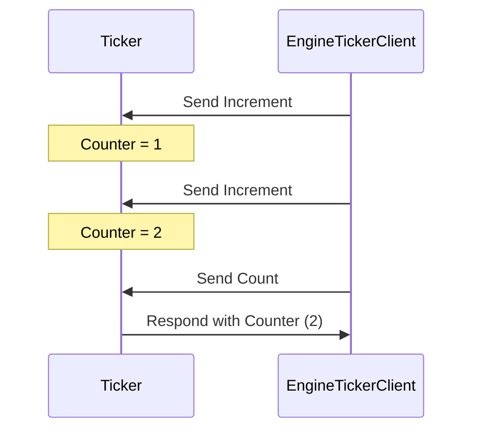
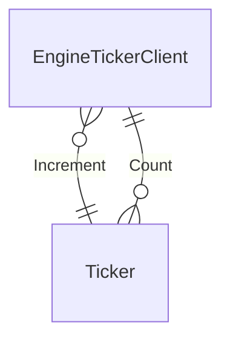

!!! warning

    This page is still under construction, needs to be updated with the latest
    changes in the engine family type.

??? info "Juvix imports"

    ```juvix
    module node_architecture.engines.ticker_overview;
    import node_architecture.basics open;
    ```

# Ticker Family Engine

## Purpose

A ticker engine, part of the `Ticker` engine family, maintains a counter in its
local state. This engine increases the counter whenever it gets a `Increment` message
and provides the updated result upon receiving a `Count` message. The initial
state initialises the counter.

## Message interface

```juvix
type TickerMsg := Increment | Count;
```

### Increment

An `Increment` message instructs the engine to increase the counter.

### Count

A `Count` message requests the engine to send
the current counter value back to the requester.

## Engine Components

??? quote "Engine Environment"

    Source: [[Ticker Engine Environment]]

    ---8<--- "node_architecture/engines/ticker_environment.juvix.md"

??? quote "Engine Dynamics"

    Source: [[Ticker Engine Dynamics]]

    ---8<--- "node_architecture/engines/ticker_dynamics.juvix.md"

## Interaction Diagrams

The figure below represents a simple interaction between two engine instances, a
`Ticker` engine instance and another entity sending increment requests and count
requests:

<figure markdown="span">



<figcaption markdown="span">
A client interacts with the `Ticker` engine, which increments and responds with the counter value.
</figcaption>
</figure>

## Conversation-partner Diagram

<figure markdown="span">



<figcaption markdown="span">
The conversation-partner diagram shows the interactions between the `Ticker` engine and a client.
</figcaption>

</figure>
