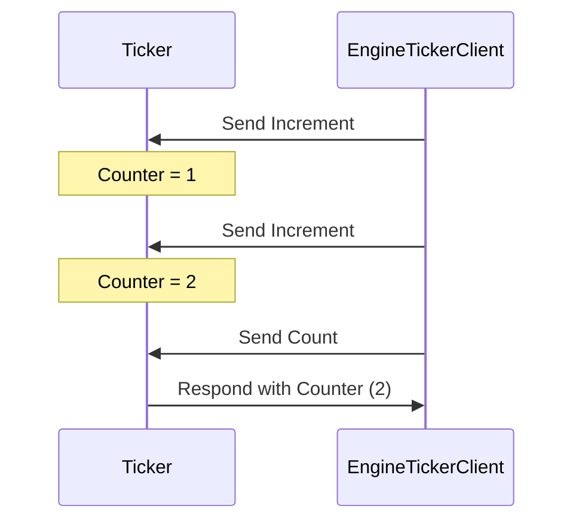

??? quote "Juvix imports"

    ```juvix
    module node_architecture.engines.ticker_overview;
    ```

# `Ticker` Engine Family Overview

--8<-- "./docs/node_architecture/engines/ticker.juvix.md:ticker-engine-family"

The Ticker engine family provides a simple counter functionality, allowing
clients to increment a counter and retrieve its current value.

## Purpose

A ticker engine maintains a counter in its local state. It increases the counter
when it receives an `Increment` message and provides the updated result upon
receiving a `Count` message. The initial state initializes the counter.

## Message interface

<!-- --8<-- [start:TickerMsg] -->
```juvix
type TickerMsg :=
    | -- --8<-- [start:Increment]
    Increment
    -- --8<-- [end:Increment]
    | -- --8<-- [start:Count]
    Count
    -- --8<-- [end:Count]
```
<!-- --8<-- [end:TickerMsg] -->


There are only two message tags: `Increment`, which increases the counter state
of the ticker, and `Count`, which the ticker responds to with the current
counter state.

### `Increment` message

!!! quote "Increment"

    ```
    --8<-- "./ticker_overview.juvix.md:Increment"
    ```

An `Increment` message instructs the engine to increase the counter. This
message doesn't require any arguments.

### `Count` message

!!! quote "Count"

    ```
    --8<-- "./ticker_overview.juvix.md:Count"
    ```

A `Count` message requests the engine to send the current counter value back to
the requester. This message doesn't require any arguments.

## Message sequence diagrams

### Ticker Interaction Diagram

This diagram represents a simple interaction between a `Ticker` engine instance
and another entity sending increment requests and count requests.

<!-- --8<-- [start:message-sequence-diagram] -->
<figure markdown="span">



<figcaption markdown="span">
A client interacts with the `Ticker` engine, which increments and responds with the counter value.
</figcaption>
</figure>

## Engine Components

- [[Ticker Engine Environment|`Ticker` Engine Environment]]
- [[Ticker Engine Dynamics|`Ticker` Engine Dynamics]]

## Useful links

- [Composable Semantic Models for Actor Theories](https://citeseerx.ist.psu.edu/document?repid=rep1&type=pdf&doi=18475015c7c46d38292833ddda32dc88b5655160)