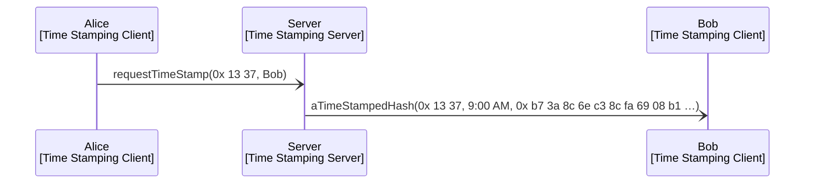

--- 
icon: octicons/gear-16
search:
  exclude: false
categories:
- engine-family 
tags:
- tutorial
- engine-overview
---

# Time Stamping Server Engine Family 

## Purpose 

Members of the time stamping server engine family<!---
--->—called _time stampers_ for short—<!---
--->offer a service for stamping and signing hashes.
More specifically, 
clients can submit signing requests for hashes
and time stampers will serve these by 
first pairing the submitted hash with a local time stamp
and then signing the pair of the time stamp and the hash;
finally, 
the result is sent to a "reply-to" address,
which is part of the client's request. 

## Message sequence diagrams 

### Time stamping a hash

Assume that Alice and Bob run time stamping clients
and there is a publicly known time stamper,
which we just call the server.
Alice sends a time stamping request to the server,
which then sends the time stamped hash to Bob,
as Alice has specified Bob as the receiver of the time stamped hash.

## Engine Components 

??? note [[Time Stamping Server Engine Environment|Engine environment]] 

    
   --8< "./docs/node_architecture/engines/time_stamping_server_environment.juvix.md"

??? note [[Time Stamping Server Engine Dynamics|Engine dynamics]] 

   --8< "./docs/node_architecture/engines/time_stamping_server_dynamics.juvix.md"
