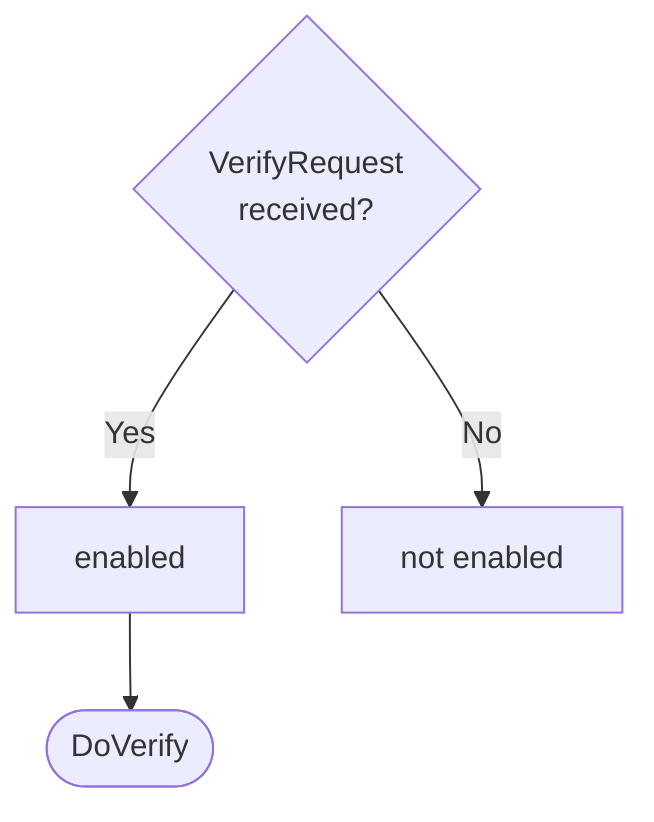

??? note "Juvix preamble"

    ```juvix
    module node_architecture.engines.verification_dynamics;

    import prelude open;
    import node_architecture.basics open;
    import node_architecture.types.engine_dynamics open;
    import node_architecture.types.engine_environment open;
    import node_architecture.engines.verification_environment open;
    import node_architecture.engines.verification_overview open;
    import node_architecture.types.identity_types open;
    import node_architecture.types.anoma_message as Anoma;
    ```

# `Verification` Dynamics

## Overview

The dynamics of the Verification Engine define how it processes incoming verification requests and produces the corresponding responses.

## Action labels

<!-- --8<-- [start:verification-action-label] -->
```juvix
type VerificationActionLabel :=
  | -- --8<-- [start:DoVerify]
    DoVerify VerificationMsg
    -- --8<-- [end:DoVerify]
;
```
<!-- --8<-- [end:verification-action-label] -->

### `DoVerify`

!!! quote ""

    --8<-- "./verification_dynamics.juvix.md:DoVerify"

This action label corresponds to verifying a commitment.

??? quote "`DoVerify` action effect"

    This action does the following:

    | Aspect | Description |
    |--------|-------------|
    | State update          | The state remains unchanged (stateless engine). |
    | Messages to be sent   | A `VerifyResponse` message is sent back to the requester. |
    | Engines to be spawned | No engine is created by this action. |
    | Timer updates         | No timers are set or cancelled. |

## Matchable arguments

<!-- --8<-- [start:verification-matchable-argument] -->
```juvix
type VerificationMatchableArgument :=
  | -- --8<-- [start:ArgVerify]
    ArgVerify VerificationMsg
    -- --8<-- [end:ArgVerify]
;
```
<!-- --8<-- [end:verification-matchable-argument] -->

### `ArgVerify`

!!! quote ""

    ```
    --8<-- "./verification_dynamics.juvix.md:ArgVerify"
    ```

This matchable argument contains the verification request data.

## Precomputation results

The Verification Engine does not require any non-trivial pre-computations.

<!-- --8<-- [start:verification-precomputation-entry] -->
```juvix
syntax alias VerificationPrecomputation := Unit;
```
<!-- --8<-- [end:verification-precomputation-entry] -->

## Guards

??? quote "Auxiliary Juvix code"

    Type alias for the guard.

    ```juvix
    VerificationGuard : Type :=
      Guard
        VerificationLocalState
        VerificationMsg
        VerificationMailboxState
        VerificationTimerHandle
        VerificationMatchableArgument
        VerificationActionLabel
        VerificationPrecomputation;
    ```

### `verifyGuard`

<figure markdown>

<figcaption>verifyGuard flowchart</figcaption>
</figure>

<!-- --8<-- [start:verify-guard] -->
```juvix
verifyGuard
  (t : TimestampedTrigger VerificationMsg VerificationTimerHandle)
  (env : VerificationEnvironment) : Maybe (GuardOutput VerificationMatchableArgument VerificationActionLabel VerificationPrecomputation)
  := case getMessageFromTimestampedTrigger t of {
      | just (VerifyRequest x y z w) := just (
        mkGuardOutput@{
          args := [ArgVerify (VerifyRequest x y z w)];
          label := DoVerify (VerifyRequest x y z w);
          other := unit
        })
      | _ := nothing
  };
```
<!-- --8<-- [end:verify-guard] -->

## Action function

??? quote "Auxiliary Juvix code"

    Type alias for the action function.

    ```juvix
    VerificationActionInput : Type :=
      ActionInput
        VerificationLocalState
        VerificationMsg
        VerificationMailboxState
        VerificationTimerHandle
        VerificationMatchableArgument
        VerificationActionLabel
        VerificationPrecomputation;

    VerificationActionEffect : Type :=
      ActionEffect
        VerificationLocalState
        VerificationMsg
        VerificationMailboxState
        VerificationTimerHandle
        VerificationMatchableArgument
        VerificationActionLabel
        VerificationPrecomputation;
    ```

<!-- --8<-- [start:action-function] -->
```juvix
-- Not yet implemented
axiom verifyCommitment : ExternalIdentity -> Commitment -> ByteString -> Bool;
axiom resolveSignsFor : ExternalIdentity -> ExternalIdentity;

axiom dummyActionEffect : VerificationActionEffect;

verificationAction (input : VerificationActionInput) : VerificationActionEffect :=
  let env := ActionInput.env input;
      out := ActionInput.guardOutput input;
  in
  case GuardOutput.label out of {
    | DoVerify (VerifyRequest commitment data externalIdentity useSignsFor) := let
        finalIdentity := case useSignsFor of {
          | true := resolveSignsFor externalIdentity
          | false := externalIdentity
        };
        isValid := verifyCommitment finalIdentity commitment data;
        responseMsgVer := VerifyResponse@{
          result := isValid;
          error := nothing
        };
        senderVer := getMessageSenderFromTimestampedTrigger (ActionInput.timestampedTrigger input);
        targetVer := case senderVer of {
          | just s := s
          | nothing := Left "unknown"
        };
      in mkActionEffect@{
        newEnv := env; -- No state change
        producedMessages := [mkEnvelopedMessage@{
          sender := just (EngineEnvironment.name env);
          packet := mkMessagePacket@{
            target := targetVer;
            mailbox := nothing;
            message := Anoma.MsgVerification responseMsgVer
          }
        }];
        timers := [];
        spawnedEngines := []
      }
    | _ := dummyActionEffect
  };
```
<!-- --8<-- [end:action-function] -->

## Conflict solver

```juvix
verificationConflictSolver : Set VerificationMatchableArgument -> List (Set VerificationMatchableArgument)
  | _ := [];
```

## `Verification` Engine Summary

--8<-- "./docs/node_architecture/engines/verification.juvix.md:verification-engine-family"
