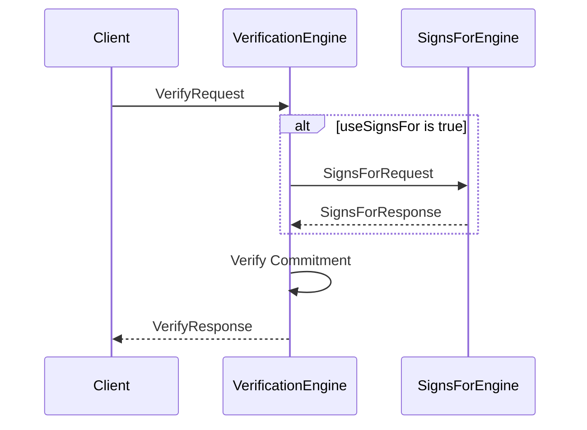

??? quote "Juvix imports"

    ```juvix
    module node_architecture.engines.verification_overview;
    import prelude open;
    import node_architecture.types.identity_types open;
    ```

# `Verification` Engine Family Overview

--8<-- "./docs/node_architecture/engines/verification.juvix.md:verification-engine-family"

The Verification Engine is responsible for verifying commitments (signatures) made by external identities. It automatically uses "signs_for" relationship information from the Signs For Engine along with caller preference information to determine how to verify a commitment.

## Purpose

The Verification Engine verifies commitments (signatures) made by external identities. It can use "signs_for" relationship information and caller preferences to determine how to verify a commitment. This engine is designed to be stateless, allowing for efficient implementation by the runtime.

## Message interface

<!-- --8<-- [start:VerificationMsg] -->
```juvix
type VerificationMsg :=
  | -- --8<-- [start:VerifyRequest]
    VerifyRequest {
      commitment : Commitment;
      data : ByteString;
      externalIdentity : ExternalIdentity;
      useSignsFor : Bool
    }
    -- --8<-- [end:VerifyRequest]
  | -- --8<-- [start:VerifyResponse]
    VerifyResponse {
      result : Bool;
      error : Maybe String
    }
    -- --8<-- [end:VerifyResponse]
  ;
```
<!-- --8<-- [end:VerificationMsg] -->

### `VerifyRequest` message

!!! quote "VerifyRequest"

    ```
    --8<-- "./verification_overview.juvix.md:VerifyRequest"
    ```

A `VerifyRequest` instructs the Verification Engine to verify a commitment (signature) from a particular external identity, possibly using known signs_for relationships.

- `commitment`: The commitment (signature) to verify.
- `data`: The data that was signed.
- `externalIdentity`: The external identity that supposedly made the commitment.
- `useSignsFor`: Whether or not to use known `signs_for` relationships.

### `VerifyResponse` message

!!! quote "VerifyResponse"

    ```
    --8<-- "./verification_overview.juvix.md:VerifyResponse"
    ```

A `VerifyResponse` contains the result of verifying a commitment in response to a VerifyRequest.

- `result`: True if the verification succeeded, False otherwise.
- `error`: An error message if verification failed.

## Message sequence diagrams

### Verification Sequence

<!-- --8<-- [start:message-sequence-diagram] -->
<figure markdown="span">



<figcaption markdown="span">
Sequence diagram for verification.
</figcaption>
</figure>
<!-- --8<-- [end:message-sequence-diagram] -->

## Engine Components

- [[verification_environment|`Verification` Engine Environment]]
- [[verification_dynamics|`Verification` Engine Dynamics]]

## Useful links

