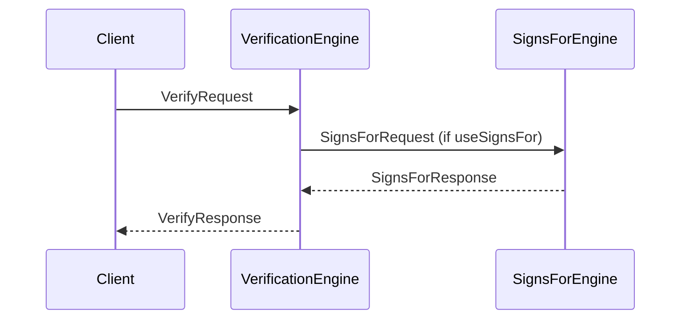

??? quote "Juvix imports"

    ```juvix
    module node_architecture.engines.verification_overview;
    import prelude open;
    import node_architecture.types.identity_types open;
    ```

# Verification Engine Family Overview

## Purpose

The **Verification Engine** is responsible for verifying commitments (signatures) made by external identities. It automatically uses "signs_for" relationship information from the **Signs For Engine** along with caller preference information to determine how to verify a commitment.

The Verification Engine is a stateless function, and calls to it do not need to be ordered. The runtime should implement this intelligently for efficiency.

## Message Interface

The Verification Engine communicates using the following messages:

- `VerifyRequest` and `VerifyResponse`

### `VerifyRequest` and `VerifyResponse`

#### `VerifyRequest`

```juvix
type VerifyRequest := mkVerifyRequest {
  commitment : Commitment;
  data : ByteString;
  externalIdentity : ExternalIdentity;
  useSignsFor : Bool;
};
```

A `VerifyRequest` instructs the Verification Engine to verify a commitment (signature) from a particular external identity, possibly using known signs_for relationships.

- `commitment`: The commitment (signature) to verify.
- `data`: The data that was signed.
- `externalIdentity`: The external identity that supposedly made the commitment.
- `useSignsFor`: Whether or not to use known `signs_for` relationships.

#### `VerifyResponse`

```juvix
type VerifyResponse := mkVerifyResponse {
  result : Bool;
  error : Maybe String;
};
```

A `VerifyResponse` contains the result of verifying a commitment in response to a VerifyRequest.

- `result`: True if the verification succeeded, False otherwise.
- `error`: An error message if verification failed.

## Verification Messages

We define the messages that the Verification Engine handles:

```juvix
type VerificationMsg :=
  | MsgVerifyRequest VerifyRequest
  | MsgVerifyResponse VerifyResponse;
```

## Engine Components

- [[verification_environment|Verification Engine Environment]]
- [[verification_dynamics|Verification Engine Dynamics]]

## Message Sequence Diagrams

### Verification Sequence

<figure markdown="span">

<figcaption markdown="span">
Sequence diagram for verification.
</figcaption>
</figure>
