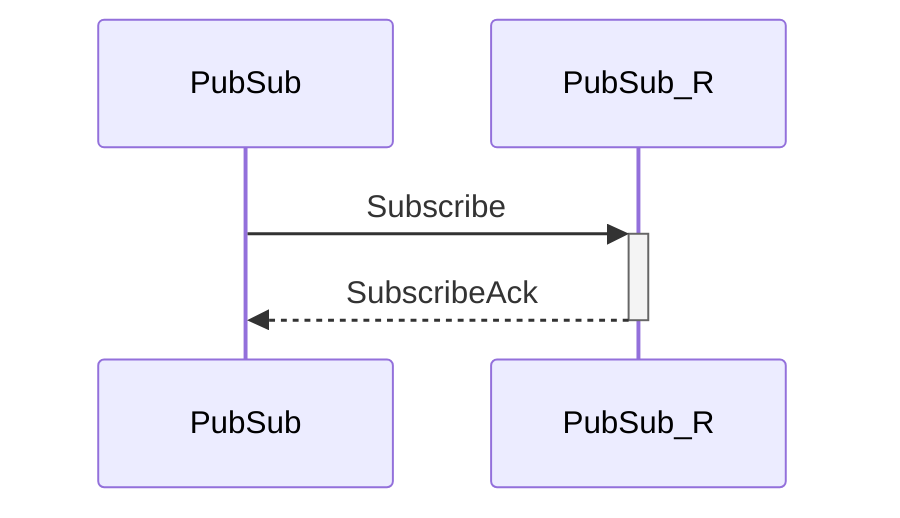

# SubscribeAck

## Purpose

<!-- --8<-- [start:purpose] -->
Subscription acknowledgement.
<!-- --8<-- [end:purpose] -->

## Type

 <!-- --8<-- [start:type] -->
**Reception:**

[[TopicRequestV1#topicrequestv1]]

--8<-- "../types/topic_request_v1.md:type"

**Triggers:**

[[TopicSubscribed#topicsubscribed]]

<!-- --8<-- [end:type] -->

## Behaviour

<!-- --8<-- [start:behaviour] -->
A [[TopicSubscribed#topicsubscribed]] notification is sent to local engines.
<!-- --8<-- [end:behaviour] -->

## Message flow

<!-- --8<-- [start:messages] -->

<!-- --8<-- [end:messages] -->

