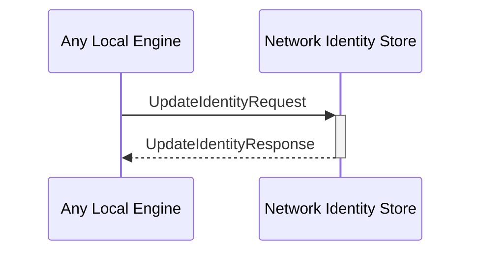

# UpdateIdentityRequest

# UpdateIdentityResponse

## Purpose

<!-- --8<-- [start:purpose] -->
Update information associated with a given external identity.
<!-- --8<-- [end:purpose] -->

## Type

<!-- --8<-- [start:type] -->
**Reception:**

[[UpdateIdentityRequestV1#updateidentityrequestv1]]

--8<-- "../types/update_identity_request_v1.md:type"

**Triggers:**

[[UpdateIdentityResponseV1#updateidentityresponsev1]]

--8<-- "../types/update_identity_response_v1.md:type"
<!-- --8<-- [end:type] -->

## Behaviour

<!-- --8<-- [start:behaviour] -->
Update the provided information in the local data store.
<!-- --8<-- [end:behaviour] -->

## Message flow

<!-- --8<-- [start:messages] -->

<!-- --8<-- [end:messages] -->

