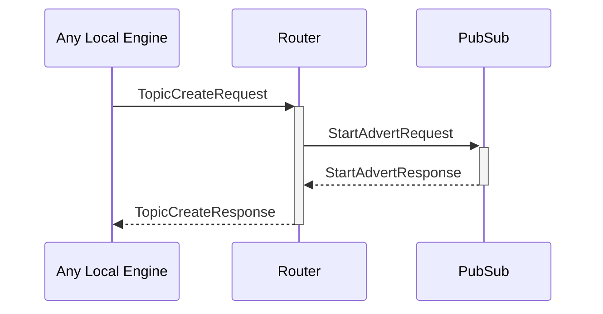

# TopicCreateRequest

## Purpose

<!-- --8<-- [start:purpose] -->
Create a pub/sub topic and start accepting subscriptions to it.
<!-- --8<-- [end:purpose] -->

## Type

<!-- --8<-- [start:type] -->
**Reception:**

[[TopicCreateRequestV1#topiccreaterequestv1]]

--8<-- "../types/topic_create_request_v1.md:type"

**Triggers:**

[[TopicCreateResponseV1#topiccreateresponsev1]]

--8<-- "../types/topic_create_response_v1.md:type"
<!-- --8<-- [end:type] -->

## Behaviour

<!-- --8<-- [start:behaviour] -->
The topic is added to the [[RoutingTable#routingtable]] with an initially empty subscriber list.
<!-- --8<-- [end:behaviour] -->

## Message flow

<!-- --8<-- [start:messages] -->

<!-- --8<-- [end:messages] -->

