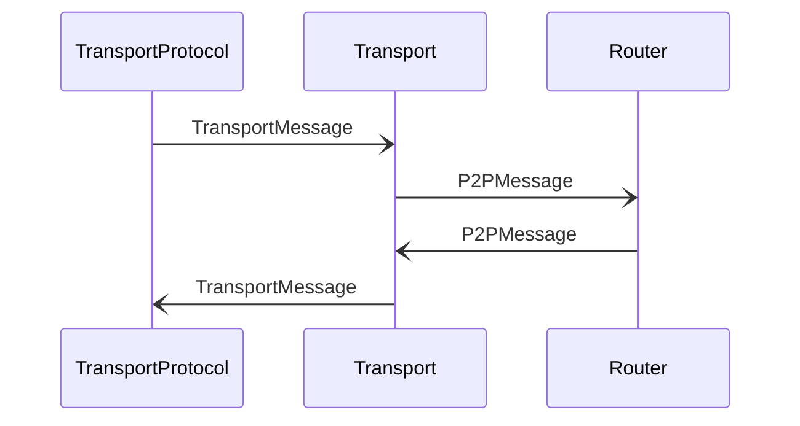

# TransportMessage

## Purpose

<!-- --8<-- [start:purpose] -->
A message from/to one of the transport protocols.
<!-- --8<-- [end:purpose] -->

## Type

<!-- --8<-- [start:type] -->
**Reception:**

[[TransportMessageV1#TransportMessagev1]]

--8<-- "../types/transport_message_v1.md:type"

**Triggers:**

[[P2PMessage#p2pmessage]]
<!-- --8<-- [end:type] -->

## Behaviour

<!-- --8<-- [start:behaviour] -->
When receiving a *TransportMessage* from one of the transport protocols
`addr` contains the source address,
`tprefs` and `expiry` are not set,
and `msg` contains the message received.
Upon reception, *Transport* forwards the contained *[[P2PMessage#p2pmessage]]* to the *[[Router#router]]*.

When sending a *TransportMessage* via one of the transport prototocols,
`addr` contains the destination address,
`tprefs` is set to the transport prefences from either the contained [[EngineMessage#enginemessage]],
the [[NodeIdentityRecord#nodeidentityrecord]] from the [[Network Identity Store#network-identity-store]],
or the defaults in the local configuration of the *Transport* engine,
`expiry` is set from the contained [[EngineMessage#enginemessage]],
and `msg` contains the message to be sent.
<!-- --8<-- [end:behaviour] -->

## Message flow

<!-- --8<-- [start:messages] -->

<!-- --8<-- [end:messages] -->

