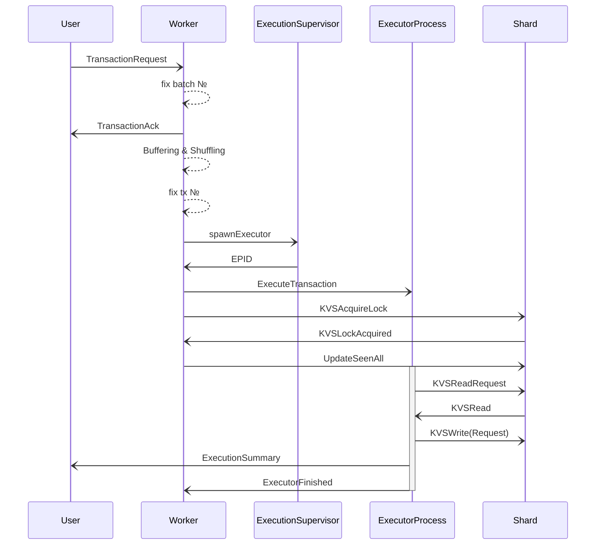

<!-- --8<-- [start:all] -->

## A life cycle with some details

Let us consider a typical/generic case
of what transaction submission triggers in the ordering machine.
Note that all message sending is asynchronous.

!!! todo

    removed `ExecutorProcess--)ExecutorProcess: .` just before
     `activate ExecutorProcess`. I'm not sure what it represented. -->

### The origin of the request

_at user_

The user creates a [[TransactionCandidate]] $T$.

$$T = \Bigl(\mathit{code},
    \underbrace{(r_e,r_l)}_{\text{read label}},
    \overbrace{(w_w,w_m)}^{\text{write label}}\Bigr)$$

!!! quote

    transaction executable $\mathit{code}$
    eager read keys $r_e$
    lazy read keys $r_l$
    $w_w$ will-write keys
    $w_m$ may-write keys

The User transmits the [[TransactionCandidate]],
packaged as a [[TransactionRequest]],
to the [[Worker Engine|worker]].

- [[TransactionRequest]] → [[Worker Engine]]

    This message is the origin of the life cycle.

<!-- this is Isaac's original post
https://github.com/anoma/specs/issues/430#issuecomment-1935077194:

Each validator should have 1 executor, so yes, each validator should replicate these side effects.

Example:

- suppose the User wants to know if  / when whatever was supposed to happen as a result of their TransactionCandidate actually happened.
  - obviously they can't rely on a message from any single Validator, since (after V1) no one validator is necessarily trustworthy. They therefore have to receive messages from at least a (weak) quorum of validators.
  - They could include in their TransactionCandidate a side effect of the form: send a message to USER containing DETAILS ABOUT WHATEVER JUST HAPPENED.
    - when the User receives (identical) messages from a (weak) quorum of validator's executors, it knows that the messages' description of whatever just happened accurately reflects something that happened in the replicated state machine.

 In fact, this is exactly how any (trustworthy) read of the state machine's state should be done. This includes "checkpoint" reads where the details to be sent in the message is some kind of commitment (e.g. a Merkle Root) of the whole state of the state machine.
-->

### Acknowledging the Users's TransactionRequest

_at [[Worker Engine]]_

Once it is clear that the transaction can be included into the current
 batch, the transaction candidate is "stamped" with the current
 _batch number_.

- [[TransactionAck]] → user

    This is mainly for purposes of UX,
    but gives also information for re-submission strategies.

### Buffering and shuffling (optional)

_at [[Worker Engine]]_

One may want to order each transaction request within a batch only after a
 minimum number of other requests are received such that they can be "slightly"
 re-ordered within a _very short_ time period---for several reasons.

!!! todo

    add footnote / explain exactly the issues this avoids

### Assigning a transaction number

_at [[Worker Engine]]_

Eventually, possibly triggered by a timer or when sufficiently many
 other transaction candidates have been received, the transaction
 request will be assigned a _transaction number_
 (within the current batch).
Together the batch and transaction numbers can form a unique
 [[TxFingerprint]] for the [[TransactionRequest]].

Transaction Numbers can be assigned immediately from some set of
 available transaction numbers, provided this complies with the
 buffering and shuffling scheme.
For example, a worker could maintain a shuffled list of natural
 numbers for each batch, and assign them sequentially from the list.
Alternatively, a worker could assign Transaction Numbers sequentially,
in which case
[[TransactionCandidate|transaction candidates]] will end up ordered in the
 order they were received.
This may slightly change in V2.

### Requesting an available executor engine

_at [[Worker Engine]]_

The [[Worker Engine]] either directly spawns an [[Executor]] process
 or contacts an [[Execution Supervisor]] that provides an
 _Executor Process ID_ (EPID).

- [[SpawnExecutor]]→[[Execution Supervisor]]

    Request a fresh process id of an available [[Executor]],
    typically a newly spawned executor engine instance.

Note that the [[Execution Supervisor]] cannot, in general,
wait for some existing [[Executor]] processes to terminate
before spawning a new [[Executor]] process.
It is possible that the existing [[Executor]] is waiting for
a [[TransactionCandidate|transaction candidate]] with
an earlier [[TxFingerprint]] to be executed,
but which does not yet have an [[Executor]], in order to run.
Therefore waiting for existing [[Executor]]s to terminate can cause deadlock.

Also, we do not want to Execution Supervisor to become a bottleneck.
Hence, the supervisor itself may be a concurrently running group of engines.

### Providing a "fresh" executor

_at [[Execution Supervisor]]_

- [[ExecutorPIDAssigned]]→[[Worker Engine|Worker]]

    Send the [[node_architecture:Identity|external identity]] of a "fresh" executor engine instance,
    either newly spawned or a waiting in a fixed pool of available executors.

!!! todo

     add one supervisor for each executor -->

### Informing shard(s) about upcoming read and write requests

_at [[Worker Engine]]_

- [[KVSAcquireLock]] → [[Shard]]s

    The [[Worker Engine]] informs all relevant [[Shard]]s about locks
    for this [[TransactionCandidate]] (at this [[TxFingerprint]]).
    This also  allows the shard to prepare for read and write requests
    (which can be used for optimizations like warming up disk storage).

If it helps, these messages can be batched and sent periodically.

### Notifying the curator about acquired locks

_at [[Shard]]_

- [[KVSLockAcquired]] → [[Worker Engine]]

    The [[Shard]] informs the [[Worker Engine]] about locks acquired
    or "recorded" for this [[Worker Engine]]'s [[TransactionCandidate]].
    This becomes crucial below, at "Notifying shards about locks seen."

### Starting transaction execution

_at [[Worker Engine]]_

- [[ExecuteTransaction]] → [[Executor]]

    This will trigger the actual execution.
    This execution _includes_ any finalization or resource logic checks.
    _Reads_, for executor process purposes, include any reads of state
    necessary for any post-ordering execution, resource logic checks,
    or anything else dependent on the "current" state of the state
    machine.
    _Writes_, for purposes of the state machine, include only final,
    valid updates to state that are definitely committed.

### Sending read requests

_at [[Executor]]_

- [[KVSReadRequest]] → [[Shard]]

    While executing the transaction
    (depending on previous reads and or static data in the code)
    send the optional read requests to the [[Shard]].

### Sending write requests

_at [[Executor]]_

!!! todo

    this should be a Request!

- [[KVSWrite]] → [[Shard]]s

    When the [[TransactionCandidate|transaction candidate]] has run,
    for each write lock, the
    [[Executor]] informs the relevant [[Shard]] of a value to write
    (or, for `may_write`s, maybe to not update this value).

### Notifying shards about locks "seen"

_at [[Worker Engine]]_

- [[UpdateSeenAll]] → [[Shard]]s

    The [[Worker Engine]] informs each [[Shard]] of the greatest
    [[TxFingerprint]] such that it can be sure
    (because it has heard enough [[KVSLockAcquired]] messages)
    that the [[Shard]] will never hear a
    [[KVSAcquireLock]] from this [[Worker Engine]] with an equal or
    lower [[TxFingerprint]] in the future.
    This is crucial, because [[Shard]]s cannot "read" values from
    storage at a particular [[TxFingerprint]] until they are sure that
    no writes with earlier [[TxFingerprint]]s will happen.

### Serving read and write requests from executors

_at [[Shard]]s_

- [[KVSRead]] → [[Executor]]

    For each read lock, if all preceding write locks have been
    recorded, and the unique preceding write has produced a value, the
    [[Shard]] can read a value.
    For _eager_ reads (as defined in [[KVSAcquireLock]]), it sends this
    value immediately to the [[Executor]], and for _lazy_ reads, it
    sends it in response to a [[KVSReadRequest]] from the [[Executor]].

### Handling transaction candidate side effects

_at [[Executor]]_

In addition to updates to state,
transaction candidates can do other stuff
(so long as it does not non-deterministically effect updates to state).
This can include logging and sending messages to users.

#### Informing users about results and logs

The user is informed about the results of the transaction outcome.
In future versions (from V2 onward), this comes in two flavors:

- communication from only one validator's executor process
  (probably whatever validator the user submitted to)

- some reliable transmission protocol between
  the user and at least a weak quorum of validators.

<!-- the following argument is due to isaac

#### Signing state update commitment

If a "block" is completed, a commitment to state updates,
e.g., a hash of the state deltas +++

-->

### Informing the curator about execution termination

_at [[Executor]]_

- [[ExecutorFinished]] → [[Worker Engine]]

    Notify the [[Worker Engine]] about the finished execution.
    This triggers a log dump at the [[Worker Engine]],
    and will be used for garbage collection from V2 onward.
    For logging purposes, we could encode values read / written in here.

<!-- --8<-- [end:all] -->