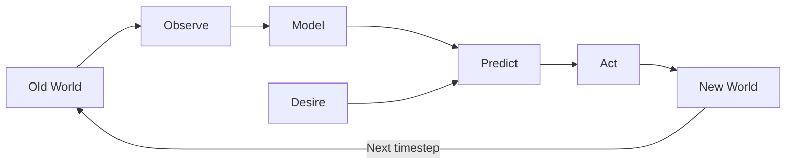
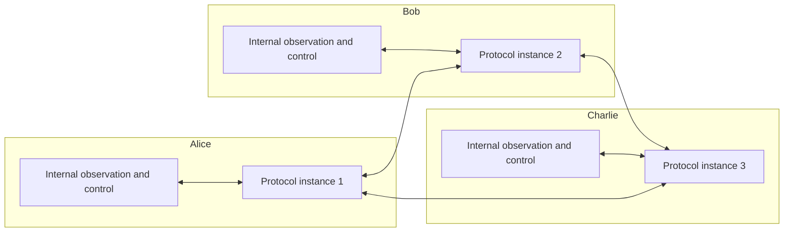

# Protocol desiderata

<!--
What is the flow from world model to desiderata?

- Different permissions (action-capacities) in the world
- Model these (e.g. linear resources)
- Promise some correspondence
    - Transfer you a sandwich
- Agree on changes to the database
    - Propagate to changes to the world
-->

## Cybernetic agency

We assume that the world is _of interest_ to agents: in general, agents may be interested in choosing their actions in such a manner as to regulate the probability distribution of their future observations, the probability distributions of future observations of other agents, and in general the probability distribution of inferred latent state of the world - which requires observing the world and building an internal model of it in order to better predict how actions may affect it. This capacity - to observe, record, model, predict, act, and thereby regulate - we refer to as _cybernetic agency_. Note in particular that many actions may simply be oriented towards crafting a better model, in expectation of said model being useful for prediction of the results of future actions.

## Coordination

We assume that - perhaps in order to increase their degree of cybernetic agency - agents may wish to _coordinate_ with other agents, which may include:

- sharing observations with other agents, for improved modeling and prediction
- sharing storage and comptuational resources with other agents (storing data or performing computations upon request)
- coordinating actions which may have causally interdependent effects, especially when the interdependence may be crucial in determining whether the effect upon the world would be desired or not

In a sense, we can understand coordination as _composition_ of cybernetic agency, in that it allows many agents who elect to do so to act "as if" they were one.

We define a _protocol_ as a way to automatically respond to messages, i.e.

We define a _compositional cybernetic agency protocol_ as a protocol which allows for all of these functions, without loss of generality. The remainder of this specification document describes the structure of such a protocol.

<!--
## Model convergence

!!! todo

    Convergence of distribution of state
    Convergence of estimations

!!! todo

    Imagine an omniscient observer who can see all messages and all private information.
-->

<!--
      Anoma is one such protocol. Figure out the comparison to natural language. Is there an "ideal" such protocol in certain ways? Can we come up with a mathematical definition here? Can this be related to Brandom on discursive commitments?
-->