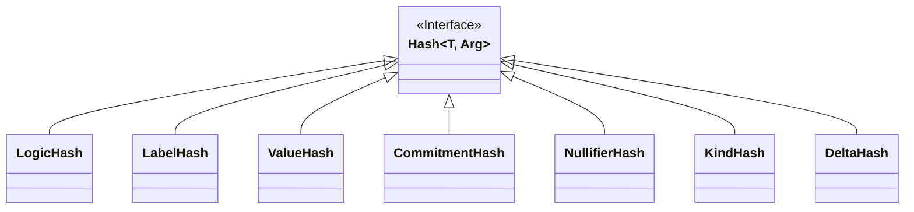

# Hash

Hash type is defined as a fixed size type that is binding, meaning that if the input value of type `Arg` changed, the output value would change as well.

!!! warning
    TODO:
    
    - for shielded: cryptographic hash, hiding
    - do we want a separate interface for the logic hash, given it is a verifier key?

### LogicHash

In the case of resource logic, the hash used to compute it should output the logic's verifying key and therefore is determined by the proving system used to compute resource logic proofs.

## Hash interface diagram

#Used in
- Resource components (logic, label, value)
- Resource computable components (cm, nf, kind, delta)