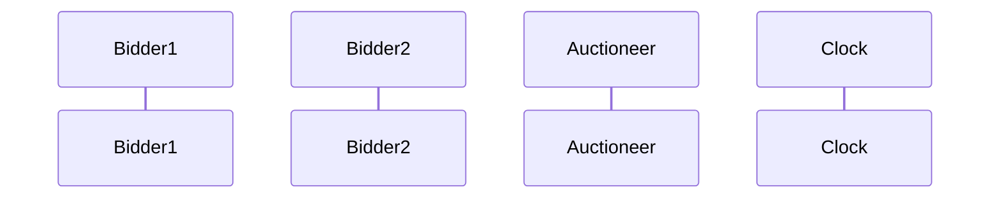
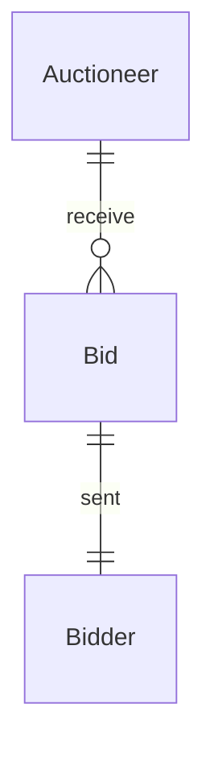

# Auctioneer 

## Purpose 

The Auctioneer is taking bids and announces the winner.
The auctioneer is responsible for a single auction.

## Auctioneer-specific types

### Bool${}^2$: the local engine specific state

Keep track of wether the auction is started
and whether the deadline has passed.

### Bid

A bid is a pair of an external id and an integer amount.

## [paradigmatic message sequence diagram] (optional)

## _All_ "Conversation Partners" (Engine _types_)

### Conversation Diagram (optional)

### Bidder

The bidder will send bids and wait for announcement of the winner.

## Guarded Actions

### Receive Bid

  
Consider a bid from a bidder.

  
That's it (in this example).

 

### Finalize Auction

  
After deadline has passed, the winner is announced.

  
That's it.

 
