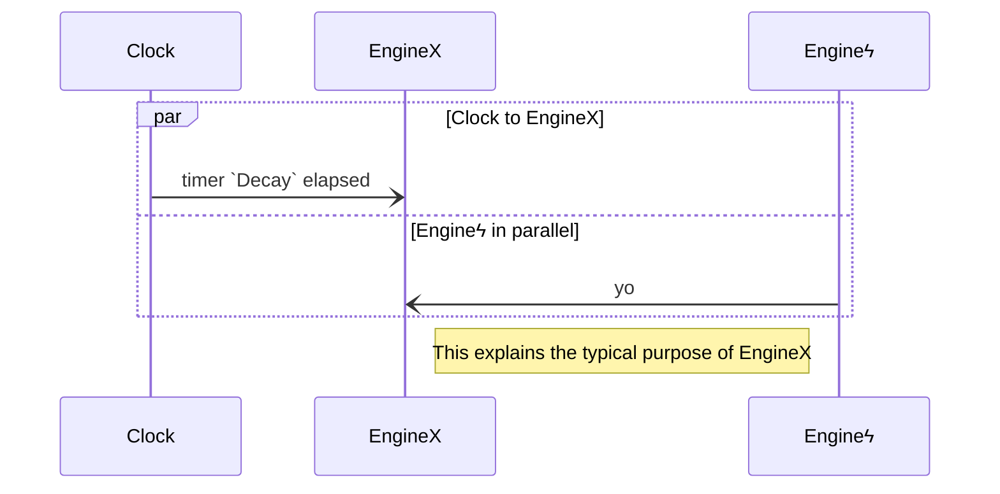

# EngineX {V2 Template}

## Purpose (of EngineX)

`<one paragraph on the purpose>`

## EngineX-specific types

### TypeX1 

.  
.  
.  

### TypeXk

## [paradigmatic message sequence diagram] (optional)

We can use `mermaid` diagrams here.

## _All_ "Conversation Partners" (Engine _types_)

### EngineType `X1

.  
.  
.  

### EngineTypeXm

## Guarded Actions

### Guarded action $1$ (click for details?)

.  
.  
.  

### Guarded action $n$ (click for details?)
