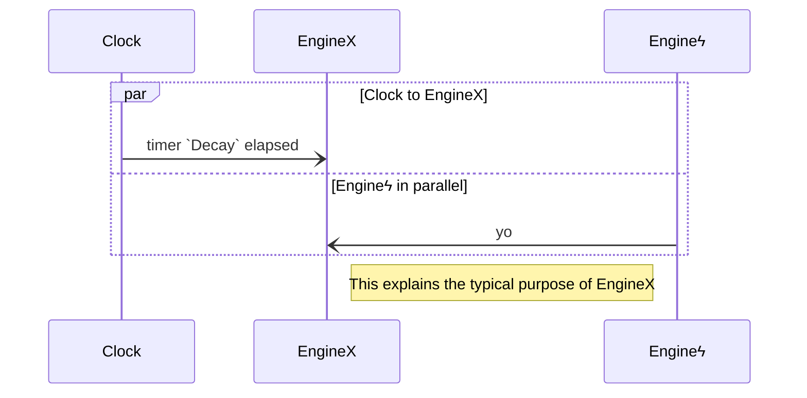
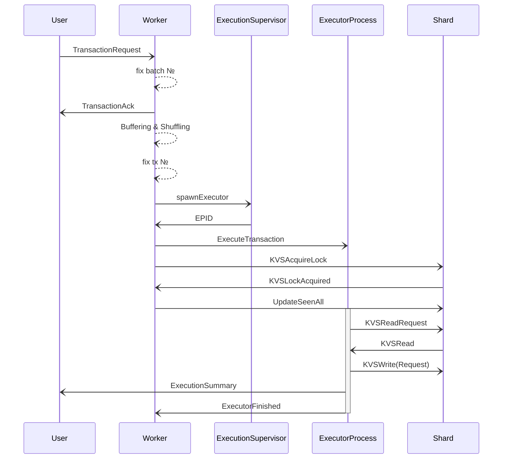
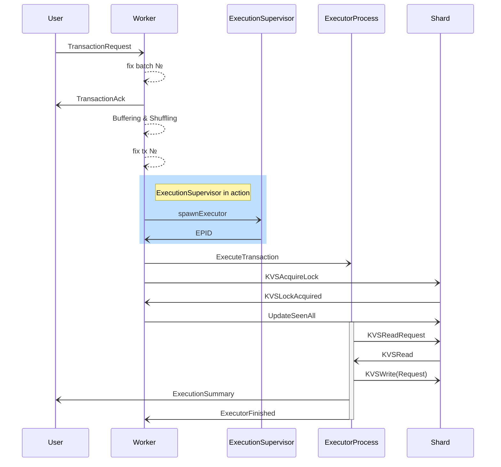
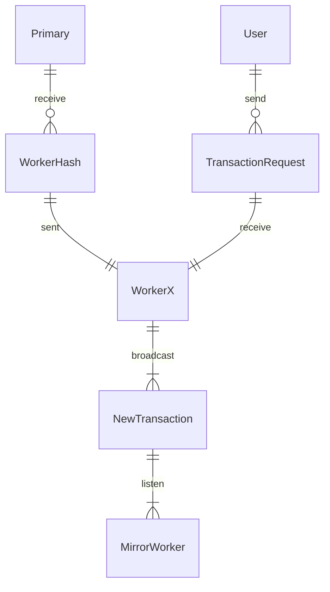

# EngineX {V2 Template}

## Purpose (of EngineX)

`<one paragraph on the purpose>`

## EngineX-specific types

### TypeX1 

.  
.  
.  

### TypeXk

## [paradigmatic message sequence diagram] (optional)

We can use `mermaid` diagrams here.

The following is a good example of a larger diagram,
which concerns several engines
taken from the [v1 specs](https://specs.anoma.net/v1/architecture-2/ordering-v1.html#a-life-cycle-with-some-details).

For an engine page,
it may be sufficient to
"cut out" a portion of such a larger diagram, or
mark it as in the following variation of the previous diagram.

## _All_ "Conversation Partners" (Engine _types_)

### Conversation Diagram (optional)

Who is talking to whom and `EngineX` in particular about what?
For a high-level overview, 
something like a [conversation diagram](https://sparxsystems.com/enterprise_architect_user_guide/16.1/modeling_languages/bpmn_2_0_conversation.html) can be helpful.
We could simply (ab-)use mermaid entity relationship diagrams here.

Taking again the example of workers in Narwhal,
the worker is in communication with other workers,
the user and the primary. 
A partial diagram would be the following.

### EngineTypeX1

.  
.  
.  

### EngineTypeXm

## Guarded Actions

### Guarded action $1$ (click for details?)

.  
.  
.  

### Guarded action $n$ (click for details?)
