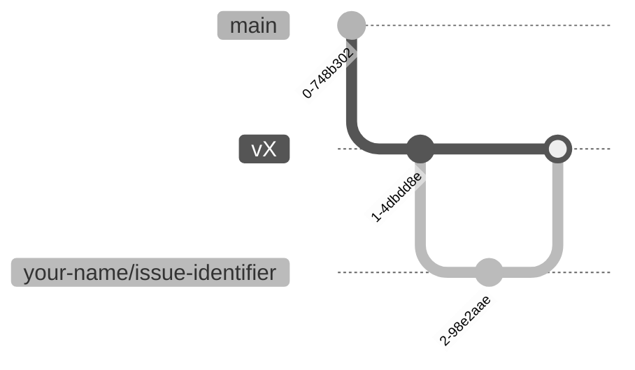

# Git branching strategy

The general workflow is to branch off from the latest version's branch, perform
your changes, open a pull request, and merge your updates.

## Branching strategy

### For changes to the latest version

For changes to the latest version, branch off from `main`. Name your branch by
prefixing your name and an issue identifier, like `your-name/issue-identifier`.

```bash
git fetch
git checkout -b your-name/issue-identifier origin/main
```

### For changes to older published versions

For patching older versions, branch off from the specific version branch.
Published versions follow the pattern `vX`, where `X` is the version number.
For example, say the latest version is `v0.1.0`.

Name your branch by prefixing your name and an patch topic, like
`your-name/patch-topic`.

```bash
git checkout -b your-name/patch-topic v0.1.0
```

The git graph will look like:



So, if your PR is merged, the changes will be incorporated into the version
branch and on the website.

### Pushing changes

When pushing changes for the first time in a new branch, set the upstream tracking branch:

```bash
git push -u origin some-branch:some-branch
```

Afterwards, for subsequent pushes the following is sufficient:
```bash
git push
```

### Rebasing your work

Every once in a while, you should rebase your branch onto the base branch,
if the current version has been updated. This will incorporate the latest
changes from the base branch into your branch. The steps to rebase are usually
the following.

- Switch to your working branch:

    ```bash
    git checkout your-name/issue-identifier
    ```

- Initiate the rebase onto the target branch:

    ```bash
    git pull origin main --rebase
    ```

    Or merge the changes from the base branch which is convenient most of the
    time:

    ```bash
    git merge main
    ```

#### Resolve conflicts

- Git will pause for conflict resolution.
- After resolving each conflict:

  ```bash
  git rebase --continue
  ```

- To stop the rebase process:

  ```bash
  git rebase --abort
  ```

#### Push your changes

- Once rebase is complete, push changes:

    ```bash
    git push origin your-name/issue-identifier
    ```

- A force push may be required:

    ```bash
    git push origin your-name/issue-identifier --force-with-lease
    ```

### Important notes

- Ensure you are on the correct branch before making changes.
- Regularly update your branch to minimise conflicts.
- Ask for help if you encounter any issues to the maintainers.

## Merging PRs

Before a PR can be merged into the `main` branch, it must be able to build the whole codebase.
The CI checks this automatically, and can be also verified manually:

First, we must check the Juvix codebase, running the following command:

```bash
juvix typecheck docs/everything.juvix.md
```

Next, we must verify the MkDocs site build by running the following command:

```bash
poetry run mkdocs build
```

## Integration branches for complex changes

When making complex changes that consist of a set of interdependent changes,
it's best to split them up into smaller PRs that each address a single topic.

For example, making a change to a type can be in one PR,
a change to a different type in a second PR,
and applying the type changes in the rest of the code base in a third one.
In this case, branch 3 needs to merge branch 1 & 2 first.

We also need to create an integration branch,
which becomes the base branch for all the interdependent PRs,
and a corresponding integration PR to be merged into the `main` branch.

On GitHub, make sure to include the list of auxiliary PRs as part of the description of the integration PR.

This way the topic branches need not be able to build the whole codebase, while
the integration branch must be able to build it once all the topic branches are
merged into it.

A possible diagram of the integration branch and topic branches is the
following, assuming the integration branch is `example/integration` against
`main`, and the topic branches are `example/topic-1` against `main`,
`example/topic-2` against `main`, and `example/topic-3` against `main`. The
topic branches are squashed-and-merged into the integration branch.


### Fetch the latest updates

```bash
git fetch
```

### Create integration branch

```bash
git branch example/integration origin/main
```

### Create topic branches

```bash
git branch example/topic-1 example/integration
git branch example/topic-2 example/integration
git branch example/topic-3 example/integration
```

### Merge dependencies

```bash
git checkout example/topic-3
git merge example/topic-1
git merge example/topic-2
```

## Using Git Worktrees

When working on multiple branches simultaneously, git worktrees come handy.
Here's how to use them.

### Fetch the latest updates

```bash
git fetch
```

### Create a branch

```bash
git branch some-branch origin/main
```

### Create a Worktree for the branch

Either inside the repo starting with a dot (to avoid build issues):
```bash
git worktree add /path/to/repo/.tree/some-branch some-branch
```

Or outside the repo:
```bash
git worktree add /path/to/repo-some-branch some-branch
```
