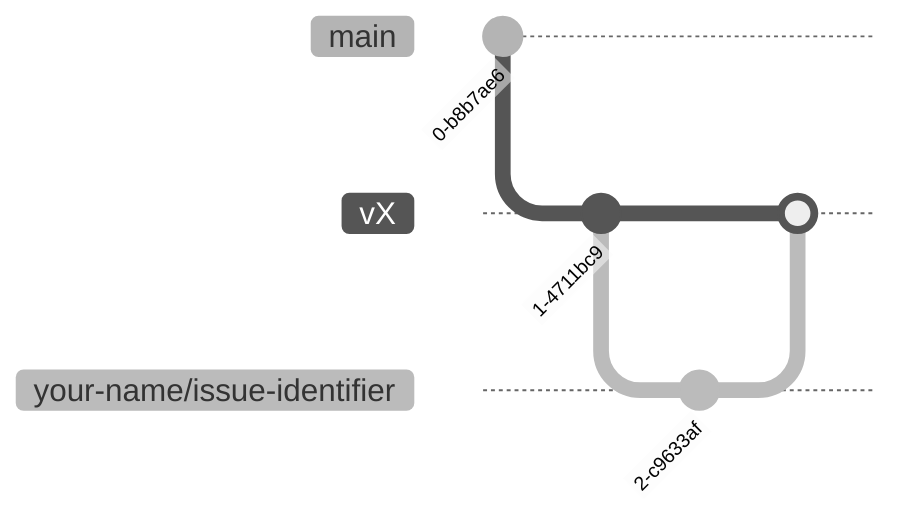

# Git branching strategy

The general workflow is to branch off from the latest version's branch, perform
your changes, open a pull request, and merge your updates.

## Branching strategy

### For changes to the latest version

For changes to the latest version, branch off from `main`. Name your branch by
prefixing your name and an issue identifier, like `your-name/issue-identifier`.

```bash
git checkout main
git checkout -b your-name/issue-identifier
```

### For changes to older published versions

For patching older versions, branch off from the specific version branch.
Published versions follow the pattern `vX`, where `X` is the version number.
For example, say the latest version is `v0.1.0`.

```bash
git checkout v0.1.0
```

Name your branch by prefixing your name and an patch topic, like
`your-name/patch-topic`.

```bash
git checkout -b your-name/patch-topic
```

The git graph will look like:



So, if your PR is merged, the changes will be incorporated into the version
branch and on the website.

### Rebasing your work

Every once in a while, you should rebase your branch onto the base branch,
if the current version has been updated. This will incorporate the latest
changes from the base branch into your branch. The steps to rebase are usually
the following.

- Switch to your working branch:

    ```bash
    git checkout your-name/issue-identifier
    ```

- Initiate the rebase onto the target branch:

    ```bash
    git pull origin main --rebase
    ```

    Or merge the changes from the base branch which is convenient most of the
    time:

    ```bash
    git merge main
    ```

#### Resolve conflicts

- Git will pause for conflict resolution.
- After resolving each conflict:

  ```bash
  git rebase --continue
  ```

- To stop the rebase process:

  ```bash
  git rebase --abort
  ```

#### Push your changes

- Once rebase is complete, push changes:

    ```bash
    git push origin your-name/issue-identifier
    ```

- A force push may be required:

    ```bash
    git push origin your-name/issue-identifier --force-with-lease
    ```

### Important notes

- Ensure you are on the correct branch before making changes.
- Regularly update your branch to minimise conflicts.
- Ask for help if you encounter any issues to the maintainers.