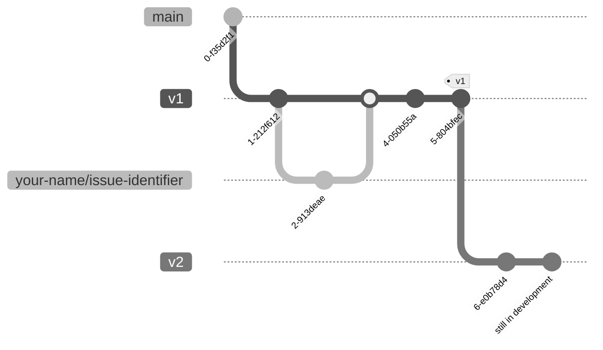

# Git branching strategy

The general workflow is to branch off from the latest version's branch, perform
your changes, open a pull request, and merge your updates. An open pull request
can finalise a version, or patch it with updates.

## Branching strategy

For new versions, branch off from the latest version. This is usually done by
maintainers. Call the branch as `vX`, where `X` is the new version number,
the successor of the latest version. To find the latest version, check the
`VERSION` file in the repository root. For example, if the latest version is
`v1`, the new version branch will be `v2`, and the git graph will look like:



!!! info

    The branch `vX` is the base branch for all new features and patches for the
    version `X`. That means that, even when there are new versions, the branch `vX`
    can still be used for patches and minor updates to the version `X`.


## Merging finalised versions

2. To merge a finalised version:
   - Open a pull request against the version in development.
   - Pass all CI checks.
   - Tag it with the `vX` label.
   - Merge the pull request.

### Adding new features to the current version

For patches or minor updates, again, branch off from the latest version. Name
your branch prefixing your name and an issue identifier, like
`your-name/issue-identifier`. Short descriptive labels are recommended, like
`fix-typo`, or `new-solver-engine`. So, the steps are:

1. **Fetch the latest changes**:
    ```bash
    git fetch --all
    ```
2. **Create a new branch**:
    ```bash
    git checkout vX # Replace vX with the current version
    git checkout -b your-name/issue-identifier
    ```
3. Open a pull request against the version in development. If you are using
   `gh`, after pushing your changes, you can create a pull request with:

    ```bash
    gh pr create
    ```

### Rebasing your work

Every once in a while, you should rebase your branch onto the base branch,
if the current version has been updated. This will incorporate the latest
changes from the base branch into your branch. The steps to rebase are usually
the following.

- Switch to your working branch:

    ```bash
    git checkout your-name/issue-identifier
    ```

- Initiate the rebase onto the target branch:

    ```bash
    git pull origin vX --rebase
    ```

    Or merge the changes from the base branch:

    ```bash
    git merge vX
    ```

#### Resolve conflicts

- Git will pause for conflict resolution.
- After resolving each conflict:
    ```bash
    git rebase --continue
    ```
- To stop the rebase process:
    ```bash
    git rebase --abort
    ```

#### Push your changes

- Once rebase is complete, push changes:
    ```bash
    git push origin your-name/issue-identifier
    ```
- A force push may be required:
    ```bash
    git push origin your-name/issue-identifier --force-with-lease
    ```

### Important notes

- Ensure you are on the correct branch before making changes.
- Regularly update your branch to minimise conflicts.
- Ask for help if you encounter any issues to the maintainers.