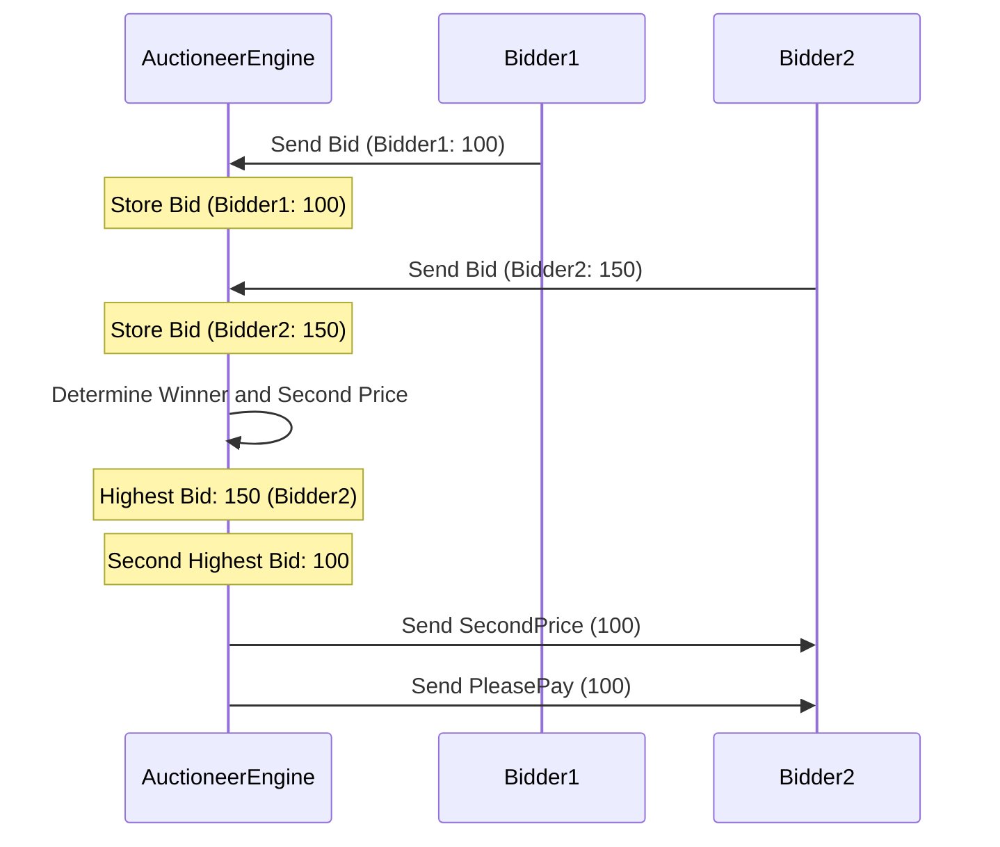
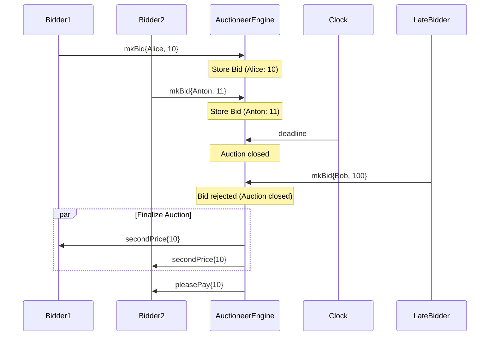
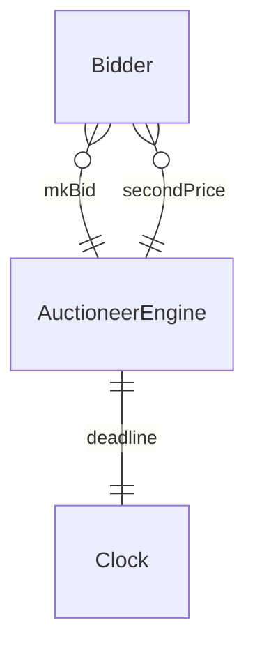

!!! warning

    This document is a work in progress. Please do not review it yet.
    The filename should be probably changed to `auction.juvix.md`.

??? info "Juvix imports"

    ```juvix 
    module tutorial.engines.Auctioneer;

    import architecture-2.engines.basic-types open;
    import architecture-2.engines.base as Engine;
    open Engine using {mkGuardedAction ; mkEngine};
    ```

# Auctioneer 

## Purpose

The `AuctioneerEngine` implements Vickrey's second-price
model[@heindel2024secondprice]. It manages the auction process by receiving
bids, identifying the highest bid, and notifying the winning bidder of the
second-highest bid.

<!-- Expect in the Juvix code two versions:
First Version: Ignores deadlines.
Second Version: Incorporates deadlines, halting bid acceptance after the deadline using a timer.
The first diagram corresponds to the first version, while the rest are for the
second version.
-->

### AuctioneerEngine Local Environment

#### Local State Type

The local state of the `AuctioneerEngine` includes:

- **bids**: A mapping from bidder [[Identity|identities]] to their bid amounts.
- **winner**: The [[Identity|identity]] of the winning bidder.
- **secondPrice**: The amount the winner has to pay.

```juvix
type LocalStateType : Type := mkLocalStateType {
  bids : Map ExternalID Natural;
  winner : Maybe ExternalID;
  secondPrice : Maybe Natural
};
```

### Message types

The `AuctioneerEngine` processes the following message types:

- **Bid**: A message containing a bid from a bidder.

- **SecondPrice**: A message containing the second-highest bid amount.

- **PleasePay**: A message instructing the winning bidder to pay the
  second-highest bid amount.

```juvix
type MessageType := Bid | SecondPrice | PleasePay;
```

#### Local Environment Type

The local environment for the `AuctioneerEngine` includes the engine's identity,
local state, time, timers, mailboxes, and acquaintances. See
the [[Engine Type#local-environment|`EngineLocalEnv`]] type for the complete
data structure.

```juvix
LocalEnvironment : Type := Engine.LocalEnvironment LocalStateType MessageType;
```

### Guarded Actions

To refer us to the Auctioneer engine's actions, we define the following type:

```juvix
GuardedAction : Type := Engine.GuardedAction LocalStateType MessageType;
```

!!! note 

    Before declaring all the guarded actions in the AuctioneerEngine, we need to
    define the state transition functions. Juvix processes declarations in a
    top-down order, requiring all symbols used in expressions to be previously declared.

Next, we will define state transitions to handle each of the following tasks:

- submission of bids, 
- determination of the winner and second price, and
- finalization of the auction.

!!! todo

    J: working on this section and the one below. So adding Juvix terms soon, not typechecking atm. ;)


??? note "Store every bid sent in time."

    The engine keeps the message in the inbox. That's it.

    ```juvix
    storeBid : GuardedAction := mkGuardedAction@{
      guard := \ {_ :=  !undefined} ;
        -- if Map.member "BidMailbox" env.mailboxCluster ??
        -- then Just () 
        -- else Nothing, -- Allow bid submission if "BidMailbox" exists
      action := \{ _ _ := !undefined} -- storeBid
    };
    ```


??? note "Determine the winner and second price."

    ```juvix
    determineWinnerAndSecondPrice : GuardedAction := mkGuardedAction@{
      guard := \ {_ :=  !undefined} ;
        -- if Map.size env.localState.bids > 1 
        -- then Just () 
        -- else Nothing, -- Ensure at least two bids are submitted
      action :=  \{ _ _ := !undefined} 
    };
    ```

??? note "Finalise the auction"

    ```juvix
    finaliseAuction : GuardedAction := mkGuardedAction@{
      guard := \ {_ :=  !undefined} ;
        -- if Map.size env.localState.bids > 1 
        -- then Just () 
        -- else Nothing, -- Ensure at least two bids are submitted
      action :=  \{ _ _ := !undefined} 
    };
    ```

List of guarded actions:

```juvix
actions : List GuardedAction := 
  [storeBid; determineWinnerAndSecondPrice; finaliseAuction];
```


## Auctioneer Engine Setup

To instantiate an Auctioneer Engine, provide a local environment as input to the
`init` function defined in this Auctioneer Juvix module.

```juvix
init (l : LocalEnvironment) : Engine.Engine LocalStateType MessageType :=
  mkEngine @{
    localEnvironment := l;
    guardedActions := actions
    };
```

## Diagrams


The figure below represents a simple interaction between an `Auctioneer` engine
instance and two bidders during an auction. No clock. Note that we refer to the
instance by its type for simplicity.

<figure markdown="span">



<figcaption markdown="span">
Two bidders participate in an auction, with the `AuctioneerEngine` determining 
the winner and second price.
</figcaption>
</figure>

In the above diagram, only two bidders are shown without a deadline. However,
with local clocks, the following scenario includes three bidders, but a deadline
restricts the third bidder's participation in the auction.

<figure markdown="span">

<figcaption markdown="span">
Three bidders participate in an auction with a deadline, where the third bidder's bid is rejected.
</figcaption>
</figure>

## Conversation-partner Diagram

<figure markdown="span">



<figcaption markdown="span">
The conversation-partner diagram shows the interactions between the `AuctioneerEngine`, bidders,
and the clock.
</figcaption>

</figure>
