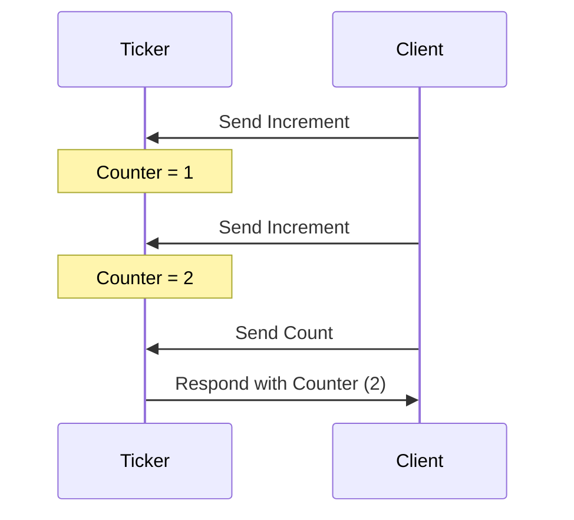
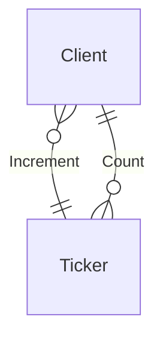

??? info "Juvix imports"

    ```juvix 
    module tutorial.engines.Ticker;

    import architecture-2.engines.basic-types open;
    import architecture-2.engines.base as Engine;
    open Engine using {mkGuardedAction; mkEngineFamily};
    ```

# Ticker Family Engine

## Purpose

A `Ticker` engine instance manages a counter in its local state. It increments
this counter each time it receives a count message and responds with the
computed result upon receiving a `Count` message. The initial state sets the
counter.

### Ticker Local Environment

#### Local State Type

The local state of the `Ticker` includes:

- **counter**: An integer value representing the current counter state.

```juvix
type LocalStateType : Type := mkLocalStateType {
  counter : Natural
};
```

### Message Types

The `Ticker` processes the following message types:

- **Increment**: A message that instructs the engine to increase the counter.
- **Count**: A message requesting the engine to send back the current counter
  value.

```juvix
type MessageType := Increment | Count;
```

#### Local Environment Type

Given the types for the local state and messages, we inherently possess the type
of the local environment. Nonetheless, to ensure clarity, let us define it
explicitly using the `LocalEnvironment` type.

```juvix
LocalEnvironment : Type := Engine.LocalEnvironment LocalStateType MessageType;
```

### Guarded Actions

To define the actions of the `Ticker`, we use the following type:

```juvix
GuardedAction : Type := Engine.GuardedAction LocalStateType MessageType;
```

Next, we define the specific tasks:

- Incrementing the counter.
- Responding with the counter value.

#### Guarded Action: Increment Counter

This action increments the counter by 1 upon receiving an `Increment` message.

```
incrementCounter : GuardedAction := mkGuardedAction@{
  guard := \ {_ := !undefined };
  -- pattern match on the message type, if it's increment, then return unit
  -- TODO: we need to define convenient functions for inspecting messages.
  action := \{ _ oldState := !undefined };
    -- let newCounter = oldState.counter + 1 in
  -- {!env.localState with counter=newCounter}
};
```

#### Guarded Action: Respond with Counter

This action sends the current counter value upon receiving a `Count` message.

```juvix 
respondWithCounter : GuardedAction := mkGuardedAction@{
  guard := \ {_ := !undefined; };
  --  if env.message == Count then Just () else Nothing} ;
  action := \{ _ oldState := !undefined };
   -- sendMessage (env.sender, CountMessage oldState.counter);
    -- {!env.localState with counter=oldState.counter}
};
```

List of guarded actions:

```
actions : List GuardedAction := 
  [incrementCounter; respondWithCounter];
```

Finally, the engine family is defined as follows:

```juvix
Ticker : Engine.EngineFamily LocalStateType MessageType := mkEngineFamily@{
  localStateType := LocalStateType;
  actions := actions;
};
```


## Diagrams


The figure below represents a simple interaction between two engine instances, a
`Ticker` engine instance and another entity sending increment requests and count
requests:

<figure markdown="span">



<figcaption markdown="span">
A client interacts with the `Ticker` engine, which increments and responds with the counter value.
</figcaption>
</figure>

## Conversation-partner Diagram

<figure markdown="span">



<figcaption markdown="span">
The conversation-partner diagram shows the interactions between the `Ticker` engine and a client.
</figcaption>

</figure>