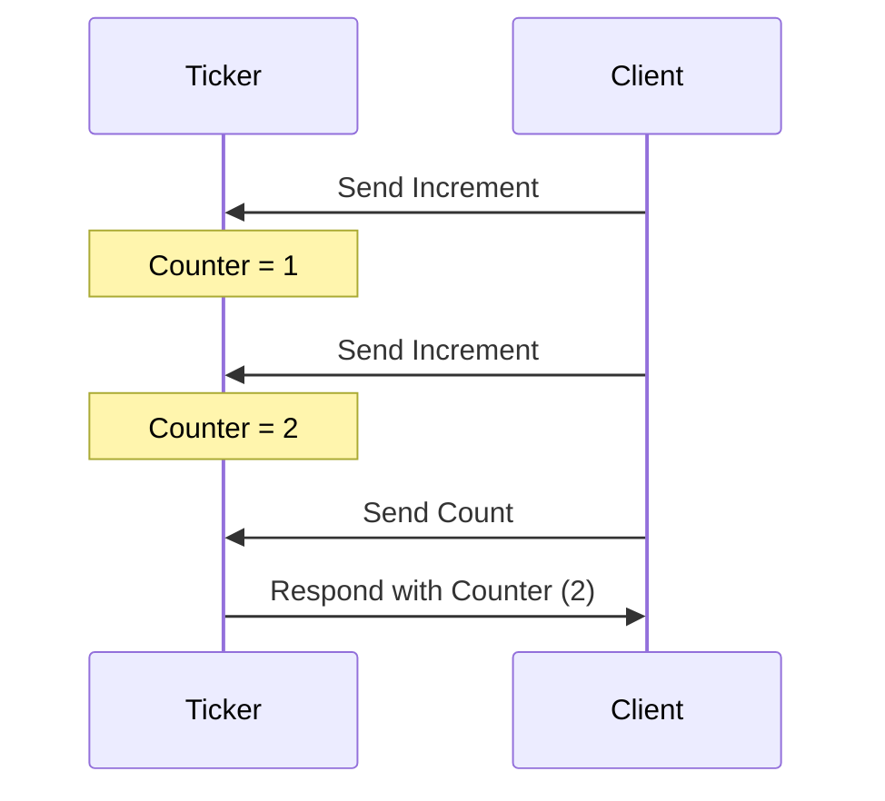
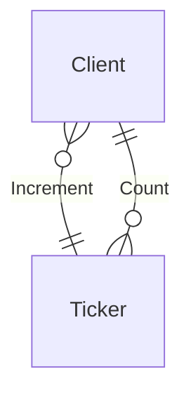

??? info "Juvix imports"

    ```juvix 
    module tutorial.engines.Ticker;

    import Stdlib.Data.Pair open;
    import Data.Set as Set open;
    import Data.Map as Map open;

    import Stdlib.Data.Bool as Bool;
    import Stdlib.Data.Nat as Nat;
    
    open Bool using {true;false};
    import Stdlib.Data.Maybe as Maybe open;

    import architecture-2.engines.basic-types open;
    import architecture-2.engines.base as EngineFamily;
    open EngineFamily using {
        EngineFamily;
        EngineInstance;
        LocalEnvironment;
        mkEngineFamily;
        mkEngineInstance;
        mkLocalEnvironment;
        mkStateTransitionInput;
        mkStateTransitionResult;
        mkGuardedAction
    };
    open EngineFamily.LocalEnvironment;
    ```

# Ticker Family Engine

## Purpose

A `Ticker` engine instance manages a counter in its local state. It increments
this counter each time it receives a count message and responds with the
computed result upon receiving a `Count` message. The initial state sets the
counter.

### Ticker Local Environment

#### Local State Type

The local state of the `Ticker` includes:

- **counter**: An integer value representing the current counter state.

```juvix
type LocalStateType : Type := mkLocalStateType {
  counter : Natural
};
```

### Message Types

The `Ticker` processes the following message types:

- **Increment**: A message that instructs the engine to increase the counter.
- **Count**: A message requesting the engine to send back the current counter
  value.

```juvix
type MessageType := Increment | Count;
```

#### Local Environment Type

Given the types for the local state and messages, we inherently possess the type
of the local environment. Nonetheless, to ensure clarity, let us define it
explicitly using the `LocalEnvironment` type.

```juvix
TickerLocalEnvironment : Type := 
    EngineFamily.LocalEnvironment LocalStateType MessageType;
```

### Guarded Actions

To define the actions of the `Ticker`, we use the following type:

```juvix
GuardedAction : Type := EngineFamily.GuardedAction LocalStateType MessageType Bool;
```

Next, we define the specific tasks:

- Incrementing the counter.
- Responding with the counter value.

#### Guarded Action: Increment Counter

This action increments the counter by 1 upon receiving an `Increment` message.

```juvix
incrementCounter : GuardedAction := mkGuardedAction@{
  act := 
    (
    (\{
      | (Elapsed@{ timers := ts }) state := nothing
      | (MessageArrived@{ message := m}) state :=
          case getMessageType m of {
            | Increment := just true
            | _ := nothing
          } 
      }) ,
     \{ (mkStateTransitionInput@{
          env := previousEnv }) := 
            mkStateTransitionResult@{
              newEnv := previousEnv@LocalEnvironment{
                localState := mkLocalStateType@{
                  counter := 1
                  -- counter := (counter (localState previousEnv)) Nat.+ 1
                  -- Anything different than a value here is producing a loop in Juvix.
                }
              };
            producedMessages := mkMailBox@{
              mailboxState := nothing;
              messages := []
            };
          spawnedEngines := [];
          timers := [];
        }
      }
    )
};
```

#### Guarded Action: Respond with Counter

This action sends the current counter value upon receiving a `Count` message.

```juvix 
respondWithCounter : GuardedAction := mkGuardedAction@{
  act := 
    (
    (\{
      | (Elapsed@{ timers := ts }) state := nothing
      | (MessageArrived@{ message := m }) state :=
          case getMessageType m of {
            | Count := just true
            | _ := nothing
          } 
      }) ,
     \{ (mkStateTransitionInput@{ 
            action := sender;
            env := previousEnv }) := 
            let lState := (localState previousEnv) in
            let counterValue := LocalStateType.counter lState in
            mkStateTransitionResult@{
              newEnv := previousEnv; -- nothing changes
              producedMessages := mkMailBox@{
                mailboxState := nothing;
                messages := [
                  mkEnvelopedMessage@{
                      packet := mkMessagePacket@{
                        -- Fix this, it must be the sender gathered from the
                        -- trigger message.
                        target := sender;
                        message := mkMessage@{
                          messageType := Unit;
                          payload := "Counter value is .. " -- Nat.toText counterValue
                        }
                      };
                      sender := engineRef previousEnv
                    }
              ]
              };
              spawnedEngines := [];
              timers := [];
            }
      }
    )
};
```

Finally, the engine family is defined as follows:

```

TickerFamily : EngineFamily LocalStateType MessageType := mkEngineFamily@{
  actions := [incrementCounter; respondWithCounter];
};
```

As an example of an engine instance in this family, we could
define the ticker starting in zero.

```
tickerInstance : EngineFamily.EngineInstance LocalStateType MessageType 
:= mkEngineInstance@{
    name := "TickerOne";
    family := TickerFamily;
    initState := mkLocalEnvironment@{
        localState := mkLocalStateType@{
            counter := 0;
        };
        engineName := "TickerOne";
        timers := [];
        acquaintances := Set.empty;
        mailboxCluster := Map.empty;
    };
  } ;
```


## Diagrams


The figure below represents a simple interaction between two engine instances, a
`Ticker` engine instance and another entity sending increment requests and count
requests:

<figure markdown="span">



<figcaption markdown="span">
A client interacts with the `Ticker` engine, which increments and responds with the counter value.
</figcaption>
</figure>

## Conversation-partner Diagram

<figure markdown="span">



<figcaption markdown="span">
The conversation-partner diagram shows the interactions between the `Ticker` engine and a client.
</figcaption>

</figure>