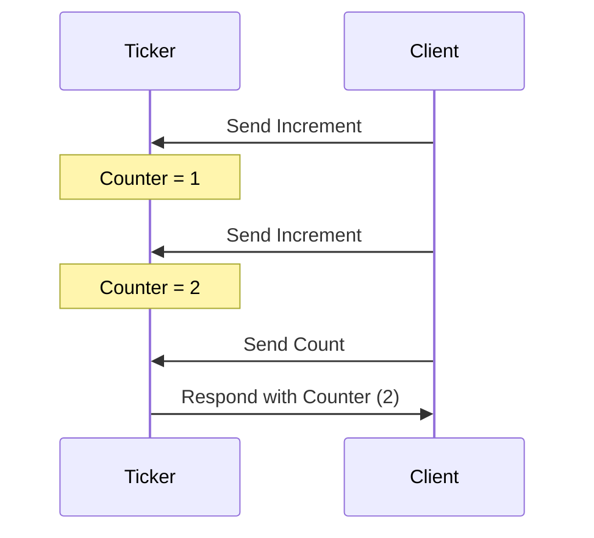
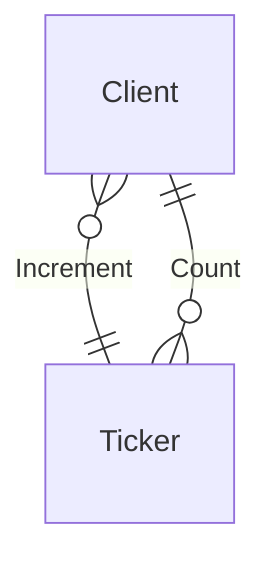

??? info "Juvix imports"

    ```juvix 
    module tutorial.engines.Ticker;

    import Stdlib.Data.Pair open;
    import Data.Set as Set open;
    import Data.Map as Map open;

  

    import Stdlib.Data.Bool as Bool;
    import Stdlib.Data.Nat as Nat;
    
    open Bool using {true;false};
    import Stdlib.Data.Maybe as Maybe open;

    import architecture-2.engines.basic-types open;
    import architecture-2.engines.base as EngineFamily;
    open EngineFamily using {
        EngineFamily;
        Engine;
        LocalEnvironment;
        mkEngineFamily;
        mkEngine;
        mkLocalEnvironment;
        mkStateTransitionInput;
        mkStateTransitionResult;
        mkGuardedAction
    };
    open EngineFamily.LocalEnvironment;
    ```

# Ticker Family Engine

## Purpose

A ticker engine, part of the `Ticker` engine family, maintains a counter in its
local state. This engine increases the counter whenever it gets a `Increment` message
and provides the updated result upon receiving a `Count` message. The initial
state initialises the counter.

### Ticker Local Environment

#### Local State Type

The local state of the `Ticker` includes:

- **counter**: An integer value representing the current counter state.

```juvix
type LocalStateType : Type := mkLocalStateType {
  counter : Nat
};
```

### Message 

### Incoming Message Type

The `Ticker` processes the following message types:

- **Increment**: A message that instructs the engine to increase the counter.
- **Count**: A message requesting the engine to send back the current counter
  value.

```juvix
type IMessageType := Increment | Count;
```

### Outgoing Message Type

To respond to the `Count` message, the engine sends a message containing the
current counter value.

```juvix
type OMessageType := Result Nat;
```

#### Local Environment Type

Given the types for the local state and messages, we inherently possess the type
of the local environment. Nonetheless, to ensure clarity, let us define it
explicitly using the `LocalEnvironment` type.

```juvix
LocalEnvironment : Type := EngineFamily.LocalEnvironment LocalStateType IMessageType;
```

### Guarded Actions

Next, we define the specific tasks:

- Incrementing the counter.
- Responding with the counter value.

Regarding the guard function's return type, we must return two different types
of values. The first value is a boolean (or possibly Unit) that indicates if the
guard condition is met. The second value is the name of the message sender,
which is used to set the target for the resulting message with the counted
value.

```juvix
type GuardReturnType := 
  | IncrementGuard Bool
  | RespondGuard Name;
```

Therefore, the `GuardedAction` type is defined as follows:

```juvix
GuardedAction : Type := 
  EngineFamily.GuardedAction 
    LocalStateType 
    IMessageType 
    GuardReturnType 
    OMessageType
    Unit;
```

#### Guarded Action: Increment Counter

This action increments the counter by 1 upon receiving an `Increment` message.

```juvix
incrementCounter : GuardedAction := mkGuardedAction@{
  guard := \{ 
      | (MessageArrived@{ envelope := m}) state :=
          case getMessageType m of {
            | Increment := just (IncrementGuard true)
            | _ := nothing
          }
      | (Elapsed@{ timers := ts }) state := nothing
      };
  action := \{ 
      | (mkStateTransitionInput@{
          env := previousEnv }) := 
            let lState := (localState previousEnv);
                counterValue := LocalStateType.counter lState
            in
            mkStateTransitionResult@{
              newEnv := previousEnv@LocalEnvironment{
                localState := mkLocalStateType@{
                  counter := counterValue + 1
                }
              };
          producedMessages := [];
          spawnedEngines := [];
          timers := [];
        }
      }
};
```

#### Guarded Action: Respond with Counter

This action sends the current counter value upon receiving a `Count` message.

```juvix
respondWithCounter : GuardedAction := mkGuardedAction@{
  guard := 
    \{
      | (Elapsed@{ timers := ts }) state := nothing
      | (MessageArrived@{ envelope := m }) state :=
          case getMessageType m of {
            | Count := just (RespondGuard (getMessageSender m))
            | _ := nothing
          } 
      };
  action := \{ (mkStateTransitionInput@{ 
            action := senderRef ;
            env := previousEnv }) := 
            let lState := (localState previousEnv);
                counterValue := LocalStateType.counter lState;
                sender := case senderRef of {
                | (RespondGuard s) := Left s
                | _ := Right 0 -- no address
                };
                in
            mkStateTransitionResult@{
              newEnv := previousEnv; -- nothing changes
              producedMessages := [
                    mkEnvelopedMessage@{
                        packet := mkMessagePacket@{
                          target := sender;
                          message := mkMessage@{
                            messageType := Result counterValue;
                            payload := Nat.natToString counterValue
                          }
                        };    
                        sender := engineRef previousEnv
                      }
              ];
              spawnedEngines := [];
              timers := [];
            }
      }
};
```

Finally, the engine family is defined as follows:

```juvix
Ticker 
  : EngineFamily LocalStateType IMessageType GuardReturnType OMessageType Unit
  := mkEngineFamily@{
    actions := [incrementCounter; respondWithCounter];
};
```

As an example of an engine instance in this family, we could
define the ticker starting in zero.

```juvix
tickerInstance : Engine LocalStateType IMessageType GuardReturnType OMessageType Unit
  := mkEngine@{
    name := Left "TickerOne";
    family := Ticker;
    initEnv := mkLocalEnvironment@{
        localState := mkLocalStateType@{
            counter := 0;
        };
        engineRef := Left  "TickerOne";
        timers := [];
        acquaintances := Set.empty;
        mailboxCluster := Map.empty;
    };
  } ;
```


## Diagrams


The figure below represents a simple interaction between two engine instances, a
`Ticker` engine instance and another entity sending increment requests and count
requests:

<figure markdown="span">



<figcaption markdown="span">
A client interacts with the `Ticker` engine, which increments and responds with the counter value.
</figcaption>
</figure>

## Conversation-partner Diagram

<figure markdown="span">



<figcaption markdown="span">
The conversation-partner diagram shows the interactions between the `Ticker` engine and a client.
</figcaption>

</figure>