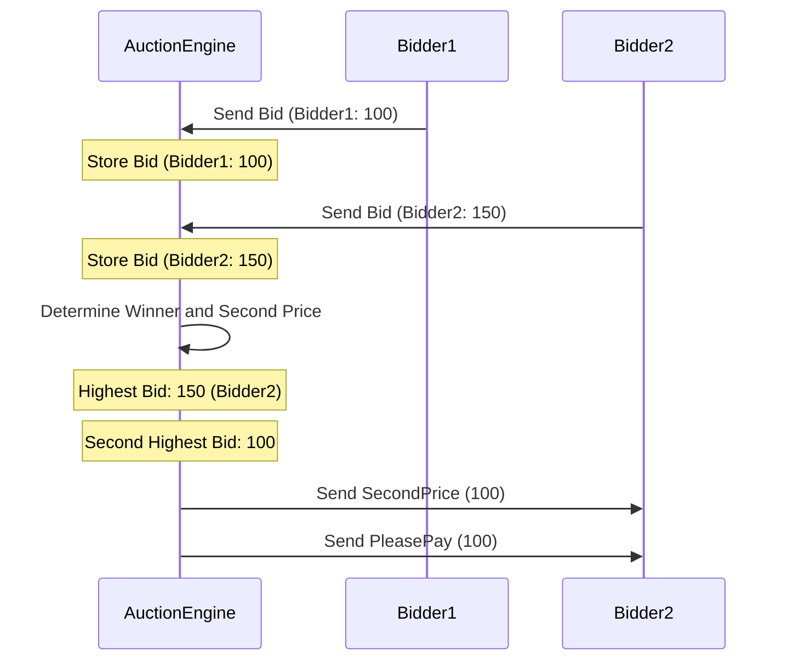
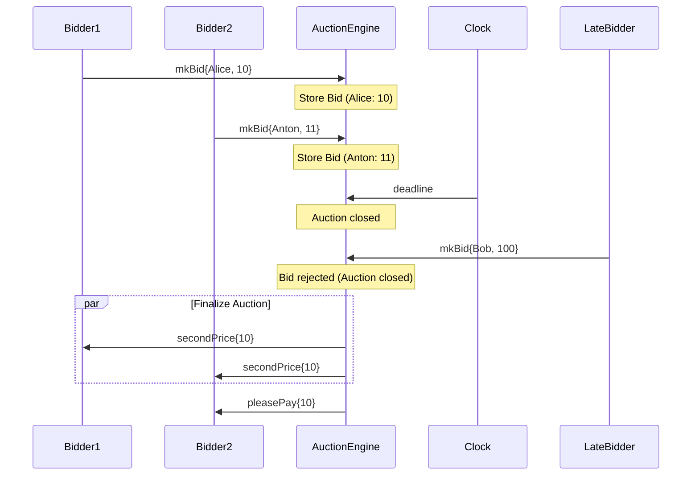
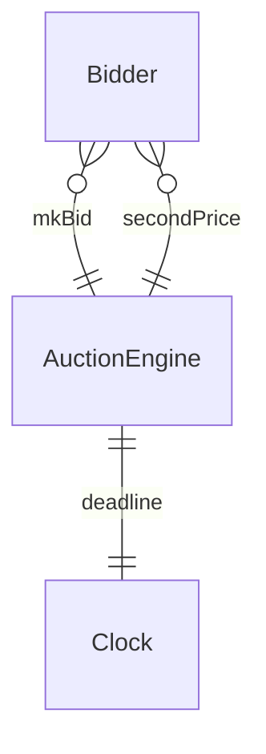

!!! warning

    This document is a work in progress. Please do not review it yet.
    The filename should be probably changed to `auction.juvix.md`.

??? info "Juvix imports"

    ```juvix 
    module tutorial.engines.engine-template-example;

    import architecture-2.engines.basic-types open;
    import tutorial.engines.base open;
    ```

# Auctioneer 

## Purpose

The `AuctionEngine` implements Vickrey's second-price
model[@heindel2024secondprice]. It manages the auction process by receiving
bids, identifying the highest bid, and notifying the winning bidder of the
second-highest bid.

<!-- Expect in the Juvix code two versions:
First Version: Ignores deadlines.
Second Version: Incorporates deadlines, halting bid acceptance after the deadline using a timer.
The first diagram corresponds to the first version, while the rest are for the
second version.
-->

### AuctionEngine Local Environment

#### Local State Type

The local state of the `AuctionEngine` includes:

- **bids**: A mapping from bidder [[Identity|identities]] to their bid amounts.
- **winner**: The [[Identity|identity]] of the winning bidder.
- **secondPrice**: The amount the winner has to pay.

```juvix
type AuctionLocalState := mkAuctionLocalState {
  bids : Map ExternalID Natural;
  winner : Maybe ExternalID;
  secondPrice : Maybe Natural
};
```

### Message types

The `AuctionEngine` processes the following message types:

- **Bid**: A message containing a bid from a bidder.

- **SecondPrice**: A message containing the second-highest bid amount.

- **PleasePay**: A message instructing the winning bidder to pay the
  second-highest bid amount.

```juvix
type AuctionMessageType := Bid | SecondPrice | PleasePay;
```

#### Local Environment Type

The local environment for the `AuctionEngine` includes the engine's identity,
local state, time, timers, mailboxes, and acquaintances. See
the [[Engine Type#local-environment|`EngineLocalEnv`]] type for the complete
data structure.

```juvix
type AuctionEngineLocalEnv := EngineLocalEnv AuctionLocalState AuctionMessageType;
```

### Guarded Actions

!!! note 

    Before declaring all the guarded actions in the AuctioneerEngine, we need to define the state transition functions. Juvix processes declarations in a top-down order, requiring all symbols used in expressions to be previously declared.

Next, we will define state transitions to handle each of the following tasks:

- submission of bids, and 
- determination of the winner and second price.

!!! todo

    J: working on this section and the one below. So adding Juvix terms soon, not typechecking atm. ;)

## Guarded Actions

??? note "Store every bid sent in time."

    The engine keeps the message in the inbox. That's it.


??? note "Announce the winner and close the auction"

	--8<-- "guarded-action-example.md:8"


## Diagrams


The figure below represents a simple interaction between an `AuctionEngine` instance and two bidders during an auction. No clock. Note that we refer to the instance by its type for simplicity.

<figure markdown="span">



<figcaption markdown="span">
Two bidders participate in an auction, with the `AuctionEngine` determining the winner and second price.
</figcaption>
</figure>

In the above diagram, only two bidders are shown without a deadline. However, with local clocks, the following scenario includes three bidders, but a deadline restricts the third bidder's participation in the auction.

<figure markdown="span">

<figcaption markdown="span">
Three bidders participate in an auction with a deadline, where the third bidder's bid is rejected.
</figcaption>
</figure>

## Conversation-partner Diagram

<figure markdown="span">



<figcaption markdown="span">
The conversation-partner diagram shows the interactions between the `AuctionEngine`, bidders, and the clock.
</figcaption>

</figure>
