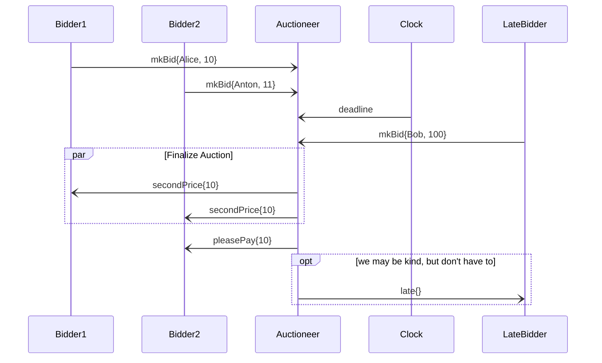
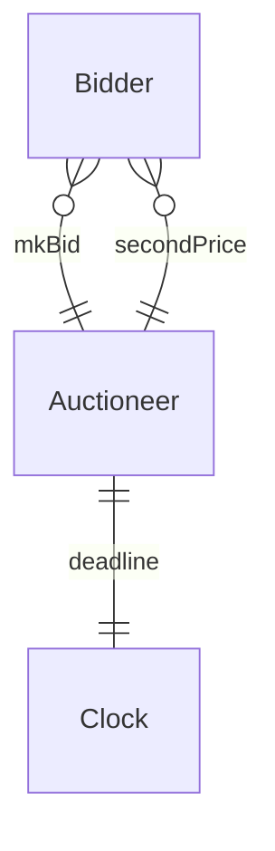

# Auctioneer 

```juvix
module tutorial.engines.engine-template-example;
import architecture-2.engines.basic-types open;
```

## Purpose 

The Auctioneer is taking bids and announces the winner
after the dealine has elapsed.
The auctioneer is responsible for a single auction.

## Auctioneer-specific types

```juvix
Types : List Type := [
  State ;
  Bid ;
  Winner ;
  Payment
];
```

### Bool${}^2$: the engine-specific local state

Keep track of whether the auction is started
and whether the deadline has passed.

```juvix
type State : Type := mkState {
  started : Bool;
  deadline : Bool
};
```

### Message Types

#### Bid

A bid is a pair of an external ID and an integer amount.

```juvix
type Bid : Type := mkBid {
  bidder : ExternalID;
  amount : Nat
};
```

#### second Price

The second price is implicitly notifying the winner.

```juvix
type Winner : Type := secondPrice {
  price : Nat
};
```

#### payment

```juvix
type Payment : Type := pleasePay {
  price : Nat
};
```

## [Paradigmatic message sequence diagram] (optional)




## _All_ "Conversation Partners" (Engine _types_)

### Conversation Diagram (optional)



### Bidder

The bidder will send bids and wait for announcement of the winner.

## Guarded Actions

### Store Bid on ReceiveBid

<details>
  <summary>Store every bid sent in time.</summary>
  <p> The engine keeps the message in the inbox. That's it. </p>
</details> 

### Finalize Auction on Deadline Elapsed

??? note "Announce the winner and close the auction"

	--8<-- "guarded-action-example.md:8"

