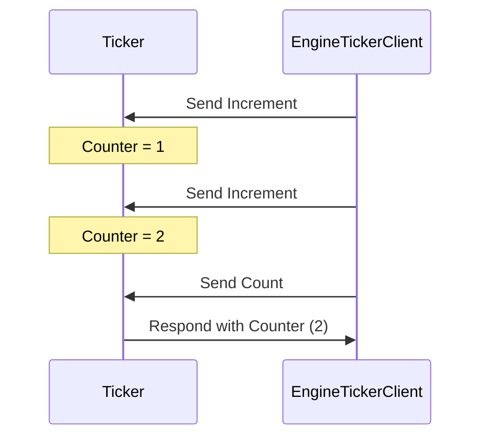
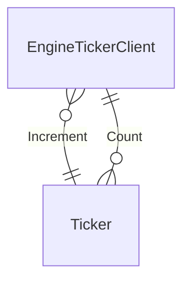

??? info "Juvix imports"

    ```juvix
    module tutorial.engines.ticker.index;
      import node_architecture.basics open;
      import node_architecture.types.EngineFamily as EngineFamily;
      open EngineFamily using {
          Engine;
          EngineEnvironment;
          EngineFamily;
          mkActionResult;
          mkEngine;
          mkEngineEnvironment;
          mkEngineFamily;
          mkGuardedAction
      };
    open EngineFamily.EngineEnvironment;
    import tutorial.engines.ticker.Env open public;
    import tutorial.engines.ticker.Actions open public;
    ```

# Ticker Family Engine

## Purpose

A ticker engine, part of the `Ticker` engine family, maintains a counter in its
local state. This engine increases the counter whenever it gets a `Increment` message
and provides the updated result upon receiving a `Count` message. The initial
state initialises the counter.

## Components

??? quote "Local Environment"

    Source: [[Ticker Environment]]

    ---8<--- "tutorial/engines/example/ticker_environment.juvix.md"

??? quote "Guarded Actions"

    Source: [[Ticker Dynamics]]
    
    ---8<--- "tutorial/engines/example/ticker_dynamics.juvix.md"


## Engine Family

The engine family is defined by first establishing a
type synonym for the corresponding engine family type to
simplify the presentation.

```juvix
EngineFamilyType : Type :=
  EngineFamily
    LocalStateType
    IMessageType
    MailboxStateType
    TimerHandleType
    GuardReturnType
    OMessageType
    SpawnEngineType;
```

So a `Ticker` engine family is defined as follows:

```juvix
TickerFamily : EngineFamilyType
  := mkEngineFamily@{ actions := [incrementCounter; respondWithCounter];
};
```

As an example of an engine instance in this family, we could
define the ticker starting in zero. We, again, define for shorten presentation, the
corresponding engine instance type.

```juvix
EngineInstanceType : Type :=
  Engine
    LocalStateType
    IMessageType
    MailboxStateType
    TimerHandleType
    GuardReturnType
    OMessageType
    SpawnEngineType;
```

Then, we define a `Ticker` engine instance as follows that set
the counter to zero:

```juvix
zeroTicker : EngineInstanceType
  := mkEngine@{
    name := Left "TickerOne";
    family := TickerFamily;
    initEnv := mkEngineEnvironment@{
        localState := mkLocalStateType@{
            counter := 0;
        };
        name := Left  "TickerOne";
        timers := [];
        acquaintances := Set.empty;
        mailboxCluster := Map.empty;
    };
  } ;
```


## Interaction Diagrams

The figure below represents a simple interaction between two engine instances, a
`Ticker` engine instance and another entity sending increment requests and count
requests:

<figure markdown="span">



<figcaption markdown="span">
A client interacts with the `Ticker` engine, which increments and responds with the counter value.
</figcaption>
</figure>

## Conversation-partner Diagram

<figure markdown="span">



<figcaption markdown="span">
The conversation-partner diagram shows the interactions between the `Ticker` engine and a client.
</figcaption>

</figure>