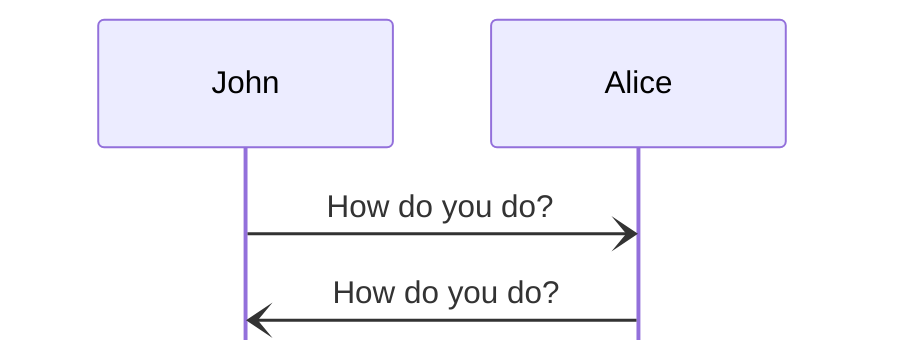

# On Engines in the Anoma Specification

This page covers
[[Engines in Anoma#engine-systems|engine-systems]]
and their
[[Engines in Anoma#on-labelled-state-transitions-via-guarded-actions|dynamics]]
and provides example code
after a short introduction to engine instances in Anoma.
From a different perspective,
it provides the background for
[[Engines in Anoma#templates|engine templates]],
which describe the desired form of
[[Engine Families|engine family]] specifications.

!!! abstract "Summary and note to the reader"
    
    This page is intended as a quick start manual
    that guides the reader by means of examples;
    in a sense,
    we are betting on the power of
    _programming by extrapolation from examples._
    However,
    everything is based on solid foundations:
    technical terms are linked to proper definitions below or elsewhere
    such that all information is
    accessible within a few clicks;
    whenever suitable,
    we also refer to the _mathematical backbone_
    at [formanoma](https://github.com/anoma/formanoma).[^0]
    
    In short,
    the main purpose of this tutorial is
    to enable you to write Juvix code
    that compiles to what we call a _model implementation._
    This page is a good place to start reading,
    but feel free to have a quick look at
    the [[The Ticker Engine Family|ticker example]] first
    or delve directly into the
    [[On Engines in the Anoma Specification#local-data-of-engine-instances-clocks-and-the-global-state|details]]    
    and come back here if you like to read more about the general context.

??? note "Juvix modules and `import` statements" 

    Every page in the Anoma specification that contains Juvix code has to define a module for it.
    This page, for example, defines the module `tutorial.engines.index`,
    as shown below.

    ```juvix
    module tutorial.engines.index;
    ```

    Additonally, for the upcoming definitions, we must also use the `import` keyword of Juvix
    to bring some common types and functions from the Node Architecture's [[Juvix Prelude|prelude]].

    ```juvix
    import architecture-2.Prelude open;
    ```

## Introduction

!!! abstract "On message passing, protocols, and engine instances"

    The introduction gives an informal description
    of the variation of the
    [actor model](https://en.wikipedia.org/wiki/Actor_model_theory)
    that the Anoma specification is grounded in.
    It also introduces the running examples
    that we shall use throught the page.

??? question "Guidelines for section titles?"

    - no capitalization needed (except for page titles, and the first letter)

    - what symbols can we use so that we can link using wikilinks
      `[[page TOC entry#title-with-the-allowed-symbols-only|xyz]]`
      [[Engines in Anoma#title-with-the-allowed-symbols-only|example]]


    ### Title with the allowed symbols only

    for the sake of example

    !!! todo "clean up this question" 

        the two bullets are

        - "section title guidelines"
        - "wiki link guide" 

### Message passing and message sequence charts    
     
In the Anoma specification,
we use the
[message passing paradigm](https://en.wikipedia.org/wiki/Message_passing)
to describe how several entities
(that are possibly distributed over the planet)
communicate with each other by sending messages,
as in typical client-server architectures.
To illustrate possible behaviours of these entities,
the most ímportant type of diagram is the
[message sequence chart](https://en.wikipedia.org/wiki/Message_sequence_chart).
The following example
describes the British greeting protocol.

<figure markdown="span">



<figcaption markdown="span">
A message sequence diagram for the British greeting protocol
</figcaption>
</figure>

This example nicely illustrates
message sequence diagrams
(see [zenuml](https://zenuml.github.io/) for how
they can be used to illustrate client-server interactions).

### Protocols

The greeting protocol is only the "Hello world" of protocols.
Our running example will be a time stamping server.
We start simple and 
gradually incorporate additional functionality along the way.

!!! example "Running example: Time stamping server"

    A time stamping server is listening
    to time stamping requests by clients.
    The main use case are attestations that
    the server has seen a certain hash
    at a certain point in time (or earlier)—relative
    to its local clock.
    Thus, the primary task of the server is
    to pair hashes with time stamps
    and signing such pairs;
    moreover, 
    the server sends the timestamped hashes
    to an arbitrary "address"
    that was specified as part of the time stamping request.
    However, we prefer to refer to these addresses as the
    names of engine instances in more general terms.

    <figure markdown="span">

    ```mermaid
    %%{initialize: {'mirrorActors': false, "htmlLabels": true} }%%
    sequenceDiagram
      participant A as Alice
      participant S as Time Stamp Server
      participant B as Bob
      A -) S: TimeStampRequest(0x1337, Bob)
      S -) B: newAttestation(0x1337 @ 9:00AM)
    ```

    <figcaption markdown="span">
    Time stamping server example: Alice requests a time stamp for hash `0x1337` 
    from the time stamping server, which then sends a new attestation to Bob.
    </figcaption>

    </figure>

    Thus, the behaviour of time stamping servers can be described as serving time
    stamping requests.
    
    !!! note "Details of a time stamping request"
    
        A time stamp request has the following form:

        `TimeStampRequest`( _hash:_ bytes, _destination:_ name )
      
        where `TimeStampRequest` is the message _tag_ and the arguments of the message
        are

        hash 

        : a fixed sized _hash_ given as a byte string
        
        destination

        : the destination, given as a name of an engine instance
        (operated by some agent).

    The functionality is kept very simple;
    we cover more complex behaviours in
    [[On Engines in the Anoma Specification#the-engine-system-for-time-stamping-with-a-rate-limit|later iterations]]
    of the time stamping server.

    Finally,
    let us look at some code for
    messages that the time stamping server will process.
    We use a Juvix record types,
    which allow to combine
    the message tag, the default argument names
    and the argument types in a single data type declaration;
    in this example,
    `TimeStampRequest` is the only message tag.

    ```juvix
    --- the datatype of messages that a time stamping server can process
    
    type TimeStampingServerMessage :=
      | TimeStampRequest {
          hash : Hash;
          destination : Name
      };
    ```

### Engine instances are running the Anoma protocol

!!! tip "Engine instance: think [actor](https://en.wikipedia.org/wiki/Actor_model_theory) (but with computable behaviour and other differences)"
    
    The first thing to remember is that in the Anoma specification,
    the participants that exchange messages will be called
    [[Engine instance|engine instances.]]
    Engine instances are similar to actors of the 
    [actor model](https://en.wikipedia.org/wiki/Actor_model);[^1]
    however, we prefer to use fresh terminology,
    as there is some "fine print" concerning differences to the
    "pure" actor model that we shall cover in due course.

The Anoma specification considers each Anoma node
to be a finite[^2] collection of
engine instances that communicate by sending messages to each other;
engines of different nodes communicate in
the very same way across Anoma instances,
i.e., via message passing.
Message sequence charts are useful to describe
_specific_ scenarios in which messages are exchanged
(giving rise to a set of "events" for each received message
and a causal order between them)
where each participant happens to be an engine instance.
However,
we need a description of all possible ways in which
an engine instance may react to received messages and/or clock notifications
for a complete engine instance specification;
the "pattern" according to which an engine instance responds to messages is
what we call the _reactive behaviour_ of an engine,
or just _behaviour,_ for short.

We shall use finite sets of
[[On Engines in the Anoma Specification#a-finite-set-of-guarded-actions-for-each-engine-environment|guarded actions]]
to specify behaviours of engine instances:
guarded actions describe all
[[On Engines in the Anoma Specification#action|actions]]
that are to be performed 
in reaction to a newly arrived message or clock notification,
if the conditions expressed by a
[[On Engines in the Anoma Specification#guard|guard]] are met.
Thus,
the guard of a guarded actions determines
whether or not an action is _enabled_
(among other things),
when a message or clock notification is received.
The decision of whether an action is enabled or not 
typically depends on local information of the engine.
Let us consider an example of guarded actions at work
using a (variation of) the time stamping server.

!!! example "Adding Rate Limits to the Timestamping Server"

    We want to implement rate limits as a primitive measure against spamming. For
    this, the timestamp server keeps track of the times at which previous requests
    arrived.

    We can describe the guard using a simple flowchart.
        
    === "Diagram"

        <figure markdown="span">

        ```mermaid
        flowchart TD
            check{Within the rate limit?}
            check -->|yes| A[Match hash and destination arguments]
            A --> doA(["Perform TimeStampRequest(hash, destination)"])
            check -->|no| B[No operation]
        ```

        </figure>

    === "Mermaid Code"

        Annotate the codeblock with `mermaid` to render the flowchart.

        ```plaintext
        flowchart TD
          check{Within the rate limit?}
          check -->|yes| A[Match hash and destination arguments]
          A --> doA(["Perform TimeStampRequest(hash, destination)"])
          check -->|no| B[No operation]
        ```


    The logic is simple: if the server is within rate limits, the request will be
    answered; otherwise, the request is dropped.

    Note that we use:

    - **Diamond shapes** for decisions. 
    - **Rectangles** for intermediate processing, particularly matching of arguments
      from a message
    - **Rounded boxes** for the actions to perform and the "parameters" passed

    In Mermaid syntax.

    - Diamonds are obtained using `{ ... }`
    - Rectangles using `[ ... ]`
    - Rounded boxes using `([ ... ])`

    ??? todo "Find a better way to render flowcharts"

        We are currently looking into alternatives to Mermaid flowcharts. Besides the issues with the layout and limited options for influencing it, the markdown option for inscriptions often does not work as expected.

!!! tip "Guard: very much like precondition"

    The second take away about
    the Anoma specification is the "postulate" that
    each state transition of an engine instance amounts to performing
    some _action(s)_—typically a signle action;
    moreover,
    each action comes with a _guard function_ that
    determines—among other things—whether the action is enabled.
    In the case where there is at most one action enabled,
    guards encode the pre-conditions of an action.
    
??? note "Action: like event ([event structure](https://en.wikipedia.org/wiki/Event_structure), [actor model](https://en.wikipedia.org/wiki/Actor_model)), _but_ with duration"
    
    Performing an action
    corresponds to an event in the sense of [actor model theories](https://en.wikipedia.org/wiki/Actor_model_theory) or [event structures](https://en.wikipedia.org/wiki/Event_structure);
    however,
    actions have a duration,
    i.e., a starting point of when the action starts,
    and a point in time when all computations  that the action involves
    are finished.[^2a]
    We shall describe later how actions are _triggered_
    by the arrival of a new message or
    the notification about elapsed timers[^3];
    performing an action has possibly several effects
    in each of the following four categories:
    
    - state updates of the engine instance
    - adding messages to the send queue
    - setting new timers and cancelling or resetting old ones
    - creating new engine instances[^4].
    
??? warning "Events of [event-driven state machines](https://www2.erlang.org/documentation/doc-8.1/doc/design_principles/statem.html): rather like action _triggers_"

    While [event-driven state machines](https://www2.erlang.org/documentation/doc-8.1/doc/design_principles/statem.html) are a rich source of inspiration,
    they are also one of the reasons why we avoid the term _event;_
    it may be that the usage of the term event
    for event-driven state machines is slighly different.
    For example,
    we can read on 
    [the cited page](https://www2.erlang.org/documentation/doc-8.1/doc/design_principles/statem.html) that

    !!! quote ""

        if we are in state `S` and event `E` occurs, we are to perform actions `A`

    whereas in the actor model, performing these "actions" `A` is part of
    another event `E'` that is "activated" by the event `E`.
    The main reason for choosing different terminology is that
    events of the actor model are considered to be instantaneous;
    while this is a powerful abstraction,
    we want to have a notion of time and duration of events.
    Hence,
    we shall use the following terminology:
    a _trigger_ is either
    a received message or a
    notification from the local clock (due to some previously set timer);
    we appeal to
    [this entry for `trigger`](https://ahdictionary.com/word/search.html?q=trigger)
    that explains trigger as

    !!! quote ""

        [s]omething that precipitates a particular event or situation.

    Thus,
    we call _trigger- what would be called event in
    the context of event-driven state machines.

??? note "On transition functions"

    The _behaviour_  of each engine instance—i.e.,
    how it reacts to receiving messages from other engine instances
    and notifications from the local clock—is
    determined by its current state and its _state transition function_,
    reminiscent of the next-state function of
    [finite state machines](https://en.wikipedia.org/wiki/Automata_theory#Formal_definition)
    (or rather [Moore machines](https://en.wikipedia.org/wiki/Moore_machine#Formal_definition))[^A].
    However,
    transition functions will be a "derived concept" 
    in the Anoma specification
    (see [[On Engines in the Anoma Specification#on-labelled-state-transitions-via-guarded-actions|below]]).
    The reason is that we
    we want to avoid the need to directly write transition functions—<!--
    -->which does not only involve a rather daunting number of technicalities
    (see the [mathematical backbone](https://github.com/anoma/formanoma/blob/1b9fa7558ce33bb4c2e4d31277255cdeabbc59b5/Types/Engine.thy#L215),<!--
    ᚦ: the last link need "continuous" updating [do not erase this comment]¶
    --> for a definition of what a _system_ of state transition functions actually is),
    but also may lead to large "monolithic" chunks of transition function code.
    Hence, we follow the more structured approach of
    [[On Engines in the Anoma Specification#a-finite-set-of-guarded-actions-for-each-engine-environment|guarded actions]].

The third and last point that we want to mention is that
the Anoma specification describes
a ꜰɪxᴇᴅ finite number of [[Engine Families|engine families]]:
each engine family is given by
a set of
[[On Engines in the Anoma Specification#a-finite-set-of-guarded-actions-for-each-engine-environment|guarded actions]]
and their accompanying type definitions.
Thus every engine instance in any implementation
is a member of exactly one engine family,
which describes its behaviour.
Note that the set of engine families is static,
by dynamic "parameters" at engine creation determine the exact behaviour.
<!-- add footnote to engine system locale ["axiom" state_partition](https://github.com/anoma/formanoma/blob/915039faa7cfe77c2998b309ef65b671e604fead/Types/Engine.thy#L192) -->
<!-- this be moved elsewhere
!!! definition
¶
  We call the set of all engine instances that share the same state transition function the _engine type_ of the state transition function.
-->

We now proceed with a thorough description of
the "internal" structure of every engine instance
and expand the running example of the time stamping server
to illustrate all the features.
Finally,
we also describe how the framework of guarded actions
allows to derive a [(labelled) state transition]() semantics
to implementations,
which we need to reason about properties of engine instances.
So, let us start now,
introducing all necessary concepts in detail.

## Local data of engine instances, clocks, and _the_ global state

In this subsection of the page
we properly introduce _the_ global state type,
which holds all local data of engine instances,
clocks, and the messages in transit.
Leaving aside clocks and messages in transit,
one ímportant point is that a set of engine instances
must have a consistent naming scheme
so that all engine instances have a unique name.
We shall come back to the dynamic aspects
later.
We first have to describe
the type of "global" state of Anoma instances
at any given moment in time
and give a correponding juvix type.

!!! note "Delayed definition of _engine instance_"

    The proper definition of engine instance 
    is deferred to a later point
    because we want to make reference to sets of guarded actions,
    which we have not properly defined, yet.

<!--ᚦ: some old stuff
we
give the definitions that we shall use throughout.
Each engine instance has two components:
its local data (to which it has exclusive access)
and its local clock;[^4']
the clock is kept separate as
local _time_ is progressing independently of the engine instance
and thus, the current time is not accessible like data
(and we shall say more how the local clocks are related to their engine instances).
[^4']: Moreover it will have access to a source of randomness and
       "synchronous" user input in future versions of the specifications
       (see [formanoma](https://github.com/anoma/formanoma)).-->

??? info "Juvix imports"

    ```juvix
    import architecture-2.types.EngineFamily open;
    ```
    
### Engine Environments

An [[Engine Family Types#engine-family-environment|_engine environment_]]
is a record with the following fields:

- the [[Juvix Prelude#addresses|_name_]],

    ??? todo "        add links below"

        add links below

- a _mailbox cluster_,<!--LNK EngineFamily.html#engine-family-environment-->
  which is a partial map<!--LNK Map.html#Data.Map:10--><!--
  cf. https://github.com/anoma/formanoma/blob/a00c270144b4cfcf2aea516d7412ffbe508cf3d1/Types/Engine.thy#L211-->

    - from _mailbox identifiers_<!--LNK Prelude.html#architecture-2.Prelude:37  MailboxID-->
      (**MID** for short)

    - to _mailboxes_,<!--LNK Prelude.html#architecture-2.Prelude:35 Mailbox-->
      which in turn consist of

        - a list of messages<!--LNK Prelude.html#architecture-2.Prelude:11 EnvelopedMessage-->
        - an optional mailbox-specific state<!--LNK http://127.0.0.1:8000/nspec/latest/architecture-2/Prelude.html#architecture-2.Prelude:53 MailboxStateType-->

  - its _acquaintances_[^5], represented by<!--
  cf. https://github.com/anoma/formanoma/blob/a00c270144b4cfcf2aea516d7412ffbe508cf3d1/Types/Engine.thy#L213
  -->

    - a finite set of names <!-- ᚦ: TODO: figure out how to combine with aliasing -->

- memory for previously set timers, given by<!--
  cf. https://github.com/anoma/formanoma/blob/a00c270144b4cfcf2aea516d7412ffbe508cf3d1/Types/Engine.thy#L212-->

    - a finite list of timers<!--LNK http://127.0.0.1:8000/nspec/latest/architecture-2/Prelude.html#architecture-2.Prelude:39 Timer-->

- local state (a type parameter of the engine environment).<!--
  cf. https://github.com/anoma/formanoma/blob/a00c270144b4cfcf2aea516d7412ffbe508cf3d1/Types/Engine.thy#L209 -->

While the above is simply a definition,
let us add short explanations of each of the fields
before we turn to an example.
The name is a means to address messages (among other things).
The mailbox contains (a subset of) previously received messages.
The acquaintances is a list of "known" names.
The role of timers will become clear later,
after we have introduced
[[On Engines in the Anoma Specification#engine-systems|local clocks]]
and sorted out some techincalities
concerning
[[On Engines in the Anoma Specification#engine-sets|sets of engine environments]].
Finally,
the _local state_ is all other kind of data that
we may want to store locally.

As the time stamping server requires time stamps,
let illustrate environments in the context of the
greeting protocol.

!!! example "Greetee engine environment"

    We take the greetee to be state-less:
    a correct greetee replies to
    every arriving message that conforms to the protocol.
    Thus,
    we define the type of messages
    that it is willing to receive.

    ```juvix
    --- the type of messages that a greetee accepts

    type GreeteeMessage :=
      | Greeting {
          yoursTruly : Name
      };

    --- the type of the engine environment of a greetee

    GreeteeEnvironment : Type := 
         EngineEnvironment Unit GreeteeMessage Unit Unit;
    ```

    We provide `Unit` for all type arguments that we do not require.
    The order of type parameters to `EngineEnvironment` is

    1. the type of local state (not needed for this example);
    2. the type of accepted messages (this one we do use in the example);
    3. the type of mailbox-specific state if we want to use it;
    4. the type of timer handles (not needed for this example).
    
    The
    [[Engine Family Types#engine-family-environment|definition of engine environment]]
    provides all the detail.
    
### Engine sets

We want to define an _engine set_<!--LNK see the todo below--> as
a finite set of engine environments
such that no two distinct elements have the same name.
This conceptually simple definition takes some work
if we want to express it in Juvix,
because the datatype `Set` requires a _single_ type parameter.
Hence,
we shall define a data type that "contains" all types of engine environment.
Before we describe what we exactly mean by this,
let us look at the "solution" for
a specific example.

#### The engine set type for greeters and gretees

!!! example " "

    We first add the definitions for the greeter environment,
    complementing the greetee environment.
    The greeter may want to remember
    the messages that it has already sent,
    but are still awaiting responses.
    Moreover,
    the greeter should be able to receive reponses to its greetings
    and thus we also have to define the corresponding message type.

    ```juvix
    --- the type of messages that a greeter can process

    type GreeterMessage :=
      | GreetingResponse {
          yoursTruly : Name
      };

    --- the lcoal state type of greeters: a list of ꜱᴇɴᴛ messages

    GreeterLocalState : Type := List GreeteeMessage;

    --- the type of the engine environment of greeters

    GreeterEnvironment : Type := 
         EngineEnvironment GreeterLocalState GreeterMessage Unit Unit;

    --- finally, we have the (derived) GreetingEngineEnvironment

    type GreetingEngineEnvironment :=
      | Greeter GreeterEnvironment
      | Greetee GreeteeEnvironment
      ;
    ```

    Note that the `GreeterEnvironment` has a non-trivial state type;
    also,
    the pattern behind the naming for `GreetingEngineEnvironment`
    is that we are implementing the _greeting_-protocol
    and that the type `GreetingEngineEnvironment`
    embeds all possible engine environments needed for the greeting-protocol.

    Once we have defined the type `GreetingEngineEnvironment`,
    we can finally form sets of engine environments.

    ```juvix
    GreetingEngineSet : Type := Set GreetingEngineEnvironment;

    greeting :  GreeteeMessage := Greeting@ {
      yoursTruly := Left "John"
    };

    greeterState : List GreeteeMessage := [greeting];

    greeterMailbox : (Mailbox GreeterMessage Unit) :=
      mkMailbox@ {
        messages := [];
        mailboxState := nothing ;
    };

    import Data.Map open;

    greeterMailboxCluster : (Map MailboxID (Mailbox GreeterMessage Unit)) :=
        fromList [mkPair 0 greeterMailbox];

    greeterEnvironment : GreeterEnvironment :=  mkEngineEnvironment@ {
      name := Left "John" ;
      localState := greeterState;
      mailboxCluster := greeterMailboxCluster;
      acquaintances := Set.empty;
      timers := []
    };


    greeteeEnvironment : GreeteeEnvironment := mkEngineEnvironment@ {
      name := Left "Alice" ;
      localState := unit;
      mailboxCluster := Map.empty;
      acquaintances := Set.empty;
      timers := []
    };
    ```

While the example might be enough to see the pattern,
let us spell it out.

#### The recipe for a type of all engine environments

??? todo "   add link to engine family"

    add link to engine family

Once all engine environment types for a protocol are defined,
it only remains to define an algebraic data type
with unary constructors,
each of which takes one engine environmen type
and it also determines the _name_ of what we shall call an engine family.<!--LNK-->
In principle,
the data type of all engine environments could be generated automatically.
We give a somewhat generic example for
protocols that take four different types of engine environments.

```juvix
EngineEnvironmentOne : Type := 
  EngineEnvironment Unit Unit Unit Unit;

EngineEnvironmentTwo : Type := 
  EngineEnvironment Unit Unit Unit Unit;

EngineEnvironmentThree : Type := 
  EngineEnvironment Unit Unit Unit Unit;

EngineEnvironmentFour : Type := 
  EngineEnvironment Unit Unit Unit Unit;

type FourfoldEngineEnvironment :=
  | FamilyOne EngineEnvironmentOne
  | FamilyTwo EngineEnvironmentTwo
  | FamilyThree EngineEnvironmentThree
  | FamilyFour EngineEnvironmentFour
;

FourfoldEngineSet : Type := Set FourfoldEngineEnvironment;
```

Right now,
this additional data type declaration may look as if it is superfluous;
however,
it will turn out to be useful when we describe
[[Engines in Anoma#a-finite-set-of-guarded-actions-for-each-engine-environment|the dynamics of engine systems]]
(and ideally it would be automatically generated).
    
### Engine systems

??? todo "add link for engine systems"

    add link for engine systems

We now have engine sets defined not only conceptually,
but also with an instantiation in Juvix
(up to the constraint of names being unique).
Next up is the definition of _engine systems,_<!--LNK-->
which consist of an engine set where
we have a local wall-clock time for each environment
and,
moreover,
we have one global set of messages in transit,
which, in turn, is a high-level abstraction for
a communication network.<!--
cf. the "Lamport model" in Tobias-speak-->
We first give an example
and then describe the recipe for the general case.

#### The engine system for time stamping with a rate limit

!!! example "Rate limit in the mailbox state (part ɪ/ɪɪ)"

    For the time stamping server example,
    we consider two clients ("Alice" and "Bob"),
    besides the time stamping server itself.
    We now fill in the detail for the time stamping server
    and later follow up with clients,
    and an example of an engine system.

    ##### Time stamping server
    
    We equip the time stamping server
    with some data for measuring rate limits to its mailbox
    (and later we will extend the example with
    several mailboxes).

    ```juvix
    syntax alias TimeStampingServerMailboxState := Nat;
    ```

    Recall that we have have already defined a type for
    message that the time stamping server is accepting,
    namely `TimeStampingServerMessage`.

    ```juvix
    syntax alias TimeStampingServerMessageHere := TimeStampingServerMessage;
    ```

    ??? question "ᚦ _Jonathan, how hard is it to have “smarter” linking here?_"

        It would be nice to have code snippets included
        and also the same syntax highlighting.
        Similarly, or if it is much easier,
        it would be nice to have an easy way
        to link to code blocks.

    Beside this type of messages,
    we use mailbox state to keep track of the rate at which
    one specific mailbox is used
    (while the computation of rate limits is deferred to part ɪɪ).

    ```juvix
    TimeStampingMailboxState : Type := List Nat;
    ```

    The complete type for the engine environment of time stamping servers
    then is as follows.

    ```juvix
    TimeStampingServerEngineEnvironment : Type := 
         EngineEnvironment TimeStampingServerMailboxState ClientMessage TimeStampingMailboxState Unit;
    ```

    <!--Timers will not matter until a third revision of the time stamping server.-->

    ##### Clients
    
    Now,
    the environments of clients hold only one piece of data:
    a list of hashes to be time stamped and sent to a destination.

    ```juvix
    type ClientState := mkClientState{
         hashes : List (Nat);
         destination : Name
    };
    ```

    Moreover,
    clients define the message type that they expect
    _from_ the time stamping server.

    ```juvix
    type ClientMessage :=
    | TimeStampedHash {
         hash : Hash;
         signature : Nat
    };
    ```

    Finally,
    we define the type of the environment for client engines;
    we shall use timers to stay within rate limits,
    and simply use strings to refer to specific timers.

    ```juvix
    ClientEngineEnvironment : Type := 
          EngineEnvironment ClientState ClientMessage Unit String;
    ```

    !!! todo

        better create type aliases for the Unit usages, it's more informative
        and is a work around before we have a proper solution
        (as answer to the next question).

        ᚦ: my suggestions

        - DefaultHandle
        - NoMailboxState
        - NoLocalState

        similarly:

        - `defaultBox : MailboxID := 0;`  for the default mailbox id

    ??? question "Can we have default type parameters?"

        this is unusual, I guess, but I could imagine
        that, in analogy to default parameters of functions,
        we could have default type paramters.

    We can now make an
    engine system for Alice's and Bob's client engines,
    which we just call "Alice" and "Bob".
    We split this into two parts:
    the definitions up to engine set
    and the additinal definitions.

    1. For the engine set,
    we proceed as before for the British greeting protocol.

    ```juvix
    type TimeStampingEngineEnvironment :=
      | TimeStampingClient ClientEngineEnvironment
      | TimeStampingServer TimeStampingServerEngineEnvironment
    ;

    TimeStampingEngineSet : Type := Set TimeStampingEngineEnvironment ;
    ```

    2. For the engine system, we need to also define
    a single message type that encompasses all the messages.
    
    ```juvix
    type TimeStampingNetworkMessage :=
    | Client ClientMessage
    | Server TimeStampingServerMessage
    ;

    type TimeStampingEngineSystem := mkTimeStampingEngineSystem{
         engineSet : TimeStampingEngineSet;
         clocks : Map Name TimeStampingEngineEnvironment;
         network : Set TimeStampingNetworkMessage
    };
    ```
    
    ??? todo "give example term of this type" 

        make an engine system with two clients,
        each one holding at least one hash
        (later we can add new hashes).

<!--Note that we have chosen to call
the local data of engine instances—still undefined-_engine environment_[^6].
The core reason is that we want to "reserve" the word `state`
for the state of the "global" labelled transition system (LTS)
that we will cover next.-->

#### The recipe for general engine systems

We finally come to define how we model the state of systems,
in particular how we reason about any "deployed" Anoma instance in the Anoma specification.
We give the defintion in analogy to
the example of engine sets. 

??? todo "fill in message types"

    this is a brainless task for finishing off the day

```juvix
syntax alias FourfoldMessage := Unit;

type FourfoldEngineSystem := mkFourfoldEngineSystem{
     engineSet : FourfoldEngineSet;
     clocks : Map Name FourfoldEngineEnvironment;
     network : Set FourfoldMessage
};
```

Thus, engine systems are a record with the following fields:
    
engine set
    
: the set of engine environments

clocks

: a map from engine names to local wall-clock

messages in transit

: a set of "global" messages in transit.

We have now completed the description of how system state is represented
(at any given moment in "totally distributed" time)
and now we turn to the dynamics of the system,
i.e.,
how one specific engine system can evolve to a "next" one.

<!--ᚦ: old stuff¶
In broad terms,
the LTS describes endows "engine systems"
with step-wise dynamics
and each step is labelled with an _action label_.
--><!--ᚦ: more old stuff ¶
but The engine instance's name is unchangeable,
once the engine is created;
every correct implementation must ensure that
the parent engine chooses a globally unique name
before the child engine can be created;
as mentioned above,
the default is a pair of the parent's globally unique name
and a _child name_ that is unique among its siblings—either
spawned previously or in the future.
Should it become necessary to change the name of an engine,
e.g., because it has been sent to undesired destinations,
a new *"continuation engine"* can be spawned with a new name.
-->

## On labelled state transitions via guarded actions

The dynamics of an engine system will eventually be given by
a [labelled state transition system](https://en.wikipedia.org/wiki/Transition_system):
the set of states is given by engine systems and
it remains to specify the possible state transitions.
In the Anoma specification,
we use pure functions to describe
the computations that need to be performed
to advance an engine system to the next state
(very much like in [stateright](https://github.com/stateright/stateright));
moreover,
we generate a transition label along the way,
which provides information about what made the transition happen, 
which aspects of the transition are "observable" to whom, and so forth.

!!! tip "The gist of state transitions"

    The main idea to retain is that
    a state transition may happen whenever
    a message or clock notification is ready to be processed;
    the result state of any transition amounts to

    - a change to exactly one engine environment,
    - progress of the local time of the updated engine environment,
    - an update to the set of messages in transit,
      typically the removal of processed message
      and new messages to be sent
    - new engine environments that are created
      (see the spawning of engines<!--LNK-->).

    ??? todo "add link above"
        
        `- new engine environments (see the spawning of engines<!--LNK-->)`

<!--ᚦ: old stuff¶
Each specific state transition corresponds to
a set of _actions_ performed,
typically a single one. However,
we can, in principle, perform multiple actions "in parallel",
provided that we have a well-defined concurrency relation among actions.
The effects of the action that computes a state transition
is computed by a corresponding action function.
Action functions compute

- updates to the engine environment
- a set of messages to be sent
- a set of timers to be set, cancelled, and reset
- new engines to be created.

Whether or not an action is enabled for a trigger
is determined by action guards,
by guard functions.
-->

Before we delve into the details of how transitions are to be specified,
note that the use of labelled state transitions goes back to the seminal work of
[Henessy and Milner](https://en.wikipedia.org/wiki/Hennessy%E2%80%93Milner_logic).
Additional sources of inspiration are
Lamport's
[temporal logic of _actions_ (ᴛʟᴀ⁺)](https://lamport.azurewebsites.net/tla/tla.html), 
Dijkstra's
[_guarded_ command language (ɢᴄʟ)](https://en.wikipedia.org/wiki/Guarded_Command_Language),
and guard functions of [coloured Petri nets](https://en.wikipedia.org/wiki/Coloured_Petri_net).

<!--
The formal details are given by
(any interpretation of) the [`transition_function`](https://github.com/anoma/formanoma/blob/75331d688f2ae399fbebb008549b2dfda78b4e5b/Types/Engine.thy#L217) of
the [`single_engine`-locale](https://github.com/anoma/formanoma/blob/f70a041a25cfebde07d853199351683b387f85e2/Types/Engine.thy#L205).--><!--
ᚦ: ALERT: out of date!!
--><!--
The main points to keep in mind:
there's an "optional parameter" for which action is to be taken,
and the action given the current environment
and the time stamped trigger do already determine
the action to be taken and also the reactions to the trigger.
Let us explain this one step at a time.

Now, one ímportant deviation from a "bare bones" actor model
are a set of guards for each engine family.
It is up to the set of guards to determine,
which action could be taken given
the local data in form of an engine environment
and the time stamped[_trigger,_](https://github.com/anoma/formanoma/blob/f70a041a25cfebde07d853199351683b387f85e2/Types/Engine.thy#L19)--><!--
ᚦ: needs updating [do not remove this comment): out of date ALERT!
-->

### A finite set of guarded actions for each engine environment

Recall that each engine environment in an engine system is
"decorated" with a constructor;
the constructor determines the [[Engine Families|engine family]] (name),
as described informally in the introduction.
Now, we come to the actual definition of _engine family_
as a record of

- a finite set of _guarded actions,_ whose elements consist of

  - a _guard function_, and
  - a non-empty set of _actions_. 

Thus, it remains to define guard function and action.

<!--ᚦ: some old stuff
where the _guard_ is a function that—among other things—determines whether
the action that it guards is _enabled._
To determine whether the action is enabled,
the guard function has access to the time stamped trigger
and the engine environment[^7].
In most situations,
only very few components of the engine environment are needed
to determine whether the action is enabled.
For a received message, the message alone may be enough,
maybe already the message tag is sufficient.
The guard function returns _matched arguments,_
e.g., the relevant information of a received message,
and an _action label_
that identifies the respective action that is enabled.
-->
<!--ᚦ: {a different description we had elsewhere}
  Recall that each guarded action is a pair of a guard function and an action function.
  Conceptually, the guard function has two purposes:
  first it determines whether the action that it is guarding is enabled;
  moreover,
  if the action is enabled it provides matched arguments and an action label.
-->

#### Guard

A guard is a function that determines
which of the actions is enabled,
given the time stamped trigger and the engine environment.

##### Guard input

The guard inputs are, a time stamp, a trigger, and the engine environment.

Trigger

: The trigger is either a
  
  - clock notification about a non-empty set of elapsed timers or
  - a received message.

Time stamp

: The time stamp give the local wall clock time when
  the evaluation of all triggers has started.

##### Guard output

The output of the guard is either `nothing`,
if none of the actions matches, or it
gives a list of matched arguments, an action lable,
and the result of other precomputation.

Matched arguments

: The matched arguments are a list of arguments
  that have been _matched_ during guard evaluation.
  Typically these are the arguments of a received message,
  or a list of previously received messages.

Action label

: The action label
  gives information about
  which action is to be performed.

Precomputation results

: The computation that guards perform to determine
  whether or which action is to be performed may be non-trivial;
  these results are output
  such that actions may reuse the computation results.

#### Action

The action of a guard is a function
that computes changes to the environment,
new messages to be sent,
spawning requests,
and updates to the list of timers.

##### Action input

The action input extends the guard input
by the guard output.

##### Action output

The action output is
an environment, a list of messages,
a list of spawning data,
and a list of timers.

Environment

: The returned environment is an arbitrary environment,
  except for that the engine name must be unchanged.

Message list

: The list of messages are message that are to be sent to
  the network and thus must be addressed,
  e.g., using an engine name and a mailbox ID.

Timer list

: The list of timers updates the list of timers;
  the only restriction is that new entries
  to the list should have new handles.

Spawning data list

: Finally, a list of spawning data is given,
  whose elements sepcify an engine environment
  and the corresponding engine family (name).


### Engine instance

Thus, we finally can define _engine instance_ as a pair
of an engine environment in an engine system 
and the associated guarded action.

## Dynamics and the derivation of a labelled state transition system

An engine system can evolve in one of two ways:
either the wall-clock time of a single engine instances increases
or some action is enabled for some engine instance;
this is subject to the condition that
timer notifications have priority
and that time increments are bounded by the next timer that is to elapse.
The details of how the system evolves is described

!!! todo "write up in the ART report for good"

    We need a proper timed LTS semantics
    so that the specs are actually specs.

<!--ᚦ: copy of a message to jonathan¶
the definition of clock is indeed hard in that it only makes sense once we define how we can evolve the system by performing actions
viz. (for async systems)
1. taking a message from the network, increment the recipients time by an arbitrary amount *t*, start guard evaluation, and finally do all the necessary updates: again increase the clock for the time it takes to compute, add messages to the network, create new engines (and sth. that I forgot), unless
2. advancing the time by *t*, would trigger a timer elapsed message, which then is to be executed first in a similar fashion to another message
... and then we have not yet considered limits for action execution time ... so lots of fun to come 😄
--><!--ᚦ: more old stuff ¶
Whenever a trigger arrives guards of an engine could be evaluated in parallel,
for every new trigger,
e.g., upon  arrival of new  message;
in practice,  one may want to choose a more efficient, but equivalent strategy.

In simple cases,
at most one action is enabled for the same trigger;
however,
if several actions are enabled,
priorities of guarded actions may be used to resolve undesirable non-determinism.
If non-determinism is part of the design,
it should be marked clearly.

!!! warning

  It is OK to keep non-determinism and mark it
  so that we are aware of potential issue.
  Inappropriate resolution of non-determinism can lead to
  deadlocks.


### Inputs for the action of a guarded action

The actions of guarded actions take three pieces of data as input:
the local state in the form of the engine environment,
the time stamped trigger (message or notification),
and finally the outputs of the guard function,
i.e., the matched arguments, the action label,
and any additional precomputations that the guard has already computed.

By _time stamped_, we mean that
each trigger comes with the local time when guard evaluation was triggered,
which one may want to think of as the local time "now".

Digression on time

: The only information about local wall-clock time in
the input of the guard function is

- "now"—the [time](https://github.com/anoma/formanoma/blob/f70a041a25cfebde07d853199351683b387f85e2/Types/Engine.thy#L222) stamp of the trigger—and
- the set of previously set timers,
  each of which has a
  [_handle._](https://github.com/anoma/formanoma/blob/f70a041a25cfebde07d853199351683b387f85e2/Types/Engine.thy#L24)

!!! warning

  The treatment of local wall-clock time is still experimental;
    however, we may need it to mitigate possible limitations of
  the partial synchrony abstraction
  (see, e.g.,
  [The Economic Limits of Permissionless Consensus](https://arxiv.org/pdf/2405.09173)).
  There are also subtleties concerning
  monotonicity of clock implementations in
  common operating systems.


??? todo
  
  add details according to the discussion in the PR,
  see e.g., here https://github.com/anoma/nspec/pull/84#discussion_r1639785764


### Outputs of an action

We describe the outputs in two steps:
first,
we cover _non-interactive_ actions,
which do neither require any source of (true) randomness
nor direct inputs to the physical device that
the engine instance happens to be running on;
then, we follow up on
how engine-local sources of input or randomness can
"affect" which action is to be taken.
--><!--ᚦ old material on the topic¶
  The output of the action describes after the event has finished
¶
  - updates to the above local data (except for identities and arguments)
  - a finite set of messages to be sent
  - a finite set of engines to be spawned, setting
    - engine type
    - initial state
    - a name for the process (that is unique relative to the engine)
-->

??? todo "clean up this page"

#### Outputs of non-interactive actions

The output of a non-interactive action function
has five components:

- the update to the engine environment (leaving the name untouched),
- messages to be sent,
- update of the timers set (new ones to set, old ones to cancel),
- new engine instances to be spawned.

!!! note

  In rare situations, it may necessary to specify a _maximum_ duration
  for how fast the action has to be.
  The formal modeling framework is prepared to handle such cases.
  However,
  it may be long before this feature will be incorporated in our software releases.

##### Timers to be set

Given the inputs,
the action may decide to set new timers
and "remove" old timers.
As each timer has an engine-local _handle,_
this amounts to updating a map of local timers,
cancelling superseded timers and
adding new timers.
A timer handle may be used for at most one timer during the life-time of
an engine instance.
The formal model has a [map from handles to points in local time](https://github.com/anoma/formanoma/blob/4ad37bc274ad25e64d15fe5f00dbd7784e339ce0/Types/Engine.thy#L230)<!--
    ᚦ: needs updating "continuously" [do not remove this comment]
-->.

##### Engine instances to be spawned

If new engine instances are created as part of an action,
the engine instance that is requesting to spawn the new instance is
called the _parent engine instance_
(or just _parent engine,_ for short);
the created instances are called _children._
The following data has to be provided to create a new engine instance.

- the engine family of the child engine
- the _initial environment_ of the child engine instance
  (the one that the engine will have when it processes its first trigger)
- a _child name,_
  which only needs to be unique among the engines that
  the parent engine creates during its lifetime
  (because the parent's name is an implicit parameter)

<!--ᚦ: this is still to be figured out ... TODO
The engine instance will become "alive"
after the current execution of the transition function.
-->

The parent engine can already send messages to engines before these "actually go live".

##### Messages to be sent

An action may queue a finite set of _enveloped messages_ to be sent.
Each of these messages carries information about the intended recipient
and the mailbox identifier of the latter.
All formalities of messages are in
the [`Message.thy`-theory](https://github.com/anoma/formanoma/blob/heindel/engine-locale/Types/Message.thy)<!--
  link will need updating [do not remove this comment]
-->.

##### Updates to the engine environment

Last but not least,
all local data can be updated—except for the engine name.

### Outputs of interactive actions

Engine instances may require access to "true" randomness[^8]
to be able to properly process triggers and thus
we equip engine instances with the possibility to use
the mathematical counterpart of $n$-sided dice.
Moreover,
engine instances may need to interact with the user
_synchronously,_
e.g., for final confirmations of ímportant actions
or interaction with hardware security modules.
Thus, reading form local _external_ streams of input
are a second kind of interaction;
users may choose from a finite number of choices at a time.
Finally,
there may be a "mix" of local user inputs and randomness.
For example and engine may generate a random username and
the user is asked to accept or choose it manually.

In short,
we can generalise the single output of non-interactive actions
to a finitely branching tree:

- leaves are outputs in the form described for non-interactive actions
- inner nodes are either
    - user choices from a finite number of candidates or
    - random experiments of rolling of an $n$-sided dice[^9].
  
!!! note

  Interactive actions are not yet covered by the templates.
  If you need to have access to user input or randomness,
  please mark it with ⚄ for randomness
  and 𓀠 for user interaction.

## From guarded actions to labelled state transitions

Given a finite set of engine environments and set of "messages in transit",
we can derive a single
[labelled transition system (ʟᴛꜱ)](https://en.wikipedia.org/wiki/Transition_system).
Roughly,
the state space of the labelled transition system is the pair
of all engine environments in existence and the messages in transit.
The transitions are "induced" by the guarded actions.


Before we quickly describe how this works,
not that via the ʟᴛꜱ,
we can use standard methods to express system properties,
e.g., the temporal logic [ᴄᴛʟ*](https://en.wikipedia.org/wiki/CTL*).
Guards emphasise that actions have clearly defined pre-conditions,
and we may also use [weakest-precondition calculus](https://en.wikipedia.org/wiki/Predicate_transformer_semantics),
e.g., for deriving invariants.

Now for how we derive the labelled state transitions,
putting aside time and interactivity for a moment,
each state is a pair of

- a finite set of engine instances
- a finite set of messages in transit

A state transition between states $s,s'$ via an action label $a$ is possible
if there is
one engine environment in the original state
and one message that is addressed to this engine in the set of messages in transit
such that the action with label $a$ is enabled for the engine
and and by adding the new messages to be sent (after dropping the received message)
to the set of pending messages and by adding
the newly created engines to the set of engine instances,
we arrive at the state $s'$.

<!--
The basic idea of guarded actions is to split up
the set of possible inputs of the state transition function into
a finite number of cases,
each of which corresponds to an _event kind_—very much like
the transitions of a [Petri net](https://en.wikipedia.org/wiki/Petri_net#Execution_semantics)
can be "unfolded" into an [event structure](https://dl.acm.org/doi/abs/10.5555/898126),
where events are _occurrences of transitions_ of the original net.
-->

<!--
The basic idea of guarded actions is to avoid
the need to describe for each engine to write a single monolithic
state transition function.
However,
we want derive  in a modular way
such that each (non-trivial) state transition corresponds to
the execution of (at least) one guarded action.[^Y]
The guard of a guarded action specifies the precondition of the action,
which describes what state changes should happen when the guard is triggered.
However,
guarded actions may be concurrent or in conflict with each other,
and this situation need to be handled with care.
The details of guarded actions are explained in the [[Guarded Engine Template]].
-->


!!! todo "clean up the above"

## Templates for engine family specifications

For each engine family, 
we want the general context,
one or several message sequence charts,
and then a description of all the details:
in particular
engine-specific types 
and, most ímportantly,
the set of guarded actions.

!!! note "Please follow the templates or raise issues!"

    The templates will evolve over time.
    However,
    pleas try to use them as much as possible;
    should certain situation require for deviations from the template,
    please raise an issue if you think it is
    a fundamental shortcoming of the (current version of the) templates.

The templates are on a [[Engine Templates|separate page]].

<!--
- engine family name (e.g., _Auctioneer_)
  - purpose {very big picture}
  - list of engine-specific types
    - local state
  - message types received and sent
    - mailbox state types (for optimisations)
  - message sequence diagram(s) {specific example(s)}
  - conversation diagram {big picture}
    - conversation partners
        - partner A
        - incoming
            - A1
            - ...
            - Anₐ
          - outgoing
                - A1
             - ...
            - Amₐ
      - ...
      - partner X
          - incoming
              - X1
             - ...
            - Xnₓ
        - outgoing
            - X1
            - ...
            - Xmₓ
  - guarded actions {now for the details}
    - guarded action α1 (e.g., receive bid)
        - guard α1 {`local data * trigger → arguments option`}
      - action α1 {`local data * arguments → local data update * sends * timers * spawns`}
          - local data update {prose}
            - messages to be sent {prose}
        - timer to be set {prose}
        - engines to be spawned {prose}
  - ...	
    - guarded action αk (e.g., finalise auction)
        - guard αk {`local data * trigger → arguments option`}
      - action αk {`local data * arguments → local data update * sends * timers * spawns`}
          - local data update {prose}
            - messages to be sent {prose}
        - timer to be set {prose}
        - engines to be spawned {prose}

-->

## Templates


??? "Engine template"

  !!! info

        The below template can be found in the `overrides/templates/engine-template.md` file.
    
  !!! info
  
    Text in curly braces `{` `}` is used for short explanations of titles
    and/or further context. Text in square brackets `[` `]` is a description
    of what should be put or what it represents.
    

    --8<-- "./../overrides/templates/engine-template.md:6"


??? "Guarded action template"


  !!! info

        The following template can be found in the `overrides/templates/guarded-action-template.md` file.

    --8<-- "./../overrides/templates/guarded-action-template.md"


---

<!-- footnotes -->

[^0]: The Isabelle code of [formanoma](https://github.com/anoma/formanoma)
      also comes with documentation,
      but does not focus on Juvix code,
      but rather on formal properties of any Anoma model implementation,
      which are to be defined on a higher level that the model implementation.

[^1]: At the time of writing V2 specs, further relevant sources are 
  *Selectors: Actors with Multiple Guarded Mailboxes*[@selectors-actors-2014] 
  and
  *Special Delivery: Programming with Mailbox Types*[@special-delivery-mailbox-types-2023].
  We shall refer to mailbox types of the latter paper
  as *mailbox **usage** types*
  whenever we want to avoid ambiguities or
  we are afraid of confusion with the generic [[Mailbox State|mailbox state]] type.


[^A]: In fact,
  here we already have one crucial difference to the "pure" actor model,
  which does not make any assumptions about how actor realize their behaviour.
  We also want to note already here that
  each engine instance is "tightly" coupled with a clock and local input streams
  although they are not part of its own state, because they are beyond control.
  However,
  the transition function also specifies how to interact with 
  the clock and the input streams;
  the transition function "itself" however is a pure function.

[^2]: The specification does not fix any bound on
  the number of engines in existence.

[^2a]: In later versions, there are also local interactions
       with sources of randomness and
       user controlled input streams
       and those local interactions also have a duration.

[^3]: The elapsing of timers is the only way to
  interact with a local clock of engine instances.

[^4]: Here, we follow Erlang's practice of
      [event-driven state machines](https://www.erlang.org/doc/system/statem.html):
      all behaviour is expressed in a single function.
      This is in contrast to [Mealy machines](https://en.wikipedia.org/wiki/Mealy_machine),
      we have a pair of functions,
      one for the state update and one for the outputs generated.
      Either choice is valid and it is a design choice.

[^5]: Here, we borrow actor terminology.


[^6]: Clocks are a little more complicated to get into the picture;
  they are "external" to the engine environment and still experimental.

<!--
[^7]: We always have a default guard that "activates"
      if no other guards are defined.
-->

[^8]: A well-known example for the relevance of sources of "true" randomness are
  [cloudflare's lava lamps](https://www.cloudflare.com/learning/ssl/lava-lamp-encryption/).

[^9]: See the
  [`local_interaction`data type](https://github.com/anoma/formanoma/blob/f70a041a25cfebde07d853199351683b387f85e2/Types/Engine.thy#L53).
  
[^X]: Note that in TLA⁺, pre-conditions of actions are
  present in the guise of the `ENABLED` predicate.

[^Y]: Arriving messages that do not trigger any "non-trivial" guarded action
  are added to the mailbox they are addressed,
  time is incremented by a default delay, and nothing else changes.


[^G]: Local time is still in alpha stage,
  but it could be used to implement busy waiting;
  however,
  the preferred way to interact with the local clock is
  setting new timers for specific points in local time.
  Probably,
  this should be replaced by minimal and maximal duration for an event
  for the specification of real time engines.

[^K]: The meaning of enabled is exactly as in TLA⁺ or Petri nets.

