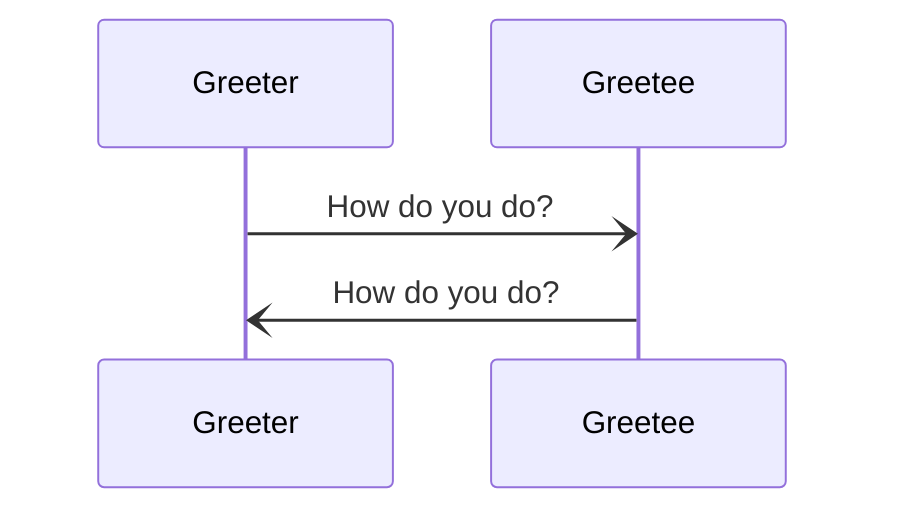

# On Engines in the Anoma Specification

!!! abstract "Summary and note to the reader"

	This page is intended as a quick start manual
	that guides the reader by means of examples;
	in a sense,
	we are betting on the power of 
	_programming by extrapolation from examples._
	However,
	everything is based on solid foundations:
	technical terms are linked to proper definitions below or elsewhere
	such that all information is 
    accessible within a few clicks; <!-- somebody please count ;-) -->
	whenever suitable,
	we also refer to the _mathematical backbone_
	at [formanoma](https://github.com/anoma/formanoma).<!--
	which comes with a more succinct documentation 
	and does not focus on Juvix code 
	but rather on formal properties of any Anoma model implementation.-->
	Thus,
 	the main purpose of this tutorial is 
	getting the reader to write Juvix code
	that compiles to what we call a _model implementation._
	However, we start with a short general introduction
	of some central concepts, paradigms, and techniques.

## Introduction: on message passing, actors, and engines

The Anoma specification will follow
the [message passing](https://en.wikipedia.org/wiki/Message_passing)
paradigm to describe how several entities
(that are possibly distributed over the planet)
communicate with each other by sending messages.
The most important diagram type are
[message sequence charts](https://en.wikipedia.org/wiki/Message_sequence_chart),
and the following example
describes the Britisch greeting protocol.

!!! example "Running example: time stamping server"

	The time stamping server ... 

In the Anoma specification,
the participants that exchange messages will be 
[[Engine instance|engine instances.]]
Engine instances are similar to actors of the 
[actor model](https://en.wikipedia.org/wiki/Actor_model);[^1]
however, we prefer to use fresh terminology,
as there is some "fine print" concerning differences to the
"pure" actor model that we shall cover in due course.
As a consequence,
the Anoma specification considers each Anoma node
to be a finite[^2] collection of
engine instances that communicate by sending messages to each other.

The behaviour of each engine instance—i.e.,
how it reacts to receiving messages from other engine instances
and notifications from the local clock—is
determined by its current state and its _state transition function,_
reminiscent of the next-state function of
[finite state machines](https://en.wikipedia.org/wiki/Automata_theory#Formal_definition)
(or rather [Moore machines](https://en.wikipedia.org/wiki/Moore_machine#Formal_definition)),
and very similar to
[event-driven state machines](https://erlang.org/doc/design_principles/statem.html).
Instead of going through the full details of
the [formal definition](https://github.com/anoma/formanoma/blob/1b9fa7558ce33bb4c2e4d31277255cdeabbc59b5/Types/Engine.thy#L215)<!--
	ᚦ: the last link need "continuous" updating [do not erase this comment]
--> of _systems_ of state transition functions,
we instead follow a more practicable approach.
We specify the behavior of each engine instance
via a finite set of guarded actions.

Thus,
the first design choice of the Anoma specification "postulates" that
each state transition of an engine instance amounts to performing some
finite set of _actions_—typically a signle action;
moreover,
each action comes with a _guard function_ that
determines—among other things—whether the action is enabled,
given its current state and the received message or notification.
Performing an action
corresponds to an event in the sense of the actor model theory.
We say that actions are _triggered_
by the arrival of a new message or
the notification about elapsed timers[^3];
performing an action has possibly several effects
in each of the following four categories:

- state updates of the engine instance
- adding messages to the send queue
- setting new timers and cancelling or resetting old ones
- creating new engine instances[^4].

The Anoma specification describes
a ꜰɪxᴇᴅ finite number of _engine families_
such that every engine instance in the model implementation
belongs to a unique family that describes its behaviour;
while the set of engine families is static,
dynamic "parameters" at engine creation determine the exact behaviour.
<!-- add footnote to engine system locale ["axiom" state_partition](https://github.com/anoma/formanoma/blob/915039faa7cfe77c2998b309ef65b671e604fead/Types/Engine.thy#L192) -->
<!-- this be moved elsewhere
!!! definition
¶
	We call the set of all engine instances that share the same state transition function the _engine type_ of the state transition function.
-->

We proceed with a more detailed description of
the "internal" structure of each engine instance.
Then we describe
how (labelled) state transitions are specified by sets of guarded actions.

## On the local data of engine instances: the engine environment

Each engine instance has the following local data that it can
access directly and exclusively
when it processes a received message or a clock notification:

- its _name_, which is a globally unique unchangeable value that
  _may_ be given by an ordered pair of<!--
  cf. https://github.com/anoma/formanoma/blob/a00c270144b4cfcf2aea516d7412ffbe508cf3d1/Types/Engine.thy#L208-L209-->

    - a _child name_ (chosen by the parent engine before creation) and
    - the parent's globally unique name

- its _mailbox cluster,_
  represented by a partial map with a finite domain of definition <!--
  cf. https://github.com/anoma/formanoma/blob/a00c270144b4cfcf2aea516d7412ffbe508cf3d1/Types/Engine.thy#L211-->

    - from _mailbox identifiers_ (**MID** for short)

     
    - to _mailboxes_, which in turn consist of

		- a list of messages (that were sent to the MID but not processed yet)
		- an optional mailbox-specific state (for quick processing of new messages)

  - its _acquaintances_[^5], represented by<!--
	cf. https://github.com/anoma/formanoma/blob/a00c270144b4cfcf2aea516d7412ffbe508cf3d1/Types/Engine.thy#L213
  -->

    - a finite set of names <!-- ᚦ: TODO: figure out how to combine with aliasing -->

- memory for previously set timers, given by<!--
  cf. https://github.com/anoma/formanoma/blob/a00c270144b4cfcf2aea516d7412ffbe508cf3d1/Types/Engine.thy#L212-->

    - a finite list of timers

- engine-specific local state (that not naturally tied to a specific mailbox) <!--
  cf. https://github.com/anoma/formanoma/blob/a00c270144b4cfcf2aea516d7412ffbe508cf3d1/Types/Engine.thy#L209 -->

The record of all these local data is called the _engine environment_[^6],
not only because the word `state` is hopelessly overworked,
but specifically because we want to reserve it for
the  states of the "global" labelled transition system
(see below).
The types are formalised in
the [`single_engine`-locale](https://github.com/anoma/formanoma/blob/f70a041a25cfebde07d853199351683b387f85e2/Types/Engine.thy#L205).<!--
	link **will** need updating [ᚦ do not erase this comment] OUT OF DATE ALERT!
--><!--
	ᚦ: TODO: describe relation of Juvix code to implementation ...
-->
The engine instance's name is unchangeable,
once the engine is created;
every correct implementation must ensure that
the parent engine chooses a globally unique name
before the child engine can be created;
as mentioned above,
the default is a pair of the parent's globally unique name
and a _child name_ that is unique among its siblings—<!--
-->either spawned previously or in the future.
Should it become necessary to change the name of an engine,
e.g., because it has been sent to undesired destinations,
a new *"continuation engine"* can be spawned with a new name.

## On labelled state transitions via guarded actions

The Anoma Specification uses pure functions to describe
the atomic computation that each engine instance performs when
a new message is ready to be processed or
a notification from the local clock is received.
Each specific state transition corresponds to
a set of _actions_ performed,
typically a single one. However,
we can, in principle, perform multiple actions "in parallel",
provided that we have a well-defined concurrency relation among actions.
The effects of the action that computes a state transition
is computed by a corresponding action function.
Action functions compute

- updates to the engine environment
- a set of messages to be sent
- a set of timers to be set, cancelled, and reset
- new engines to be created.

Whether or not an action is enabled for a trigger
is determined by action guards,
by guard functions.

Before we delve into the details,
note that this approach is based on the seminal work of
[Henessy and Milner](https://en.wikipedia.org/wiki/Hennessy%E2%80%93Milner_logic)
and
Lamport's [temporal logic of _actions_ (ᴛʟᴀ⁺)](https://lamport.azurewebsites.net/tla/tla.html).
Additional sources of inspiration are
Dijkstra's [_guarded_ command language (ɢᴄʟ)](https://en.wikipedia.org/wiki/Guarded_Command_Language)
and guard functions of [coloured Petri nets](https://en.wikipedia.org/wiki/Coloured_Petri_net).

<!--
The formal details are given by
(any interpretation of) the [`transition_function`](https://github.com/anoma/formanoma/blob/75331d688f2ae399fbebb008549b2dfda78b4e5b/Types/Engine.thy#L217) of
the [`single_engine`-locale](https://github.com/anoma/formanoma/blob/f70a041a25cfebde07d853199351683b387f85e2/Types/Engine.thy#L205).--><!--
ᚦ: ALERT: out of date!!
-->

<!--
The main points to keep in mind:
there's an "optional parameter" for which action is to be taken,
and the action given the current environment
and the time stamped trigger do already determine
the action to be taken and also the reactions to the trigger.
Let us explain this one step at a time.

Now, one important deviation from a "bare bones" actor model
are a set of guards for each engine family.
It is up to the set of guards to determine,
which action could be taken given
the local data in form of an engine environment
and the time stamped[_trigger,_](https://github.com/anoma/formanoma/blob/f70a041a25cfebde07d853199351683b387f85e2/Types/Engine.thy#L19)--><!--
ᚦ: needs updating [do not remove this comment): out of date ALERT!
-->

### A finite set of guarded actions for each engine family

Each engine family comes with a set of guarded actions
where the _guard_ is a function that—among other things—determines whether
the action that it guards is _enabled._
To determine whether the action is enabled,
the guard function has access to the time stamped trigger
and the engine environment[^7].
In most situations,
only very few components of the engine environment are needed
to determine whether the action is enabled.
For a received message, the message alone may be enough,
maybe already the message tag is sufficient.
The guard function returns _matched arguments,_
e.g., the relevant information of a received message,
and an _action label_
that identifies the respective action that is enabled.

<!--ᚦ: {a different description we had elsewhere}
	Recall that each guarded action is a pair of a guard function and an action function.
	Conceptually, the guard function has two purposes:
	first it determines whether the action that it is guarding is enabled;
	moreover,
	if the action is enabled it provides matched arguments and an action label.
-->

All guards of an engine could be evaluated in parallel,
for every new trigger,
e.g., upon  arrival of new  message;
in practice,  one may want to choose a more efficient, but equivalent strategy.

In simple cases,
at most one action is enabled for the same trigger;
however,
if several actions are enabled,
priorities of guarded actions may be used to resolve undesirable non-determinism.
If non-determinism is part of the design,
it should be marked clearly.

!!! warning

	It is OK to keep non-determinism and mark it
	so that we are aware of potential issue.
	Inappropriate resolution of non-determinism can lead to
	deadlocks.

### Inputs for the action of a guarded action

The actions of guarded actions take three pieces of data as input:
the local state in the form of the engine environment,
the time stamped trigger (message or notification),
and finally the outputs of the guard function,
i.e., the matched arguments, the action label,
and any additional precomputations that the guard has already computed.<!--
ᚦ: well, need to discuss with Jonathan
-->
By _time stamped_, we mean that
each trigger comes with the local time when guard evaluation was triggered,
which one may want to think of as the local time "now".

Digression on time

: The only information about local wall-clock time in
the input of the guard function is

- "now"—the [time](https://github.com/anoma/formanoma/blob/f70a041a25cfebde07d853199351683b387f85e2/Types/Engine.thy#L222) stamp of the trigger—and
- the set of previously set timers,
  each of which has a
  [_handle._](https://github.com/anoma/formanoma/blob/f70a041a25cfebde07d853199351683b387f85e2/Types/Engine.thy#L24)

!!! warning

	The treatment of local wall-clock time is still experimental;
    however, we may need it to mitigate possible limitations of
	the partial synchrony abstraction
	(see, e.g.,
	[The Economic Limits of Permissionless Consensus](https://arxiv.org/pdf/2405.09173)).
	There are also subtleties concerning
	monotonicity of clock implementations in
	common operating systems.

??? todo
	
	add details according to the discussion in the PR,
	see e.g., here https://github.com/anoma/nspec/pull/84#discussion_r1639785764

### Outputs of an action

We describe the outputs in two steps:
first,
we cover _non-interactive_ actions,
which do neither require any source of (true) randomness
nor direct inputs to the physical device that
the engine instance happens to be running on;
then, we follow up on
how engine-local sources of input or randomness can
"affect" which action is to be taken.

<!--ᚦ old material on the topic
	The output of the action describes after the event has finished
¶
	- updates to the above local data (except for identities and arguments)
	- a finite set of messages to be sent
	- a finite set of engines to be spawned, setting
		- engine type
		- initial state
		- a name for the process (that is unique relative to the engine)
-->

#### Outputs of non-interactive actions

The output of a non-interactive action function
has five components:

- the update to the engine environment (leaving the name untouched),
- messages to be sent,
- update of the timers set (new ones to set, old ones to cancel),
- new engine instances to be spawned.

!!! note

	In rare situations, it may necessary to specify a _maximum_ duration
	for how fast the action has to be.
	The formal modeling framework is prepared to handle such cases.
	However,
	it may be long before this feature will be incorporated in our software releases.

##### Timers to be set

Given the inputs,
the action may decide to set new timers
and "remove" old timers.
As each timer has an engine-local _handle,_
this amounts to updating a map of local timers,
cancelling superseded timers and
adding new timers.
A timer handle may be used for at most one timer during the life-time of
an engine instance.
The formal model has a [map from handles to points in local time](https://github.com/anoma/formanoma/blob/4ad37bc274ad25e64d15fe5f00dbd7784e339ce0/Types/Engine.thy#L230)<!--
    ᚦ: needs updating "continuously" [do not remove this comment]
-->.

##### Engine instances to be spawned

If new engine instances are created as part of an action,
the engine instance that is requesting to spawn the new instance is
called the _parent engine instance_
(or just _parent engine,_ for short);
the created instances are called _children._
The following data has to be provided to create a new engine instance.

- the engine family of the child engine
- the _initial environment_ of the child engine instance
  (the one that the engine will have when it processes its first trigger)
- a _child name,_
  which only needs to be unique among the engines that
  the parent engine creates during its lifetime
  (because the parent's name is an implicit parameter)

<!--ᚦ: this is still to be figured out ... TODO
The engine instance will become "alive"
after the current execution of the transition function.
-->

The parent engine can already send messages to engines before these "actually go live".

##### Messages to be sent

An action may queue a finite set of _enveloped messages_ to be sent.
Each of these messages carries information about the intended recipient
and the mailbox identifier of the latter.
All formalities of messages are in
the [`Message.thy`-theory](https://github.com/anoma/formanoma/blob/heindel/engine-locale/Types/Message.thy)<!--
	link will need updating [do not remove this comment]
-->.

##### Updates to the engine environment

Last but not least,
all local data can be updated—except for the engine name.

### Outputs of interactive actions

Engine instances may require access to "true" randomness[^8]
to be able to properly process triggers and thus
we equip engine instances with the possibility to use
the mathematical counterpart of $n$-sided dice.
Moreover,
engine instances may need to interact with the user
_synchronously,_
e.g., for final confirmations of important actions
or interaction with hardware security modules.
Thus, reading form local _external_ streams of input
are a second kind of interaction;
users may choose from a finite number of choices at a time.
Finally,
there may be a "mix" of local user inputs and randomness.
For example and engine may generate a random username and
the user is asked to accept or choose it manually.

In short,
we can generalise the single output of non-interactive actions
to a finitely branching tree:

- leaves are outputs in the form described for non-interactive actions
- inner nodes are either
    - user choices from a finite number of candidates or
    - random experiments of rolling of an $n$-sided dice[^9].
	
!!! note

	Interactive actions are not yet covered by the templates.
	If you need to have access to user input or randomness,
	please mark it with ⚄ for randomness
	and 𓀠 for user interaction.

## From guarded actions to labelled state transitions

Given a finite set of engine environments and set of "messages in transit",
we can derive a single
[labelled transition system (ʟᴛꜱ)](https://en.wikipedia.org/wiki/Transition_system).
Roughly,
the state space of the labelled transition system is the pair
of all engine environments in existence and the messages in transit.
The transitions are "induced" by the guarded actions.

Before we quickly describe how this works,
not that via the ʟᴛꜱ,
we can use standard methods to express system properties,
e.g., the temporal logic [ᴄᴛʟ*](https://en.wikipedia.org/wiki/CTL*).
Guards emphasise that actions have clearly defined pre-conditions,
and we may also use [weakest-precondition calculus](https://en.wikipedia.org/wiki/Predicate_transformer_semantics),
e.g., for deriving invariants.

Now for how we derive the labelled state transitions,
putting aside time and interactivity for a moment,
each state is a pair of

- a finite set of engine instances
- a finite set of messages in transit

A state transition between states $s,s'$ via an action label $a$ is possible
if there is
one engine environment in the original state
and one message that is addressed to this engine in the set of messages in transit
such that the action with label $a$ is enabled for the engine
and and by adding the new messages to be sent (after dropping the received message)
to the set of pending messages and by adding
the newly created engines to the set of engine instances,
we arrive at the state $s'$.

<!--
The basic idea of guarded actions is to split up
the set of possible inputs of the state transition function into
a finite number of cases,
each of which corresponds to an _event kind_—very much like
the transitions of a [Petri net](https://en.wikipedia.org/wiki/Petri_net#Execution_semantics)
can be "unfolded" into an [event structure](https://dl.acm.org/doi/abs/10.5555/898126),
where events are _occurrences of transitions_ of the original net.
-->

<!--
The basic idea of guarded actions is to avoid
the need to describe for each engine to write a single monolithic
state transition function.
However,
we want derive  in a modular way
such that each (non-trivial) state transition corresponds to
the execution of (at least) one guarded action.[^Y]
The guard of a guarded action specifies the precondition of the action,
which describes what state changes should happen when the guard is triggered.
However,
guarded actions may be concurrent or in conflict with each other,
and this situation need to be handled with care.
The details of guarded actions are explained in the [[Guarded Engine Template]].
-->

## The conceptual structure of engine family specifications

The structure of each engine family page
first describes the general context,
gives some example message exchanges,
and then covers the details
about engine-specific types
and its set of guarded actions.
In more detail,
we use the following templates
to describe engine families.

<!--
- engine family name (e.g., _Auctioneer_)
  - purpose {very big picture}
  - list of engine-specific types
    - local state
	- message types received and sent
    - mailbox state types (for optimisations)
  - message sequence diagram(s) {specific example(s)}
  - conversation diagram {big picture}
    - conversation partners
        - partner A
    		- incoming
	    	    - A1
		        - ...
		        - Anₐ
      		- outgoing
                - A1
 		        - ...
    		    - Amₐ
	    - ...
	    - partner X
	        - incoming
	            - X1
     		    - ...
	    	    - Xnₓ
		    - outgoing
		        - X1
    		    - ...
	    	    - Xmₓ
  - guarded actions {now for the details}
    - guarded action α1 (e.g., receive bid)
  	    - guard α1 {`local data * trigger → arguments option`}
	    - action α1 {`local data * arguments → local data update * sends * timers * spawns`}
	        - local data update {prose}
            - messages to be sent {prose}
		    - timer to be set {prose}
		    - engines to be spawned {prose}
	- ...	
    - guarded action αk (e.g., finalise auction)
  	    - guard αk {`local data * trigger → arguments option`}
	    - action αk {`local data * arguments → local data update * sends * timers * spawns`}
	        - local data update {prose}
            - messages to be sent {prose}
		    - timer to be set {prose}
		    - engines to be spawned {prose}

-->

## Template files

??? "Engine template"

	!!! info

        The below template can be found in the `overrides/templates/engine-template.md` file.
		
	!!! info
	
		Text in curly braces `{` `}` is used for short explanations of titles
		and/or further context. Text in square brackets `[` `]` is a description
		of what should be put or what it represents.
		

    --8<-- "./../overrides/templates/engine-template.md:6"

??? "Guarded action template"

	!!! info

        The following template can be found in the `overrides/templates/guarded-action-template.md` file.

    --8<-- "./../overrides/templates/guarded-action-template.md"

---

<!-- footnotes -->

[^1]: At the time of writing V2 specs, further relevant sources are 
	*Selectors: Actors with Multiple Guarded Mailboxes*[@selectors-actors-2014] 
	and
	*Special Delivery: Programming with Mailbox Types*[@special-delivery-mailbox-types-2023].
	We shall refer to mailbox types of the latter paper
	as *mailbox **usage** types*
	whenever we want to avoid ambiguities or
	we are afraid of confusion with the generic [[Mailbox State|mailbox state]] type.

[^2]: The specification does not fix any bound on
	the number of engines in existence.

[^3]: The elapsing of timers is the only way to
	interact with a local clock of engine instances.

[^4]: Here, we follow Erlang's practice of
	[event-driven state machines](https://www.erlang.org/doc/system/statem.html):
    all behaviour is expressed in a single function.
	This is in contrast to [Mealy machines](https://en.wikipedia.org/wiki/Mealy_machine),
	we have a pair of functions,
	one for the state update and one for the outputs generated.
	Either choice is valid and it is a design choice.

[^5]: Here, we borrow actor terminology.

[^6]: Clocks are a little more complicated to get into the picture;
	they are "external" to the engine environment and still experimental.

[^7]: We always have a default guard
	that "activates" if no other guards are defined.

[^8]: A well-known example for relevance of sources of "true" randomness are
	[cloudflare's lava lamps](https://www.cloudflare.com/learning/ssl/lava-lamp-encryption/).

[^9]: See the
	[`local_interaction`data type](https://github.com/anoma/formanoma/blob/f70a041a25cfebde07d853199351683b387f85e2/Types/Engine.thy#L53).
	
[^X]: Note that in TLA⁺, pre-conditions of actions are
	present in the guise of the `ENABLED` predicate.

[^Y]: Arriving messages that do not trigger any "non-trivial" guarded action
	are added to the mailbox they are addressed,
	time is incremented by a default delay, and nothing else changes.

[^G]: Local time is still in alpha stage,
	but it could be used to implement busy waiting;
	however,
	the preferred way to interact with the local clock is
	setting new timers for specific points in local time.
	Probably,
	this should be replaced by minimal and maximal duration for an event
	for the specification of real time engines.

[^K]: The meaning of enabled is exactly as in TLA⁺ or Petri nets.
