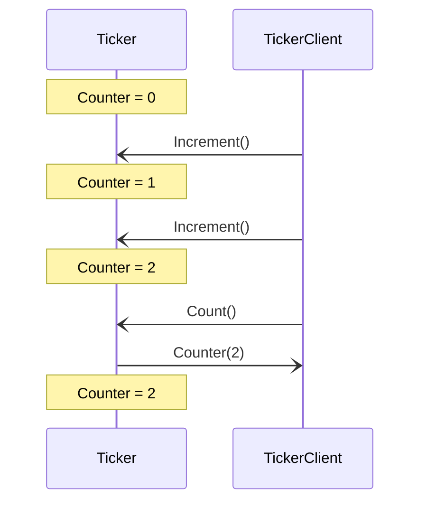

# Ticker Engine Family

## Purpose

A ticker engine instance, or _ticker_ for short,
maintains a counter in its local state.
A ticker increases the counter whenever it receives an `Increment` message;
moreover,
whenever a ticker receives a `Count` message,
it replies the updated result back to the requester.
The initial state of the counter is set at spawning time.

## Message Sequence Diagrams

### Increment and respond

<figure markdown="span">

<figcaption markdown="span">
A client interacts with a ticker, 
which first increments twice and 
then responds with the counter value
to the `Count` request.
</figcaption>
</figure>

### [[Engine Environment Example|Engine environment]]

!!! tip "on snippeting"

    Snippets do not work with syntax highlighting yet.
    That is why we link to the other page (for the moment).

### [[Engine Dynamics Example|Engine dynamics]]

!!! tip "on snippeting"

    Snippets do not work with syntax highlighting yet.
    That is why we link to the other page (for the moment).
