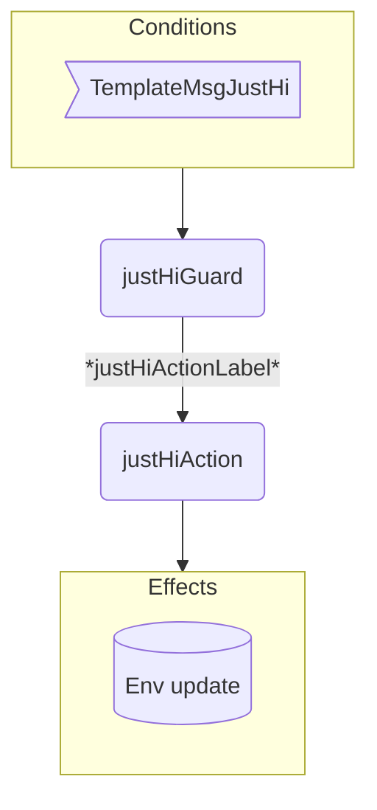
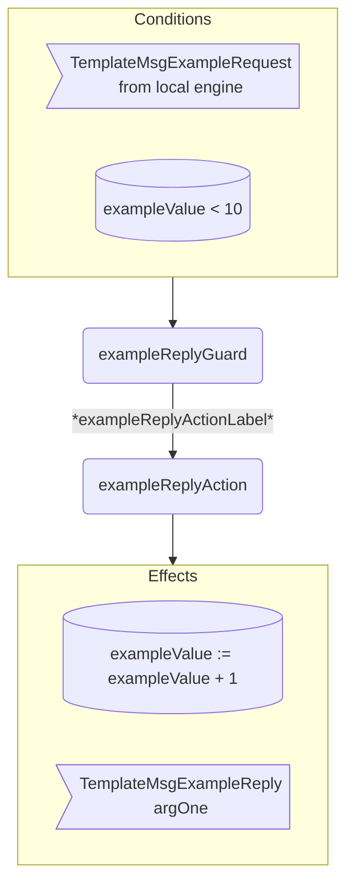

??? code "Juvix imports"

    ```juvix
    module tutorial.engines.template_behaviour;

    import tutorial.engines.template_messages open;
    import tutorial.engines.template_config open;
    import tutorial.engines.template_environment open;

    import arch.node.types.basics open;
    import arch.node.types.identities open;
    import arch.node.types.messages open;
    import arch.node.types.engine open;
    import arch.node.types.anoma as Anoma open;
    ```

# Template Behaviour

## Overview

A template engine acts in the ways described on this page.
The action labels correspond to the actions that can be performed by the engine.
Using the action labels, we describe the effects of the actions.

## Action arguments

The action arguments are set by a guard
and passed to the action function as part of the `GuardOutput`.

??? code "Auxiliary Juvix code"

    <!-- --8<-- [start:Val] -->
    ```juvix
    syntax alias Val := Nat;
    ```
    <!-- --8<-- [end:Val] -->

### `One FirstArgument`

<!-- --8<-- [start:FirstArgument] -->
```juvix
type FirstArgument := mk@{
  data : Val;
};
```
<!-- --8<-- [end:FirstArgument] -->

???+ code "Arguments"

    `data`:
    : is the value of the action argument.

### `Two SecondArgument`

<!-- --8<-- [start:SecondArgument] -->
```juvix
type SecondArgument := mk@{
  data : String;
};
```
<!-- --8<-- [end:SecondArgument] -->

???+ code "Arguments"

    `data`:
    : is the value of the action argument.

### `TemplateActionArgument`

<!-- --8<-- [start:TemplateActionArgument] -->
```juvix
type TemplateActionArgument :=
  | One FirstArgument
  | Two SecondArgument
  ;
```
<!-- --8<-- [end:TemplateActionArgument] -->

### `TemplateActionArguments`

<!-- --8<-- [start:TemplateActionArguments] -->
```juvix
TemplateActionArguments : Type := List TemplateActionArgument;
```
<!-- --8<-- [end:TemplateActionArguments] -->

## Actions

??? code "Auxiliary Juvix code"

    ### `TemplateAction`

    <!-- --8<-- [start:TemplateAction] -->
    ```juvix
    TemplateAction : Type :=
      Action
        TemplateLocalCfg
        TemplateLocalState
        TemplateMailboxState
        TemplateTimerHandle
        TemplateActionArguments
        Anoma.Msg
        Anoma.Cfg
        Anoma.Env;
    ```
    <!-- --8<-- [end:TemplateAction] -->

    ### `TemplateActionInput`

    <!-- --8<-- [start:TemplateActionInput] -->
    ```juvix
    TemplateActionInput : Type :=
      ActionInput
        TemplateLocalCfg
        TemplateLocalState
        TemplateMailboxState
        TemplateTimerHandle
        TemplateActionArguments
        Anoma.Msg;
    ```
    <!-- --8<-- [end:TemplateActionInput] -->

    ### `TemplateActionEffect`

    <!-- --8<-- [start:TemplateActionEffect] -->
    ```juvix
    TemplateActionEffect : Type :=
      ActionEffect
        TemplateLocalState
        TemplateMailboxState
        TemplateTimerHandle
        Anoma.Msg
        Anoma.Cfg
        Anoma.Env;
    ```
    <!-- --8<-- [end:TemplateActionEffect] -->

    ### `TemplateActionExec`

    <!-- --8<-- [start:TemplateActionExec] -->
    ```juvix
    TemplateActionExec : Type :=
      ActionExec
        TemplateLocalCfg
        TemplateLocalState
        TemplateMailboxState
        TemplateTimerHandle
        TemplateActionArguments
        Anoma.Msg
        Anoma.Cfg
        Anoma.Env;
    ```
    <!-- --8<-- [end:TemplateActionExec] -->

### `justHiAction`

Action description.

State update
: Update state with the data set by `justHiGuard`.

Messages to be sent
: No messages are added to the send queue.

Engines to be spawned
: No engine is created by this action.

Timer updates
: No timers are set or cancelled.

Acquaintance updates
: None.

<!-- --8<-- [start:justHiAction] -->
```juvix
justHiAction
  (input : TemplateActionInput)
  : Option TemplateActionEffect :=
  let
    env := ActionInput.env input;
    args := ActionInput.args input;
  in
    case args of {
    | TemplateActionArgument.Two (SecondArgument.mk@{
        data := data;
      }) :: _ :=
      some ActionEffect.mk@{
        env := env@EngineEnv{
          localState := TemplateLocalState.mk@{
            taskQueue := CustomData.mkCustomData@{
              word := data
            }
          }
        };
        msgs := [];
        timers := [];
        engines := [];
      }
    | _ := none
    }
```
<!-- --8<-- [end:justHiAction] -->

#### `exampleReplyAction`

Respond with a `TemplateMsgExampleReply`.

State update
: The state remains unchanged.

Messages to be sent
: A `TemplateMsgExampleReply` message with the data set by `exampleReplyGuard`.

Engines to be spawned
: No engine is created by this action.

Timer updates
: No timers are set or cancelled.

<!-- --8<-- [start:exampleReplyAction] -->
```juvix
exampleReplyAction
  (input : TemplateActionInput)
  : Option TemplateActionEffect :=
  let
    cfg := ActionInput.cfg input;
    env := ActionInput.env input;
    trigger := ActionInput.trigger input;
    args := ActionInput.args input;
  in
    case getEngineMsgFromTimestampedTrigger trigger of {
    | some EngineMsg.mk@{
        msg := Anoma.Msg.Template (TemplateMsg.ExampleRequest req);
        sender := sender;
        target := target;
        mailbox := mailbox;
      } :=
      some ActionEffect.mk@{
        env := env;
        msgs := [
          EngineMsg.mk@{
            sender := getEngineIDFromEngineCfg cfg;
            target := sender;
            mailbox := some 0;
            msg :=
              Anoma.Msg.Template
                (TemplateMsg.ExampleReply
                  (ok ExampleReplyOk.mkExampleReplyOk@{
                    argOne := ExampleRequest.argOne req;
                  }));
          }
        ];
        timers := [];
        engines := [];
      }
  | _ := none
  };
```
<!-- --8<-- [end:exampleReplyAction] -->

## Action Labels

### `justHiActionLabel`

```juvix
justHiActionLabel : TemplateActionExec := ActionExec.Seq [ justHiAction ];
```

### `exampleReplyActionLabel`

```juvix
exampleReplyActionLabel : TemplateActionExec := ActionExec.Seq [ exampleReplyAction ];
```

### `doBothActionLabel`

```juvix
doBothActionLabel : TemplateActionExec :=
  ActionExec.Seq [
    justHiAction;
    exampleReplyAction;
  ];
```

## Guards

??? code "Auxiliary Juvix code"

    ### `TemplateGuard`

    <!-- --8<-- [start:TemplateGuard] -->
    ```juvix
    TemplateGuard : Type :=
      Guard
        TemplateLocalCfg
        TemplateLocalState
        TemplateMailboxState
        TemplateTimerHandle
        TemplateActionArguments
        Anoma.Msg
        Anoma.Cfg
        Anoma.Env;
    ```
    <!-- --8<-- [end:TemplateGuard] -->

    ### `TemplateGuardOutput`

    <!-- --8<-- [start:TemplateGuardOutput] -->
    ```juvix
    TemplateGuardOutput : Type :=
      GuardOutput
        TemplateLocalCfg
        TemplateLocalState
        TemplateMailboxState
        TemplateTimerHandle
        TemplateActionArguments
        Anoma.Msg
        Anoma.Cfg
        Anoma.Env;
    ```
    <!-- --8<-- [end:TemplateGuardOutput] -->

    ### `TemplateGuardEval`

    <!-- --8<-- [start:TemplateGuardEval] -->
    ```juvix
    TemplateGuardEval : Type :=
      GuardEval
        TemplateLocalCfg
        TemplateLocalState
        TemplateMailboxState
        TemplateTimerHandle
        TemplateActionArguments
        Anoma.Msg
        Anoma.Cfg
        Anoma.Env;
    ```
    <!-- --8<-- [end:TemplateGuardEval] -->

### `justHiGuard`

Guard description (optional).

Condition
: Message type is `TemplateMsgJustHi`.

<!-- --8<-- [start:justHiGuard] -->
```juvix
justHiGuard
  (trigger : TemplateTimestampedTrigger)
  (cfg : TemplateCfg)
  (env : TemplateEnv)
  : Option TemplateGuardOutput :=
  let
    emsg := getEngineMsgFromTimestampedTrigger trigger;
  in
    case emsg of {
    | some EngineMsg.mk@{
        msg := Anoma.Msg.Template TemplateMsg.JustHi;
      } :=
      some GuardOutput.mk@{
        action := justHiActionLabel;
        args := [
          TemplateActionArgument.Two
            SecondArgument.mk@{
              data := "Hello World!"
            }
        ];
      }
    | _ := none
    };
```
<!-- --8<-- [end:justHiGuard] -->

### `exampleReplyGuard`

Guard description (optional).

Condition
: Message type is `TemplateMsgExampleRequest`.

<!-- --8<-- [start:exampleReplyGuard] -->
```juvix
exampleReplyGuard
  (trigger : TemplateTimestampedTrigger)
  (cfg : TemplateCfg)
  (env : TemplateEnv)
  : Option TemplateGuardOutput :=
  case getEngineMsgFromTimestampedTrigger trigger of {
    | some EngineMsg.mk@{
        msg := Anoma.Msg.Template (TemplateMsg.ExampleRequest req);
        sender := mkPair none _; -- from local engines only (NodeID is none)
      } := some GuardOutput.mk@{
        action := exampleReplyActionLabel;
        args := [];
      }
    | _ := none
    };
```
<!-- --8<-- [end:exampleReplyGuard] -->

## Engine behaviour

### `TemplateBehaviour`

<!-- --8<-- [start:TemplateBehaviour] -->
```juvix
TemplateBehaviour : Type :=
  EngineBehaviour
    TemplateLocalCfg
    TemplateLocalState
    TemplateMailboxState
    TemplateTimerHandle
    TemplateActionArguments
    Anoma.Msg
    Anoma.Cfg
    Anoma.Env;
```
<!-- --8<-- [end:TemplateBehaviour] -->

#### Instantiation

<!-- --8<-- [start:exTemplateBehaviour] -->
```juvix
module template_behaviour_example;

  exTemplateBehaviour : TemplateBehaviour :=
    EngineBehaviour.mk@{
      guards :=
        GuardEval.First [
          justHiGuard;
          exampleReplyGuard;
        ];
    };
end;
```
<!-- --8<-- [end:exTemplateBehaviour] -->

## Template Action Flowchart

### `justHi` Flowchart

<figure markdown>



<figcaption markdown="span">

`justHi` flowchart

</figcaption>
</figure>

### `exampleReply` Flowchart

<figure markdown>



<figcaption markdown="span">

`exampleReply` flowchart

</figcaption>
</figure>
