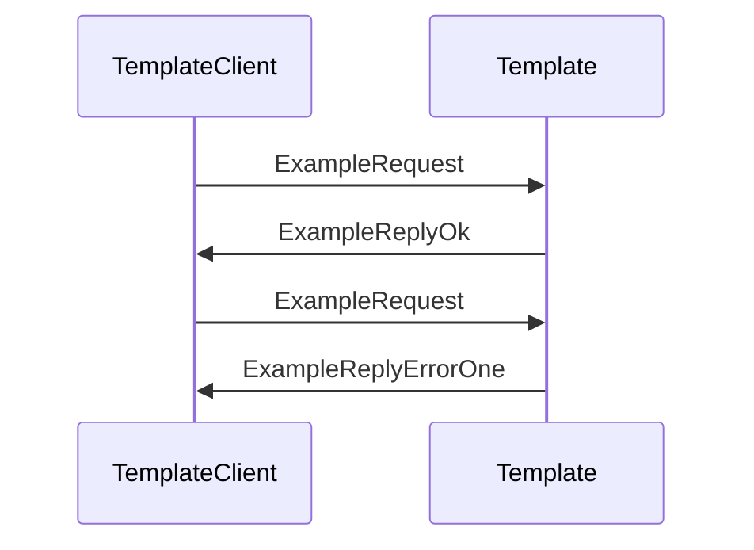

??? code "Juvix imports"

    ```juvix
    module tutorial.engines.template_messages;
    import prelude open;
    ```

# Template Messages

These are the messages that the Template engine can receive/respond to.

## Message interface

--8<-- "./template_messages.juvix.md:TemplateMsg"


## Message sequence diagrams

### `ExampleRequest` and `ExampleReply`

Lorem ipsum dolor sit amet, consectetur adipiscing elit.
Sed ut purus eget sapien. Nulla facilisi.

<!-- --8<-- [start:message-sequence-diagram-ExampleRequest] -->
<figure markdown="span">



<figcaption markdown="span">
Sequence Diagram: `ExampleRequest` & `ExampleReply`
</figcaption>
</figure>
<!-- --8<-- [end:message-sequence-diagram-ExampleRequest] -->

## Message types

### `TemplateMsgJustHi`

Lorem ipsum dolor sit amet, consectetur adipiscing elit.

### `ExampleRequest`

Example request.

<!-- --8<-- [start:ExampleRequest] -->
```juvix
type ExampleRequest := mkExampleRequest@{
  argOne : Nat;
  argTwo : Nat;
}
```
<!-- --8<-- [end:ExampleRequest] -->

???+ code "Arguments"

    `argOne`
    : Lorem ipsum dolor sit amet, consectetur adipiscing elit.

    `argTwo`
    : Lorem ipsum dolor sit amet, consectetur adipiscing elit.

### `ExampleReply`

Reply to an `ExampleRequest`.

??? code "Auxiliary Juvix code"

    #### `ExampleReplyOk`

    Example OK reply.

    <!-- --8<-- [start:ExampleReplyOk] -->
    ```juvix
    type ExampleReplyOk := mkExampleReplyOk@{
      argOne : Nat;
    }
    ```
    <!-- --8<-- [end:ExampleReplyOk] -->

    ???+ code "Arguments"

        `argOne`
        : Lorem ipsum dolor sit amet, consectetur adipiscing elit.


    #### `ExampleReplyError`

    Example error reply.

    ```juvix
    type ExampleReplyError :=
      | ExampleErrorOne
      | ExampleErrorTwo
      ;
    ```

    ???+ code "Error types"

        `ExampleErrorOne`
        : Lorem ipsum dolor sit amet, consectetur adipiscing elit.

        `ExampleErrorTwo`
        : Lorem ipsum dolor sit amet, consectetur adipiscing elit.

<!-- --8<-- [start:ExampleReply] -->
```juvix
ExampleReply : Type := Result ExampleReplyError ExampleReplyOk;
```
<!-- --8<-- [end:ExampleReply] -->

### `TemplateMsg`

<!-- --8<-- [start:TemplateMsg] -->
```juvix
type TemplateMsg :=
  | TemplateMsgJustHi
  | TemplateMsgExampleRequest ExampleRequest
  | TemplateMsgExampleReply ExampleReply
  ;
```
<!-- --8<-- [end:TemplateMsg] -->

## Engine components

- [[Template Configuration]]
- [[Template Environment]]
- [[Template Behaviour]]
