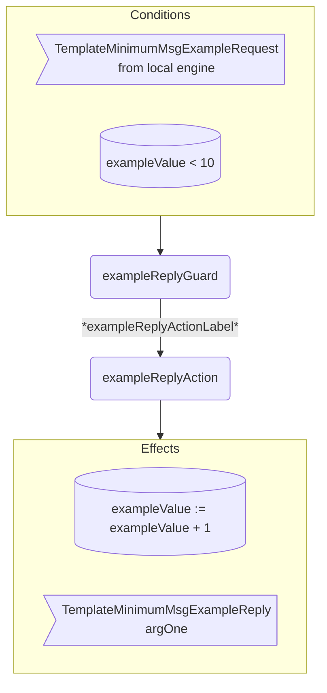

??? code "Juvix imports"

    ```juvix
    module tutorial.engines.template_minimum_behaviour;

    import tutorial.engines.template_minimum_messages open;
    import tutorial.engines.template_minimum_config open;
    import tutorial.engines.template_minimum_environment open;

    import arch.node.types.basics open;
    import arch.node.types.identities open;
    import arch.node.types.messages open;
    import arch.node.types.engine open;
    import arch.node.types.anoma as Anoma open;
    ```

# Template Minimum Behaviour

## Overview

A *Template Minimum* engine acts in the ways described on this page.
The action labels correspond to the actions that can be performed by the engine.
Using the action labels, we describe the effects of the actions.

## Action arguments

The action arguments are set by a guard
and passed to the action function as part of the `GuardOutput`.

### `TemplateMinimumActionArguments`

<!-- --8<-- [start:TemplateMinimumActionArguments] -->
```juvix
TemplateMinimumActionArguments : Type := Unit;
```
<!-- --8<-- [end:TemplateMinimumActionArguments] -->

## Actions

??? code "Auxiliary Juvix code"

    ### `TemplateMinimumAction`

    <!-- --8<-- [start:TemplateMinimumAction] -->
    ```juvix
    TemplateMinimumAction : Type :=
      Action
        TemplateMinimumLocalCfg
        TemplateMinimumLocalState
        TemplateMinimumMailboxState
        TemplateMinimumTimerHandle
        TemplateMinimumActionArguments
        Anoma.Msg
        Anoma.Cfg
        Anoma.Env;
    ```
    <!-- --8<-- [end:TemplateMinimumAction] -->

    ### `TemplateMinimumActionInput`

    <!-- --8<-- [start:TemplateMinimumActionInput] -->
    ```juvix
    TemplateMinimumActionInput : Type :=
      ActionInput
        TemplateMinimumLocalCfg
        TemplateMinimumLocalState
        TemplateMinimumMailboxState
        TemplateMinimumTimerHandle
        TemplateMinimumActionArguments
        Anoma.Msg;
    ```
    <!-- --8<-- [end:TemplateMinimumActionInput] -->

    ### `TemplateMinimumActionEffect`

    <!-- --8<-- [start:TemplateMinimumActionEffect] -->
    ```juvix
    TemplateMinimumActionEffect : Type :=
      ActionEffect
        TemplateMinimumLocalState
        TemplateMinimumMailboxState
        TemplateMinimumTimerHandle
        Anoma.Msg
        Anoma.Cfg
        Anoma.Env;
    ```
    <!-- --8<-- [end:TemplateMinimumActionEffect] -->

    ### `TemplateMinimumActionExec`

    <!-- --8<-- [start:TemplateMinimumActionExec] -->
    ```juvix
    TemplateMinimumActionExec : Type :=
      ActionExec
        TemplateMinimumLocalCfg
        TemplateMinimumLocalState
        TemplateMinimumMailboxState
        TemplateMinimumTimerHandle
        TemplateMinimumActionArguments
        Anoma.Msg
        Anoma.Cfg
        Anoma.Env;
    ```
    <!-- --8<-- [end:TemplateMinimumActionExec] -->

#### `exampleReplyAction`

Respond with a `TemplateMinimumMsgExampleReply`.

State update
: The state remains unchanged.

Messages to be sent
: A `TemplateMinimumMsgExampleReply` message with the data set by `exampleReplyGuard`.

Engines to be spawned
: No engine is created by this action.

Timer updates
: No timers are set or cancelled.

<!-- --8<-- [start:exampleReplyAction] -->
```juvix
exampleReplyAction
  (input : TemplateMinimumActionInput)
  : Option TemplateMinimumActionEffect :=
  TODO {-
  let
    cfg := ActionInput.cfg input;
    env := ActionInput.env input;
    trigger := ActionInput.trigger input;
    args := ActionInput.args input;
  in
    case getEngineMsgFromTimestampedTrigger trigger of {
    | some EngineMsg.mk@{
        msg := Anoma.PreMsg.MsgTemplateMinimum (TemplateMinimumMsgExampleRequest req);
        sender := sender;
        target := target;
        mailbox := mailbox;
      } :=
      some ActionEffect.mk@{
        env := env;
        msgs := [
          EngineMsg.mk@{
            sender := getEngineIDFromEngineCfg cfg;
            target := sender;
            mailbox := some 0;
            msg :=
              Anoma.PreMsg.MsgTemplateMinimum
                (TemplateMinimumMsgExampleReply
                  (ok mkExampleReplyOk@{
                    argOne := ExampleRequest.argOne req;
                  }));
          }
        ];
        timers := [];
        engines := [];
      }
  | _ := none
  -};
```
<!-- --8<-- [end:exampleReplyAction] -->

## Action Labels

### `exampleReplyActionLabel`

```juvix
exampleReplyActionLabel : TemplateMinimumActionExec := ActionExec.Seq [ exampleReplyAction ];
```

## Guards

??? code "Auxiliary Juvix code"

    ### `TemplateMinimumGuard`

    <!-- --8<-- [start:TemplateMinimumGuard] -->
    ```juvix
    TemplateMinimumGuard : Type :=
      Guard
        TemplateMinimumLocalCfg
        TemplateMinimumLocalState
        TemplateMinimumMailboxState
        TemplateMinimumTimerHandle
        TemplateMinimumActionArguments
        Anoma.Msg
        Anoma.Cfg
        Anoma.Env;
    ```
    <!-- --8<-- [end:TemplateMinimumGuard] -->

    ### `TemplateMinimumGuardOutput`

    <!-- --8<-- [start:TemplateMinimumGuardOutput] -->
    ```juvix
    TemplateMinimumGuardOutput : Type :=
      GuardOutput
        TemplateMinimumLocalCfg
        TemplateMinimumLocalState
        TemplateMinimumMailboxState
        TemplateMinimumTimerHandle
        TemplateMinimumActionArguments
        Anoma.Msg
        Anoma.Cfg
        Anoma.Env;
    ```
    <!-- --8<-- [end:TemplateMinimumGuardOutput] -->

    ### `TemplateMinimumGuardEval`

    <!-- --8<-- [start:TemplateMinimumGuardEval] -->
    ```juvix
    TemplateMinimumGuardEval : Type :=
      GuardEval
        TemplateMinimumLocalCfg
        TemplateMinimumLocalState
        TemplateMinimumMailboxState
        TemplateMinimumTimerHandle
        TemplateMinimumActionArguments
        Anoma.Msg
        Anoma.Cfg
        Anoma.Env;
    ```
    <!-- --8<-- [end:TemplateMinimumGuardEval] -->

### `exampleReplyGuard`

Guard description (optional).

Condition
: Message type is `TemplateMinimumMsgExampleRequest`.

<!-- --8<-- [start:exampleReplyGuard] -->
```juvix
exampleReplyGuard
  (trigger : TemplateMinimumTimestampedTrigger)
  (cfg : TemplateMinimumCfg)
  (env : TemplateMinimumEnv)
  : Option TemplateMinimumGuardOutput :=
  case getEngineMsgFromTimestampedTrigger trigger of {
    | some EngineMsg.mk@{
        msg := Anoma.PreMsg.MsgTemplateMinimum (TemplateMinimumMsg.ExampleRequest req);
        sender := mkPair none _; -- from local engines only (NodeID is none)
      } := some GuardOutput.mk@{
        action := exampleReplyActionLabel;
        args := unit;
      }
    | _ := none
  };
```
<!-- --8<-- [end:exampleReplyGuard] -->

## Engine behaviour

### `TemplateMinimumBehaviour`

<!-- --8<-- [start:TemplateMinimumBehaviour] -->
```juvix
TemplateMinimumBehaviour : Type :=
  EngineBehaviour
    TemplateMinimumLocalCfg
    TemplateMinimumLocalState
    TemplateMinimumMailboxState
    TemplateMinimumTimerHandle
    TemplateMinimumActionArguments
    Anoma.Msg
    Anoma.Cfg
    Anoma.Env;
```
<!-- --8<-- [end:TemplateMinimumBehaviour] -->

#### Instantiation

<!-- --8<-- [start:exTemplateMinimumBehaviour] -->
```juvix
module template_minimum_behaviour_example;

  exTemplateMinimumBehaviour : TemplateMinimumBehaviour :=
    EngineBehaviour.mk@{
      guards :=
        GuardEval.First [
          exampleReplyGuard;
        ];
    };
end;
```
<!-- --8<-- [end:exTemplateMinimumBehaviour] -->

## Action Flowchart

### `exampleReply` Flowchart

<figure markdown>



<figcaption markdown="span">

`exampleReply` flowchart

</figcaption>
</figure>
