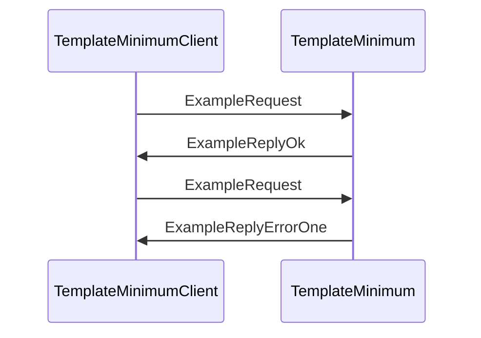

??? quote "Juvix imports"

    ```juvix
    module tutorial.engines.template_minimum_messages;
    import prelude open;
    ```

# Template Minimum Messages

These are the messages that the *Template Minimum* engine can receive/respond to.

## Message interface

--8<-- "./template_minimum_messages.juvix.md:TemplateMinimumMsg"

## Message sequence diagrams

---

### `ExampleRequest` and `ExampleReply`

Lorem ipsum dolor sit amet, consectetur adipiscing elit.
Sed ut purus eget sapien. Nulla facilisi.

<!-- --8<-- [start:message-sequence-diagram-ExampleRequest] -->
<figure markdown="span">



<figcaption markdown="span">
Sequence Diagram: `ExampleRequest` & `ExampleReply`
</figcaption>
</figure>
<!-- --8<-- [end:message-sequence-diagram-ExampleRequest] -->

## Message types

---

### `TemplateMinimumMsgJustHi`

Lorem ipsum dolor sit amet, consectetur adipiscing elit.

---

### `ExampleRequest`

Example request.

<!-- --8<-- [start:ExampleRequest] -->
```juvix
type ExampleRequest := mkExampleRequest@{
  argOne : Nat;
  argTwo : Nat;
}
```
<!-- --8<-- [end:ExampleRequest] -->

???+ quote "Arguments"

    `argOne`
    : Lorem ipsum dolor sit amet, consectetur adipiscing elit.

    `argTwo`
    : Lorem ipsum dolor sit amet, consectetur adipiscing elit.

---

#### `ExampleReply`

???+ quote "Auxiliary types"

    ### `ReplyPayload`

    ```juvix
    type ReplyPayload := mkReplyPayload@{
      payload : String;
    };
    ```

    ---

    ### `ReplyError`

    ```juvix
    type ReplyError := mkReplyError@{
      error : String;
    };
    ```

<!-- --8<-- [start:ExampleReply] -->
```juvix
ExampleReply : Type := Result ReplyError ReplyPayload;
```
<!-- --8<-- [end:ExampleReply] -->

---

### `TemplateMinimumMsg`

<!-- --8<-- [start:TemplateMinimumMsg] -->
```juvix
type TemplateMinimumMsg :=
  | TemplateMinimumMsgJustHi
  | TemplateMinimumMsgExampleRequest ExampleRequest
  | TemplateMinimumMsgExampleReply ExampleReply
  ;
```
<!-- --8<-- [end:TemplateMinimumMsg] -->

---

## Engine components

- [[Template Minimum Configuration]]
- [[Template Minimum Environment]]
- [[Template Minimum Behaviour]]
