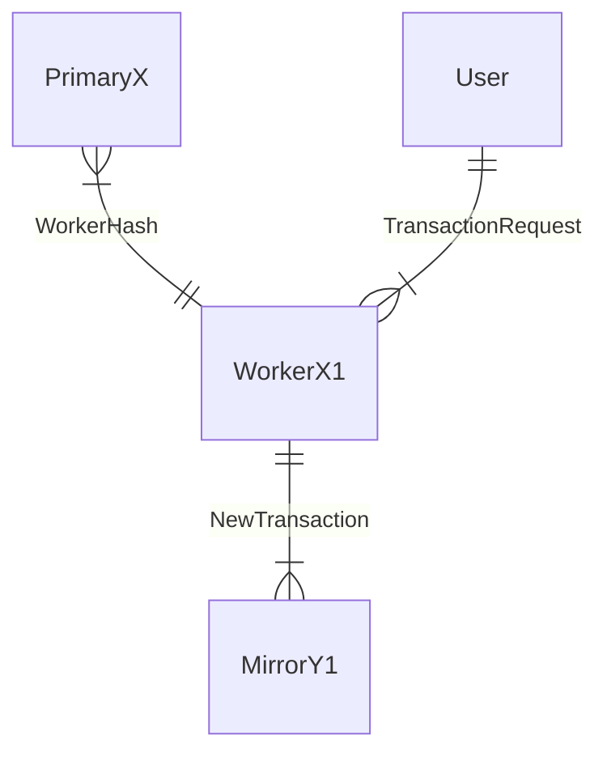

# EngineX {V2 Template}

## Purpose (of EngineX)

`<one paragraph on the purpose>`

Describe what the role of this engine is in context,
be it

- in relation to other engine instances within an Anoma node and/or
- in the whole Anoma instance at large.

## EngineX-specific types

This section describes all types that are specific to an engine. Types should be
defined in the most local place in which they are used. For example, if a type
is only used in one engine, it should be defined in this section for that
engine. If a type is used in multiple engines, it should be defined in the
highest-level composed engine which contains all the engines in which it is
used. If a type is used everywhere, it should be defined in [[Basic Types]].

### Engine-Specific Local State Type

This section explains the type of engine-specific local state. Note that this local state is only part of all the local data.

### Message types

Links to all the types that this engine type may process,
optionally as a description with the tag of a message
where tag is used as in [Special Delivery's paper](https://dl.acm.org/doi/abs/10.1145/3607832).

### Mailbox state type (optional)

We may specify for each mailbox a type. 


## [Paradigmatic message sequence diagram(s)] (optional)

We can use one or more message sequence diagrams to show how
instances of the engine type exchange messages with other engine instances, whether they are the same type or different types.
The general idea is that 
each message sequence diagram in the engine type page describes
a pattern for test cases.

??? example "Client-Server Example"

    In the below _Client-Server_ example,
    the message sequence chart expresses the possibility of a message exchange,
    where the server responds to the request of the client;
    every implementation has to have a counterpart.
    A good practical example for how
    an actor system (or a formal model of it) gives rise to sequence diagrams
    is [stateright](https://www.stateright.rs/)'s [state explorer](https://www.stateright.rs/seeking-consensus.html#stateright-explorer).


    We can use
    [`mermaid` sequence diagrams](https://mermaid.js.org/syntax/sequenceDiagram.html) 
    to draw [message sequence diagrams](https://www.uml-diagrams.org/sequence-diagrams.html),<!--
    see e.g., https://moves.rwth-aachen.de/teaching/ws-21-22/fuml/  
    - https://www.researchgate.net/profile/Joost-Pieter-Katoen/publication/221305522_Pomsets_for_MSC/links/5778102608aead7ba07461af/Pomsets-for-MSC.pdf
    - our formal model should have a precise notion of these as well, 
      in particular if a given one can actually happen in our model
    -->
    using the `-)`-syntax by default,
    expressing that message sending is "asynchronous"[^1].
    The message sequence chart should be included for
    machines and high-level engine groups;
    it is optional for small component engines.
    A simplest possible example would be
    a request response interaction
    and a more complex example is given in the [[Engine Template Example]].

    ```mermaid
    sequenceDiagram
        participant Client
        participant Server
        Client-)Server: read request for key α
      Server-)Client: current value of α is ζ
      Note right of Server: A blockchain is a data base after all.
    ```

??? example "Several Engines Example"

    The following is a good example of a larger diagram,
    which concerns several engines
    taken from the
    [v1 specs](https://specs.anoma.net/v1/architecture-2/ordering-v1.html#a-life-cycle-with-some-details).

    ```mermaid
    sequenceDiagram
        participant User
        participant Worker
        participant ExecutionSupervisor
        participant ExecutorProcess
        User-)Worker: TransactionRequest
        Worker--)Worker: fix batch №
        Worker-)User: TransactionAck
        Worker--)Worker: Buffering & Shuffling
        Worker--)Worker: fix tx №
        Worker-)ExecutionSupervisor: spawnExecutor
        ExecutionSupervisor-)Worker: EPID
        Worker-)ExecutorProcess: ExecuteTransaction
        Worker-)Shard: KVSAcquireLock
        Shard-)Worker: KVSLockAcquired
        Worker-)Shard: UpdateSeenAll
        activate ExecutorProcess
        ExecutorProcess-)Shard: KVSReadRequest
        Shard-)ExecutorProcess: KVSRead
        ExecutorProcess-)Shard: KVSWrite(Request)
        %%    ExecutorProcess-)WhereToIdontKnow: pub sub information of execution data
        ExecutorProcess-)User: ExecutionSummary
        ExecutorProcess-)Worker: ExecutorFinished
        deactivate ExecutorProcess
    ```


    For an engine page,
    it may be sufficient to
    "cut out" a portion of such a larger diagram, or
    mark it as in the following variation of the previous diagram.


    ```mermaid
    sequenceDiagram
        participant User
        participant Worker
        participant ExecutionSupervisor
        participant ExecutorProcess
        User-)Worker: TransactionRequest
        Worker--)Worker: fix batch №
        Worker-)User: TransactionAck
        Worker--)Worker: Buffering & Shuffling
        Worker--)Worker: fix tx №
        rect rgb(191, 223, 255)
          note right of Worker: ExecutionSupervisor in action
          Worker-)ExecutionSupervisor: spawnExecutor
          ExecutionSupervisor-)Worker: EPID
        end
        Worker-)ExecutorProcess: ExecuteTransaction
        Worker-)Shard: KVSAcquireLock
        Shard-)Worker: KVSLockAcquired
        Worker-)Shard: UpdateSeenAll
        activate ExecutorProcess
        ExecutorProcess-)Shard: KVSReadRequest
        Shard-)ExecutorProcess: KVSRead
        ExecutorProcess-)Shard: KVSWrite(Request)
        %%    ExecutorProcess-)WhereToIdontKnow: pub sub information of execution data
        ExecutorProcess-)User: ExecutionSummary
        ExecutorProcess-)Worker: ExecutorFinished
        deactivate ExecutorProcess
    ```

## _All_ Conversation Partners (Engine _types_)


### Conversation Diagram (optional)

Who is talking to whom and `EngineX` in particular, and if so, about what?
For a high-level overview, 
something like a [conversation diagram](https://sparxsystems.com/enterprise_architect_user_guide/16.1/modeling_languages/bpmn_2_0_conversation.html) can be helpful.
We could simply (ab-)use mermaid entity relationship diagrams here. This diagram should be included for machines and high-level engine groups. It is optional for small component engines.

Taking again the example of workers in Narwhal,
the worker is in communication with other workers,
the user and the primary. 
A partial diagram would be the following.




The information from the conversation diagram could be taken from
the list of conversation partners,
each with a list of incoming and outgoing messages,
relative to the current engine `EngineX`.


### [Conversation Partners of type EngineTypeX1] (optional)

#### incoming messages 

- `<` link to type `>`
- ...
- `<` link to type `>`

#### outgoing messages to EngineTypeX1

- `<` link to type `>`
- ...
- `<` link to type `>`

.
.
.

### Conversation Partners of type EngineTypeXm

#### incoming messages 

- `<` link to type `>`
- ...
- `<` link to type `>`

#### outgoing messages to EngineTypeX1

- `<` link to type `>`
- ...
- `<` link to type `>`


## Guarded Actions

See the [Guarded Action Template](https://specs.anoma.net/v2/guarded-actions.html) page for more information on guarded actions.

By default, guarded actions should be inlined in the same page. If an engine has
too many guarded actions (and thereby putting them all in one page would be
unworkable), they can be split out into separate files and linked.

### Guarded action $1$ 

<details>
  <summary>single phrase on guarded action $1$</summary>
  <p>Guarded action one description</p>
</details> 

.  
.  
.  

### Guarded action $n$ 

<details>
  <summary>single phrase on guarded action $n$</summary>
  <p>Guarded action n description</p>
</details> 

[^1]: By default,
	we are working actually with the partial synchrony abstraction,
	which in first approximation is closer to the asynchronous case
	as even if we are after the global synchronisation time,
	we cannot know how long we would have to wait for responses to messages sent.
